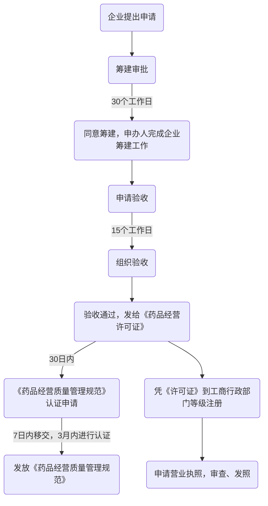

# 医药商品经营与管理

# 目录

[TOC]

# 第一章 管理学的发展及流派

## 第一节 管理理论的萌芽

### 中国早期的管理思想

1. 顺道

   主观范畴的道是指治国的理论；客观范畴的指客观经济规律。

2. 重人

   一是重人心向背；二是重人才归离。

3. 人和

   就是调整人际关系，讲团结，上下和，左右和。

4. 守信

   治国、办企业都要守信。

5. 对策

   运筹策帷幄中，决胜于千里之外。

6. 法治

   法治优于人治。

### 西方早期的管理思想

亚当 · 斯密著作《国富论》

#### 关于管理的职能

1. 关于管理人员的职能
2. 人事管理（罗伯特 · 欧文）
3. 关于组织职能

#### 关于管理人员所具备的素质

#### 关于动作和工时研究

亚当 · 斯密关于”制针厂“的例子

#### 关于专业化和劳动分工

亚当 · 斯密和查尔斯 · 巴贝奇

## 第二节 古典管理理论

### 泰罗的科学管理理论

科学管理之父-泰罗

### 法约尔的一般管理理论

经营管理之父-法约尔

#### 关于经营与管理的关系

经营包括：技术、商业、财务、会计、安全、管理六项活动，其中**管理处于核心地位**

#### 关于管理的职能

计划、组织、指挥、协调、控制

#### 关于管理的十四条原则

劳动分工、权利和责任、纪律、统一指挥及领导等。

### 马克思·韦伯的行政组织理论

#### 组织理论之父

马克思·韦伯代表作《社会组织与经济组织理论》，被称为“**组织理论之父**”。

**理想的行政组织体系**理论，是指通过职务或职位而不是通过个人或世袭地位来管理，他所讲的“理想的”并不是指最合乎需要的，而是指现代社会最有效和合理的组织方式。

#### 理想行政组织体系的内容

权利的三种形态：

1. 理性合法
2. 传统
3. 超凡

#### 理想行政组织体系的特点

1. 明确的分工
2. 自上而下的等级系统
3. 人员的使用
4. 职业管理人员
5. 遵守规则和纪律
6. 组织中人与人之间的关系-理性

### 古典管理理论的系统化

## 第三节 行为科学理论

广义行为科学：研究自然和社会环境中人的行为，如心理学、管理学、社会学等。

狭义行为科学：研究工作环境中个人和群体的行为，现称组织行为学。

### 梅奥及霍桑实验

#### 实验阶段

第一阶段：[照明实验](<https://baike.baidu.com/item/%E9%9C%8D%E6%A1%91%E5%AE%9E%E9%AA%8C/1698846#3_1>)

第二阶段：[福利实验](<https://baike.baidu.com/item/%E9%9C%8D%E6%A1%91%E5%AE%9E%E9%AA%8C/1698846#3_2>)

第三阶段：[访谈实验](<https://baike.baidu.com/item/%E9%9C%8D%E6%A1%91%E5%AE%9E%E9%AA%8C/1698846#3_3>)

第四阶段：[群体实验](<https://baike.baidu.com/item/%E9%9C%8D%E6%A1%91%E5%AE%9E%E9%AA%8C/1698846#3_4>)

#### 实验结论

1. 职工是“[社会人](<https://baike.baidu.com/item/%E7%A4%BE%E4%BC%9A%E4%BA%BA/4278728>)”
2. 企业中存在着“非正式组织”
3. 新型的领导能力在于提高职工的满足度
4. 存在着[霍桑效应](<https://baike.baidu.com/item/%E9%9C%8D%E6%A1%91%E6%95%88%E5%BA%94>)

#### 管理思想

1. 人才是企业发展的动力之源
2. 有效沟通是管理中的艺术方法
3. 企业文化是寻求效率逻辑与感情逻辑之间的动态平衡的有效途径

### 人际关系理论主要思想

1. 梅奥认为企业中的人首先是“社会人”
2. 生产效率主要取决与职工的士气
3. 重视“非正式组织”的存在和作用
4. 提高效率的关键在于提高士气

## 第四节 现代管理理论

### 管理理论的丛林

1. 社会系统学派
2. 决策理论学派
3. 经验主义学派
4. 权变理论学派
5. 管理科学学派
6. 系统管理学派

### 代表性流派

| 学派         | 代表人物          | 主要观点                                                     |
| ------------ | ----------------- | ------------------------------------------------------------ |
| 社会系统学派 | 巴纳德(Barnard)   | 1. 组织是一种人的相互关系的协作系统 2. 系统存在条件 3. 正式组织三要素 4. 对管理者的责任要求 |
| 决策理论学派 | **西蒙(Simon)**   | 1. 管理就是决策 2. 决策的“满意准则” 3. 程序决策和非程序决策 4. **决策的程序四阶段（情报活动阶段、设计活动阶段、选择活动阶段、实施评价阶段）** |
| 经验主义学派 | 德鲁克(Drucker)   | 1. 关于管理的性质 2. 关于管理的任务 3. 提倡实行目标管理 |
| 权变理论学派 | 卢桑斯            | 1. 没有一成不变、普遍适用的“最好”管理理论和方法 2. 环境同管理之间存在着一种函数关系 3. 依据环境和管理之间的函数关系确定有效的管理方式 |
| 管理科学学派 | 伯法(Buffa)       | 1. 强调用数学模型和计算机技术进行管理决策，以提高经济效率。生产资源分配的线性规划模型。 2. 管理就是用数学模式与计算机程序来表示计划、组织、控制、决策等合乎逻辑的程序，求出最优解，以达到系统目标。 |
| 系统管理学派 | 卡斯特 罗森茨威克 | 1. 企业是由人、财、物等资源构成的系统 2. 企业是由许多子系统组成的、开放的社会系统 3. 运用系统观点考察管理职能，可以提高组织的整体效率 |

## 第五节 管理理论新发展

### 企业战略

#### 发展过程

出现（20世纪60年代） -> 盛行时期（20世纪70年代）-> 战略管理时期

#### 战略管理的定义和内容

经营条件外部环境 -> 一种或几种有效的战略 -> 经营宗旨和经营目标

内容：战略制定、战略实施、战略评价及控制

### 企业文化

#### 企业文化的产生

美国：理论发源地

日本：实践成功地

#### 企业（组织）文化的含义

是指在一定的社会政治、经济、文化背景条件下，**企业（组织）**在生产与工作实践过程中所创造或逐步形成的价值观念、行为准则、作风和团体氛围的总和。

#### 企业文化的组成

1. 企业精神：核心层，呈现观念形态的价值观等。
2. 制度文化：中间层，联系企业精神和物质文化。
3. 物质文化：外围层，呈现物质形态的厂容厂貌。

#### 企业文化的功能

1. 导向作用（思想和行为）
2. 凝聚作用（员工）
3. 约束作用
4. 辐射作用（员工行为）
5. 激励作用

# 第二章 医药市场营销环境分析

略（老师没讲）。

# 第三章 药品零售企业经营与管理

## 概述

**药品零售企业**是指从药品生产企业或者药品批发企业购进药品，直接销售给最终消费者用以防止疾病的机构。习惯上称为药店。

### 药店经营现状

+ 市场类型转变
+ 布局不合理，扎堆经营现象
+ 部分国外医药零售企业的进入
+ 规模小，竞争力弱
+ 消费寻求的个性化
+ 服务意识不够，专业性有待提高
+ 陷入平价竞争的泥潭
+ 行业内的竞争日益激烈
+ 经营管理水平有待提高

### 药店的岗位设置

药店经理、执业药师（或者药学技术人员）、营业员、采购员、配送员、储存保管员、质量管理员、财务统计员、收银员等。

### 药店经营模式分类

1. 药店性质
   1. 独立药店经营模式
   2. 连锁药店经营模式
2. 是否属于医保定点单位
   1. 定点药店经营模式
   2. 非定点零售药店经营模式
3. 药品销售形式
   1. 开架（药品超市）经营模式
   2. 闭柜经营模式
4. 药品性质
   1. 处方药柜台经营模式
   2. 非处方药柜台经营模式
   3. （老师讲的）DTP药房

## 药店经理

### 药店经理概述

+ 负责全面的管理工作
+ 具备药学或相关专业知识、现代科学管理知识和一定药品经营实践经验
+ 对经营结果负全部责任

### 药店经理的职责

+ 贯彻党的各项方针、政策，认真执行国家有关的政策和法规
+ 制定本药店的销售费用、上缴利税计划，落实各项年度计划
+ 合理安排各工作岗位人员，以保证各项计划任务的完成
+ 制定岗位责任制、文明经商条约和服务公约等规章制度，并督促执行
+ 根据有关规定，确定职工的奖金分配
+ 批准权限范围内的药品报损和费用开支，审查药品采购计划
+ 处理经营、服务和管理上出现的特殊问题
+ 组织职工学习国家有关政策和法规、业务技术知识，提高人员素质

### 药店经理的业务管理工作

+ 市场调研
+ 药品零售企业的开办
+ 药品的配置
+ 药店人员的培训管理
+ 药店促销策略
+ 提高药店营业额的方式
+ 信息管理

## 药品零售企业的开办

### 企业开办的申请与审批

### 药店投资预算

+ 投资能力预算指对投资资金来源和数量的预算
+ 投资支出预算

### 店面选址

较大规模药店、中小规模药店、特殊人群药店店面、连锁药店店面等都有各自独特的选址要求，但都应考虑到周围环境清洁卫生情况、有无噪声、交通情况、同行业竞争情况。

+ 选址决策要谨慎
+ 连锁药店的立地条件受制于业态
+ 注意大环境的变化及位置潜力
+ 开店方位有讲究
+ 拐角的位置较理想
+ 三岔路口是个好位置
+ 三角形店址选择法

## 药品的配置

### 药品分类

按功能分：

1. 药品
   1. 处方药
   2. 非处方药
2. 非药品
   1. 口服（食品、保健品）
   2. 非口服（化妆品）
   3. 消（消毒、防腐、杀虫剂等日用品）
   4. 械（医疗器械）
   5. 计生用品

按销售排名分：

A：销售额占80%

B：销售额占15%

C：销售额占5%

按药品销售情况和药品的贡献大小分：

1. 畅销药品
2. 主力药品
3. 策略药品
4. 基本药品
5. 滞销药品

### 药品配置依据

商圈调查、消费者调查、药店药品策略、药店实际状况是否有品种限制等，类似成功门店的药品配置

### 药品配置的修正

销售情况的分析、滞销药品的淘汰、畅销药品的调整和新药品的导入、药品布置的调整

## 药店促销策略

+ 药品陈列
+ POP广告
+ 媒介，根据药品本身（处方药、非处方药）
+ 名医坐诊
+ 发放社区公众服务卡
+ 建立医疗咨询服务热线电话
+ 厂商结合，开展大型义诊

## 提高药店营业额的方式

+ 建立顾客数据库，培养忠诚顾客
+ 通过价格和服务竞争留住忠诚顾客
+ 扩大商圈覆盖面积和药品种类吸引一般顾客和路过散客
+ 经常推出新药和新的医疗保健药品或方法吸引新的顾客
+ 争取成为医保定点药店
+ 药店布置应减少商业气息，增加对商圈内顾客的人文关怀
+ 增加美容类、健康类日用品的销售，起到与药品销售的相互促进
+ 提供义诊与医疗器械免费试用的服务
+ 形成某类药品的专科特色药店
+ 把营业员培养成药品和常见疾病的“专家”
+ 经常开展健康主题宣传活动
+ 做好内部管理，保证产品不断货
+ 紧跟广告，销售流行药品

## 信息管理

### 药品连锁企业信息化进程

1. 信息化改造（手工——机器，节约成本）
2. 企业内部信息化（部门管理——流程管理）
3. 系统外扩，电子商务化

### 连锁/零售药店药品信息管理系统

1. 出入库管理子系统（日常账务处理、查询打印、统计分析、系统维护）
2. 出入库检验子系统
3. 初始化子系统
4. 采购管理子系统

# 第四章 药学技术从业人员

## 药学技术人员概念

药学技术人员是指取得药学类专业学历，依法经过国家有关部门考试考核合格，取得专业技术职务证书或执业药师资格，遵循药事法规和职业道德规范，从事与药品的生产、经营、使用、科研、检验和管理有关实践活动的技术人员。包括药师、执业药师、临床药师等。

### 药师定义

药师是指受过高等药学教育或在医疗预防机构、药事机构和制药企业从事药品调剂、制备、鉴定和生产等工作，并经卫生部门审查合格的高级药学人员。

### 执业药师

执业药师（Licensed Pharmacist）是指依法经资格认定，准予在药事单位，主要是药房执业的药师。

### 药师和执业药师的区别

药师是职称考试，主要用在医院。职称考试分为初级药士，初级药师，中级主管药师，还有高级的。在卫生局报名。

执业药师主要用于营销，比如药店，一些药厂药企也会要求员工考，在中国人事考试网报名。两者的考试内容，时间也不一样。

### 药师的类别

1. 根据所学专业可分为：西药师和中药师
2. 根据职称职务可分为（卫生部系统划分，医院认）：药士、药师（初级职称）、主管药师（中级职称）、副主任药师或主任药师（高级职称）
3. 根据职业资格可分为（药监局系统划分，药店认）：执业药师、非执业药师（如从业药师）

## 执业药师资格考试

执业药师资格考试属于职业资格准人考试，实行全国统一大纲、统一命题、统一组织的考试制度。一般每年举行一次（八月报名，十月考试）。

执业药师制度性质：专业技术人员职业资格

### 执业药师报考条件

| 药学、中药学或相关专业 | 从事药学、中药学或相关工作         |
| ---------------------- | ---------------------------------- |
| 中专                   | 七年（2020年底取消中专生报考资格） |
| 大专                   | 五年                               |
| 本科                   | 三年                               |
| 硕士                   | 一年                               |
| 博士                   | 零年                               |

### 执业药师考试科目

| 考试科目  | 药学类             | 中药学类             |
| --------- | ------------------ | -------------------- |
| 专业知识1 | 药理、药分         | 中药学、中药药剂学   |
| 专业知识2 | 药剂、药化         | 中药鉴定学、中药化学 |
| 综合知识  | 药学综合知识与技能 | 中药综合知识与技能   |
| 法规知识  | 药事管理法规       | 药事管理法规         |

四年一周期，累计合格，颁发证书。

#### 执业药师考试题型介绍

A型题，也称最佳选择题，即有A、B、C、D、E五个备选答案，其中只有一个为最佳答案，其余选项为干扰答案。考生需从备选答案中选出一个与题干最吻合的选项。它主要是对一些概念或结果的判断，这种题型较为简单，是得分的主要题型。

B型题，也称配伍选择题，其特点为5个备选答案在前，一组试题（2\~4个）在后，且每题仅有一个正确答案。每个备选答案可重复选用，也可以不被选用。这类题往往用来考察考生对密切相关知识的掌握情况。

X型题，又称多项选择题，每组有A、B、C、D、E五个备选答案，其中有2个或2个以上为正确答案，少选、错选或多选均不得分。由于有多个正确答案，考生往往不能将全部正确答案选出来，因而增加了题目的难度。

### 执业药师注册

注册单位：各省级药品监督管理部门

注册条件：

1. 取得《执业药师资格证书》
2. 遵纪守法，遵守职业道德
3. 身体健康，能坚持在执业药师岗位上工作
4. 经执业单位同意

执业药师注册证有效期：5年

## 从业药师

### 什么是从业药师

我国执业药师制度建立于1994年。但由于执业药师数量不足，分布不均等，2001~2004年期间，国家药品监管部门实施从业药师政策。通过考核，认定一批**具备一定药学专业技术职称、实践经验丰富、长期在药品经营企业工作的人员为从业药师**，进行安全用药指导。

### 从业药师的过渡性政策

原国家食品药品监管总局办公厅发布《关于现有从业药师使用管理问题的通知》决定实施从业药师过渡政策，并明确提出“有条件地延长现有从业药师资格期限至2020年”

1. 2020年12月31日前，由经过确认的从业药师承担执业药师职责的药品经营企业，视为符合执业药师配备要求。
2. 从业药师过渡性政策仅限于已有的药品经营企业，新开办药品经营企业必须配备执业药师。 
3. 经确认的从业药师不得随意变更从业企业，其所在企业不再具备药品经营资格时，方可向原确认登记部门申请变更登记，不得跨省登记。未经变更登记自行变更从业企业的，不再具有从业药师资格。
4. 已配备了执业药师的经营企业，不得使用从业药师替换执业药师。

## 驻店药师

### 什么是驻店药师

驻店药师是药品零售企业的一个职务（即处方审核员），持有职称药师、从业药师、执业药师等资格证书的专业人员均可在零售药店担任其职务。

### 驻店药师的职责职责

对处方的用药情况，用药数量，配伍禁忌，潜在危险点做出评估，然后再将信息反馈给医生。

### 内容

1. 驻店药师是药品零售企业的一个职务
2. 驻店药师需对潜在危险点做出评估
3. 驻店药师注册的前提是持有职称药师、从业药师、执业药师资格证书
4. 驻店药师是将其资格证书的执业地址注册为所在药店的药学专业人员

## 药店营业员

### 概述

药店营业员为一线岗位，主要负责柜台药品销售、开票工作，必须重视的岗位。

### 职责

顾客接待，药品零售；

处方调剂；

销售内务管理。

营业前：验柜补货

下班前：账目清算

### 基本素质

推销商品之前要先推销自己

1. 服务态度

   热诚、微笑、心胸宽阔

2. 职业仪表

   服饰美、修饰美、举止美、情绪美

3. 药品知识

   药品的分类、特点、价格、产地等，同类药品的特点、优劣对比，适用人群；临床常见病诊断；药物配伍禁忌和不良反应；药物的服用方法等。

4. 语言技巧

   说话诚恳，实事求是，不夸夸其词，并要留有余地，尽量避免使用绝对、肯定等极端词语。注意某些禁忌用语，如瘦、胖、老、黑等。

5. 了解顾客的心理

   知己知彼，百战不殆。顾客在购买过程中的内心活动对购买行为起着关键作用。

### 药店服务规范

#### 四声

顾客进门有迎声、顾客离店有送声、顾客咨询有答声、顾客留言有回声

#### 四心

接待顾客热心、解答问题耐心、排忧解困诚心、接受意见虚心

#### 四服务

**微笑服务、站立服务、主动服务、灵活服务**

### 业务工作

#### 药品陈列

##### 陈列的基本原则及要求

1. 陈列货架标准化
2. 按《药品经营质量管理规范》的要求陈列
3. 体现企业及门店风格
4. 醒目原则
5. 方便原则
6. 安全性原则
7. 满陈列原则
8. 整洁美观原则
9. 先进先出、先产先出的原则
10. 关联性原则

##### 药品开架销售陈列的技巧

1. 集中陈列
2. 特殊陈列法
3. 橱窗陈列：玻璃橱窗POP要双面书写，进店前吸引顾客，进店后可看到促销信息。
4. 收银台陈列
   1. 有爆炸花的提示，收银台为黄金位置，陈列的商品对刺激顾客的购买欲和增加销售有很多意义
   2. 摆放了冲动性购买的商品，而且有醒目的赠品区，对顾客在购买前的吸引力较好，而不是买了商品才提示顾客有赠品。 
   3. 主要陈列：冲动性购买商品、季节性商品、价格较低及体积较小且毛利较高的商品。
   4. 主题促销赠品：如唇膏、护手霜、口香糖、棉签、创可贴、棒棒糖、喉片之类。
5. 专柜陈列
6. 利用柱子的“主题式”陈列
7. 端架陈列
8. 柜台陈列：把柜台转角处的黄金位置设计陈列好。 
9. 分段陈列
10. 黄金位置的陈列
11. 量感陈列
12. 质感陈列
13. 集中焦点陈列
14. 突出陈列法
15. 悬挂式陈列
16. 除去外包装的陈列

##### 商品陈列自查七要点

1. 价格标签是否面向顾客的正面
2. 商品有无被遮挡，无法显而易见
3. 商品上有无灰尘或杂物
4. 有无价格标签脱落或者价格不明显的商品
5. 是否做到了取商品容易，放回也容易
6. 商品群和商品部门区分是否正确
7. 货架上放在最上面的商品是否堆放得过高

### 药品的柜台销售

#### 八大心理阶段

消费者在购买机动驱动下步入药店，从对药品的选择、评价到购买，从心理上大致要经历八个阶段。

1. 观察阶段
2. 兴趣阶段
3. 联想阶段
4. 欲望阶段
5. 评价阶段
6. 信心形成阶段
7. 行动阶段
8. 感受阶段

#### 非处方药品销售的基本步骤和方法

1. 准备
2. 观察顾客，相机接近
3. 推介、展示药品
4. 诱导劝说
5. 促成交易
6. 成交
7. 欢送顾客

### 非处方药批准文号中字母的含义

| 批准文号字母 | 含义                                 |
| ------------ | ------------------------------------ |
| H            | 化学药品                             |
| Z            | 中药                                 |
| B            | 通过国家药品监督管理局整顿的保健药品 |
| S            | 生物制品                             |
| T            | 体外化学诊断试剂                     |
| F            | 药用辅料                             |
| J            | 进口分包装药品                       |

## 药品采购员

### 采购员

Buyer在中文中称为采购员，是对所有采购人员的总称。

#### 采购员的工作任务

1. 以尽可能低的价格和合适的量来购买最高质量的商品。准备购货订单，征求出价建议并且审查货物和服务的要求。
2. 根据价格、质量、选择、服务、支持、可获得性、可靠性、生产和分配能力以及供应者的名声和历史来研究和评价供应者。
3. 分析报价，财务报告和其他数据及信息来确定合理的价格。
4. 协商，或者重新商议，并管理与供应者、卖主和其他代表的合同。

有三个方面：

+ 物料供应
+ 库存水平控制
+ 成本控制

#### 采购员基本素养

1. 社交能力、市场调研分析能力、谈判应变能力
2. 不贪不取不抬高单价拿回扣
3. 有责任心，懂得为企业节约成本
4. 熟悉商业规则、工程技术和市场发展现状
5. 对采购品成本的构成有清楚的认知
6. 总成本=原材料成本+制造加工成本+管理成本+运输物料成本+合理利润

### 药品采购员

#### 概述

负责药品的采购，按药库管理计划采购所需品种，保证所经营的品种不断档。

在具体实践中，采购新品种时，药品采购员一般按经理指示或柜组长建议并报经理审查批准，如果是连锁分店，一般要负责与总店协调进货事宜。

#### 药品采购流程图

#### 职责

编写进货计划，坚持购药原则，选购优质药品，核对购进药品，收集药品信息，及时提运药品。

1. 根据市场需要、季节特点、病疫情况以及结合库存余缺编写进货计划，报经理审查同意后进行采购。
2. 加强采购工作的计划性，消灭认为脱销和防止盲目购药。坚持购药原则。
3. 多方听取顾客意见，收集信息，积极为顾客提供质量高、疗效好、价格合理的药品。
4. 对购进药品，如验收时发现质量或数量不符，负责向原进货单位提出退货或索赔。
5. 注意收集药品供销信息、货源信息、价格信息以及质量信息。
6. 负责购进药品的提运，以保证药品的及时运回。

#### 业务工作

##### 采购计划

1. 药品采购计划
2. 基本药品计划
3. 新特药品的采购计划

原则：以需订购、以够促销、注重质量、加强核算、勤进快销、进销结合、协调利益，并保持其连续性、稳定性。

##### 进货管理

###### 基本条件

符合法定的质量标准；有批准文号和生产批号、《进口药品注册证》、《进口药品检验报告书》或进口药品通关单复印件和注册商标样品；包装标签、说明书和标识清晰、规范；中药材标明产地，制定进货程序。

###### 进货质量评审

###### 购货合同

形式：标准书面合同、质量保证协议、文书、传真、电话记录、电传、口头约定

条款：标的，数量和质量，价款或者酬金，履行的期限、方式和地点，违约责任

###### 购进记录

保存期限：超过药品有效期1年，不少于3年。

###### 注意事项

### 四分开原则

药品与非药品分开

处方药与非处方药分开

内服药与外用药分开

易串味药与一般药品分开

## 药店配送员

服务 - 无形的商品

服务的蝴蝶效应

+ 服务差
+ 客户评价差
+ 企业口碑差
+ 销售业绩差
+ 企业效益差
+ 员工待遇差
+ 服务态度更差

### 服务在我形

我们是公司市场的**形象代表**，而并非只代表我们个人。

要做什么像什么，要具备**职业化**的形象

73855定律：

7%：谈话内容

38%：语气、音调、手势、站姿、动作、坐姿

55%：外表（衣着、发型、妆容）

#### 配送员仪容规范

头发：头发必须保持清洁，男士不得留长发，不得烫染；女士的发型与场合和服饰相协调（如穿礼服时，应将头发挽在颈后），个别特殊岗位的女士不得留长发。

指甲：经常修剪指甲，指甲的长度不得超过手指指尖。

胡须：男士不得留胡须，保持仪容整洁。

口腔：保持牙齿清洁，清除口腔异味，上班前不能喝酒或吃有异味的食品。嚼口香糖可减少口腔异味，但与人交谈时，不应嚼口香糖。

化妆：女性员工上班时间可化淡妆，不能浓妆艳抹，不宜用香味浓烈的香水。

#### 配送员衣着规范

身着公司统一制服，不得有污损。

不得佩戴装饰性很强的装饰物、标记和吉祥物。

手腕除了手表外不得带有其他装饰物。

携带要系好，保持鞋面干净，穿深色袜子，不得穿拖鞋。

### 服务在我心

积极、灵活、礼貌、热情

+ 动作迅速、规范
+ 手脚麻利、不拖拖拉拉、轻拿轻放、清理留下的垃圾
+ 1. 送货时间紧凑
  2. 客户赶时间收货
  3. 不给客户制造麻烦
+ 客户面前要听话、做了再说
+ 1. 客户不是想吵架、是要沟通
  2. 客户不是针对个人
  3. 急客户所急

### 服务在我行

### 配送员的职责

#### 入库

1. 协助司机装卸货
2. 入库时，检查货物订单，签字并自留一份存档
3. 按流程办理货物入库，转交药库管理员，做入库单，并做好货到货架的第二次对单
4. 与店员核对单据无误后签字存档

#### 出库

1. 根据客户发货通知单发货，做到单物相符。
2. 根据货物的体积、重量订相应吨位的车辆
3. 协助司机装卸货物
4. 拟定配送管理办法、配送计划和作用流程，并不断改进完善

### 配送员的业务工作

1. 药品出库手续
2. 药品出库原则
   1. 先产先出
   2. 近期先出
   3. 按批号发货
3. 药品出库复核

## 购销经理

### 药品批发企业

属于药品经营企业，是药品流通的中转站

1. 从药品生产企业或其他药品批发企业购进药品，供应给零售企业、医疗单位和其他药品批发企业用作转卖
2. 供应给药品生产企业做生产的药品经营企业

### 挂靠走票

挂靠：指未取得药品经营资格的单位或个人，利用合法药品经营企业提供的场地、资质证明、票据等条件从事药品经营活动。

走票：指不具有药品经营资格，但掌握较固定的销售渠道和药品来源的居间人，通过向合法药品经营企业支付一定税点或“管理费”后，由合法企业为自己销售的药品提供相关票据。

### 概述

购销经理负责企业药品购销业务管理工作，必须具备药学或相关专业知识、现代科学管理知识和一定药品经营管理实践经验。

采购部 —— 药品的购进

销售部 —— 药品的销售

