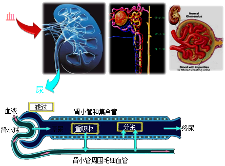
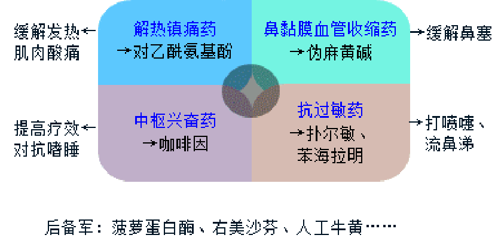

# 药学综合知识与技能

# 目录

[TOC]

# 第一章

## 第一节

怎么确定给药间隔：
1. 根据半衰期确定
2. 根据平均稳态血药浓度
3. 根据峰、谷浓度

`CSS`：平均稳态浓度

> 给药**剂量相同**，稳态血药浓度相同
>
> 给药**间隔不同**，血药浓度不同

治疗指数底：容易中毒，稍微过量，直接中毒

半衰期小于 30 分钟：
* 给药间隔
    * 治疗指数低
        * 一般静脉滴注
    * 治疗指数高
        * 一般 1~3 个

半衰期在 8~24 小时

特点：消除慢、长效

给药间隔：

+ 每个半衰期给药一次
+ 如果需要立即达到稳态，可首剂加倍

### 四、调整给药方案
#### 什么情况下需要调？
1. 治疗窗改变（药效改变）
2. 血药浓度 - 时间曲线改变（药时曲线）
3. 治疗窗与药时曲线改变
4. 红细胞 / 血红蛋白减少的意义3

1. 急性、慢性红细胞丢失过多

2. null

3. 红细胞破坏过多

   1. 红细胞内异常

      如：膜结构缺陷，酶活性缺失

   2. 红细胞外异常

      如：血清中存在红细胞抗体导致的自身免疫性溶血性贫血。

# 第七章 常见医学指标的解读

## 第一节 血常规检查

### 常见的检查项目

#### 三大常规

1. 血常规
2. 尿常规
3. 粪常规

#### 两大功能

1. 肝功能检查
2. 肾功能检查

#### 其它

1. 血生化
2. 两对半

### 血液的组成

1. 血浆
2. 血细胞
   1. 红细胞
   2. 白细胞
   3. 血小板

### 一、红细胞（RBC）

#### 正常参考区间

1. 新生儿： （6.0-7.0） ×1012/L
2. 婴儿： （5.2-7.0） ×1012/L
3. 儿童： （4.2-5.2） ×1012/L
4. 成人：
   1. 男：（4.0-5.5） ×1012/L
   2. 女：（3.5-5.0） ×1012/L

### 二、血红蛋白（Hb）

血红蛋白常被称为“血色素”，是组成红细胞的主要成分。

#### 正常参考区间

1. 女性：110\~150g/L
2. 男性：120\~160g/L
3. 新生儿：170\~200g/L

### 三、红细胞/血红蛋白的临床意义

#### 红细胞/血红蛋白与贫血的关系

贫血：即RBC及Hb减少。

贫血的程度主要取决于血红蛋白（Hb）。

##### 贫血按严重程度分类

1. 轻度贫血，Hb量>90g/L且低于正常参考值下限；
2. 中度贫血，Hb量61\~90g/L；
3. 重度贫血，Hb量31\~60g/L；
4. 极重度贫血，Hb量<30g/L。

#### 红细胞/血红蛋白增多的意义

1. 相对增多

   频繁呕吐、出汗过多，大面积烧伤等，由于大量失水使血浆减少，血液浓缩，血中各种有形成分包括红细胞相对增多，仅为一种暂时的现象。 

2. 代偿性和继发性增多

   长期缺氧，导致的红细胞增多。常继发于：慢性肺心病、肺气肿、高原病和肿瘤患者，可引起红细胞代偿性增生。

3. 真性红细胞增多

   为原因不明的慢性骨髓功能亢进，红细胞计数可达（7.0-12.0）×1012/L。 

#### 红细胞/血红蛋白减少的意义

1. 急性、慢性红细胞丢失过多

   常由各种原因的出血引起。如：消化道溃疡、痔疮、十二指肠钩虫病等。

2. 生成减少

   1. 红细胞生成减少：如：再生障碍性贫血； 骨髓病性贫血；巨幼细胞性贫血； 慢性病贫血； 肾性贫血。
   2. 血红蛋白生成减少：如：缺铁性贫血、 铁粒幼细胞性贫血、 铅中毒贫血、 珠蛋白合成障碍性贫血。

3. 红细胞破坏过多

   1. 红细胞内异常：如：膜结构缺陷，导致的遗传性球形红细胞增多症； 酶活性缺陷，导致的葡萄糖-6-磷酸脱氢酶缺陷等；珠蛋白肽链量改变及分子结构变异导致的血红蛋白病等
   2. 红细胞外异常：如：血清中存在红细胞抗体导致的自身免疫性溶血性贫血；机械性、化学性、物理性及生物因素、脾亢等原因导致红细胞破坏过多。

### 四、白细胞（WBC）

白细胞的使命：监视、识别、防御、攻击、修复。

#### 一、白细胞分类

1. 有粒白细胞
   1. 中性粒细胞
   2. 嗜酸性粒细胞
   3. 嗜碱性粒细胞
2. 无粒白细胞
   1. 单核细胞
   2. 淋巴细胞

#### 二、计数

白细胞计数：指单位体积血液中含的白细胞数目。

##### 正常参考区间（白细胞计数）

1. 成人末梢血：（4.0\~10.0）×109/L
2. 成人静脉血：（3.5\~10.0）×109/L
3. 新生儿：（15.0\~20.0）×109/L
4. 6个月\~2岁婴幼儿：（11.0\~12.0）×109/L

##### 正常参考区间（白细胞分类计数）

1. 中性分叶核粒细胞（中性粒细胞）0.50\~0.70（50%-70%）
2. 中性杆状核粒细胞0.01\~0.06（1%\~6%）
3. 嗜酸性粒细胞
   1. 成人0.01\~0.05（1%\~5%）
   2. 儿童0.005\~0.05（0.5%\~5%）
4. 嗜碱性粒细胞0\~0.01（0%\~1%）
5. 淋巴细胞0.20\~0.40（20%\~40%）
6. 单核细胞0.03\~0.08（3%\~8%）

#### 三、临床意义

##### 1. 中性粒细胞的临床意义

由于中性粒细胞在白细胞所占百分率高（50%\~70%），因此它的数值增减是影响白细胞总数的关键。

###### 中性粒细胞增加的意义

1. 生理性
2. 病理性
   1. 急性感染和化脓性炎症
   2. 白血病、骨髓增殖性疾病及恶性肿瘤
   3. 中毒、急性大出血
   4. 严重的组织损伤及大量红细胞破坏 

###### 中性粒细胞减少的意义

1. 特殊感染
   1. 革兰阴性菌感染（伤寒、副伤寒）
   2. 结核分枝杆菌感染
   3. 病毒感染（风疹、肝炎、感冒）
   4. 寄生虫感染（疟疾）
2. 物理化学损害
3. 血液系统疾病
4. 过敏性休克、重度恶病质
5. 脾功能亢进和自身免疫性疾病

###### 中性粒细胞异常改变的意义

1. 核象变化

   1. 核左移现象

      1. 幼稚的：杆状核、晚幼粒细胞增加；
      2. 若白细胞总数不增高而核左移，常见于严重感染或患者机体抵抗力低下，如：中毒性休克等。

   2. 核右移现象

      1. 衰老的：五叶核粒细胞增多
      2. 超过5%提示骨髓功能减退；

      出现于如：败血症等急性重症细菌性感染；

      也可见于：应用抗代谢药（如：阿糖胞昔）

      

2. 毒性变化与退行性变化

   1. 中性粒细胞胞浆中可出现中毒颗粒，或胞浆内出现空泡，发生核膨胀或核固缩等变性。　　
   2. 提示严重感染或中毒。　

##### 2. 嗜酸性粒细胞的临床意义

1. 嗜酸性粒细胞增多的意义
   1. 过敏、寄生虫。
   2. 药物：应用头孢拉定、头孢氨苄、头孢呋辛、头孢哌酮等抗生素等。
   3. 血液病：慢性粒细胞性白血病、嗜酸性粒细胞性白血病等。
2. 嗜酸性粒细胞减少的意义
   1. 伤寒、副伤寒、大创伤。
   2. 长期用肾上腺皮质激素。

##### 3. 嗜碱性粒细胞的临床意义

略。

##### 4. 单核细胞的临床意义

1. 单核细胞增多的意义：

   可见于：结核、伤寒、亚急性细菌性心内膜炎。

##### 5. 淋巴细胞的临床意义

1. 淋巴细胞增多的意义

   1. 传染病（病毒、结核）
   2. 血液系统疾病（白血病）
   3. 其他 肾移植术后发生排斥反应时。

2. 淋巴细胞减少的意义

   多见于：

   1. 传染病的急性期
   2. 细胞免疫缺陷病（如艾滋病）
   3. 长期应用肾上腺皮质激素后
   4. 接触放射线

###### 长期应用肾上腺皮质激素对骨髓造血的影响

促进骨髓制造：红细胞、中性粒细胞、血小板；

抑制骨髓制造：其它血细胞（嗜酸、嗜碱性、淋巴）

### 五、血小板（PLT）

#### 一、简述

血小板是由骨髓巨核细胞产生的，每个巨核细胞可以产生2000\~3000个血小板，生存期为8\~11天，具有黏附、聚集、释放等多种功能。

##### 正常参考区间

（100\~300）×109/L

##### 作用

1. 营养、维护、保持毛细血管壁的完整性；
2. 参与止血和凝血，促进血液凝固。

##### 生理止血过程

受损小血管收缩 $\Rightarrow$ 血小板血栓 $\Rightarrow$ 血液凝固

#### 二、临床意义

1. 血小板减少
   1. 血小板生成减少：造血功能损伤（再障、白血病）
   2. 血小板破坏过多：免疫性或继发性血小板减少性紫癜/脾亢/体外循环
   3. 血小板消耗过多：如弥漫性血管内凝血
   4. 血小板分布异常：脾肿大
   5. 药物中毒或过敏反应：磺胺类药
2. 血小板增多（略）

### 六、红细胞沉降率

#### 一、简述

指红细胞在单位时间内沉降的距离。简称血沉，英文缩写 ESR.

##### 正常参考区间

1. 男性0\~15mm/1h
2. 女性0\~20mm/1h

#### 二、临床意义

1. 生理性增快

   见于：月经期、妊娠3个月以上至分娩后3周内。

2. 病理性增快

   1. 炎症
   2. 组织损伤及坏死
   3. 恶性肿瘤——是鉴别恶性和良性肿瘤的指标之一。
   4. 高球蛋白血症——其实还是炎症
   5. 贫血——贫血越严重，血沉增快越明显。　　
   6. 高胆固醇血症。

## 第二节 尿常规检查

| 名称                    | 正常                                                         | 异常                                                         |
| ----------------------- | ------------------------------------------------------------ | ------------------------------------------------------------ |
| 酸碱度（Ph）            | 晨尿 5.5\~6.5 随机尿 4.5\~8.0                           | 增高：碱中毒、频繁呕吐、肾小管性酸中毒等 降低：酸中毒、肾炎、糖尿病酮症酸中毒等 |
| 尿比重（SG）            | 成人晨尿 1.015\~1.025 随机尿 1.003\~1.030（一般为 1.010\~1.025） 新生儿 1.002\~1.004 | 增高多见于高热、心力衰竭、糖尿病等 降低多见于慢性肾功能不全、慢性肾盂肾炎等 |
| **尿蛋白（PRO）**       | 定性：阴性（-） 定量：<100mg/L, <150mg/24h尿            | **肾损害**（肾小球性、肾小管性、混合性、溢出性、组织性、假性、药物性） |
| **尿隐血（BLD）**       | 阴性（-）                                                    | **尿血红蛋白阳性**：红细胞被大量破坏（溶血） **尿肌红蛋白阳性**：肌肉损伤 |
| **尿沉渣白细胞（LEU）** | 阴性（-）                                                    | 超过5个，说明**尿路感染**                                    |
| **尿沉渣管型**          | 0或偶见                                                      | 大量出现说明**肾脏损害**                                     |
| **尿沉渣结晶**          | 少量                                                         | 尿酸盐结晶：常见于**痛风** 服用磺胺类药、氨苄西林、疏嘌呤、扑米酮等药，可出现：**结晶尿** |
| **尿葡萄糖（GLU）**     | 阴性（-）                                                    | **血糖上升+尿糖阳性**：提示可能有糖尿病、甲亢、肢端肥大症等 **血糖正常+尿糖阳性**：提示肾脏损害 **严重应激**：烧伤、感染、骨折、心肌梗死、应用药物（糖皮质激素、避孕药、蛋白同化激素） **假性糖尿**：指尿液中含有还原性物质引起尿糖定性出现阳性反应。如含维生素C、尿酸、阿司匹林、异烟肼等 |
| **尿酮体（KET）**       | 阴性（-）                                                    | 阳性：提示酮症酸中毒（糖尿病）、也可见于呕吐、腹泻、重度营养不良。 |
| **尿胆红素（BIL）**     | 阴性（-）                                                    | **阳性**：肝细胞性黄疸或胆道阻塞性黄疸                       |
| **尿肌酐**              | 略                                                           | 增加：内分泌与代谢病、消耗性疾病 **减少**：肾损害       |
| **尿尿酸**              | 略                                                           | **增加**：**痛风**或组织大量破坏、高嘌呤饮食 **减少**：痛风发作前期、肾衰 |

## 第三节 粪常规检查

| 项目       | 结果       | 参考值                                                       |            |
| ---------- | ---------- | ------------------------------------------------------------ | ---------- |
| 颜色及性状 | 黄色正常便 | 粘液便，鲜血便，柏油便，白陶土样便； 脓血便，乳凝块便，细条便，稀便 |            |
| 红细胞     | 阴性       | 阴性，阳性+，++，+++                                         | 脓血便肠炎 |
| 白细胞     | 阴性       | 阴性，阳性+，++，+++                                         | 脓血便肠炎 |
| 上皮细胞   | 阴性       | 阴性，阳性+，++，+++                                         |            |
| 肿瘤细胞   | 阴性       | 阴性，阳性+，++，+++                                         |            |
| 淀粉颗粒   | 阳性+      | 阴性，阳性+，++，+++                                         | 消化不良   |
| 脂肪颗粒   | 阴性       | 阴性，阳性+，++，+++                                         | 消化不良   |
| 肌纤维     | 阳性+      | 阴性，阳性+，++，+++                                         |            |
| 植物纤维   | 阳性+      | 阴性，阳性+，++，+++                                         |            |
| 致病菌     | 阴性       | 阴性，阳性+，++，+++                                         | 感染       |
| 真菌       | 酵母菌     | 阴性，阳性+，++，+++                                         | 感染       |
| 寄生虫     | 阴性       | 阴性                                                         | 感染       |
| 原虫       | 阴性       | 阴性                                                         | 感染       |
| 气味       | 酸臭       | 正常，酸臭，腥臭，恶臭                                       |            |

### 粪外观

#### 药物影响

1. 口服药用炭、铋制剂、铁制剂、中草药者粪便可呈**无光泽的灰黑色**
2. 服用大黄、番泻叶等中药者大便呈**黄色**
3. 服用硫酸钡粪便可呈**白片土状或白色**，氢氧化铝制剂粪便为**灰白色或白色斑点**。
4. 水杨酸钠可使粪便呈**红至黑色**
5. 利福平可使粪便呈**橘红色至红色**
6. 抗凝血药华法林可使粪便呈**红或黑色**

#### 疾病的影响

+ 稀糊状或水样状粪便——感染或非感染性腹泻、急性胃肠炎
+ 脓血便——细菌性痢疾（以脓为主）、阿米巴痢疾（以血为主）
+ 米泔水样便——霍乱、副霍乱
+ 鲜血便——下消化道出血
+ 柏油便——上消化道出血
+ 白陶土样便——阻塞性黄疸

## 第四节 肝功能检查

### 一、丙氨酸氨基转移酶（ALT）

旧称：谷丙转氨酶（GPT）

### 二、天门冬氨酸氨基转移酶（AST）

旧称：谷草转氨酶（GST）

#### 核心内容

两种转氨酶（ALT和AST）

1. 正常值：均为 <40U/L。
2. 主要存在于心肌、肝、肾、骨骼肌、胰腺等；指标升高，反应这些部位的损伤，**尤其是肝胆疾病损伤**。
3. 使用肝毒性药物也可使转氨酶升高。如：抗生素、抗真菌药、抗病毒药、**他汀类调血脂药**。
4. 1. 在急性或轻型肝炎时：血清ALT升高幅度大于AST；
   2. 在慢性肝炎尤其是肝硬化时：AST上升的幅度高于ALT；
   3. AST/ALT比值越高，肝脏病变越慢性化。

#### 详细内容

传染性肝炎、中毒性肝炎、肝癌、肝硬化活动期、肝脓疡、脂肪肝、梗阻性黄疸、肝内胆汁淤积或淤滞、胆管炎、胆囊炎等。在急性或轻型肝炎时，血清AST升高，但升高幅度不如ALT，AST/ALT比值<1；如在急性病程中该比值明显升高。在慢性肝炎尤其是肝硬化时，AST上升的幅度高于ALT，故AST/ALT比值测定有助于肝病的鉴别诊断。

### 三、γ-谷氨酰转移酶（γ-GT ）

#### 正常参考范围

男性 11\~50 U/L

女性 7\~32 U/L

#### 临床意义

1. **肝胆疾病、胰腺疾病**
2. 苯妥英钠、苯巴比妥或乙醇常致γ-GT升高

### 四、碱性磷酸酶（ALP）

#### 正常参考范围

1. 女性
   1. 1\~12岁：<500U/L
   2. 大于15岁：40\~150U/L
2. 男性
   1. 1\~12岁：<500U/L
   2. 12\~15岁：<750U/L
   3. 大于25岁：40\~150U/L

#### 临床意义

1. 肝胆疾病。
2. 骨骼疾病 如：佝偻病。
3. 药物 ※他汀类药物可导致ALP升高。

### 五、血清总蛋白（TP）、白蛋白（ALB）和球蛋白（GLO）

#### 正常参考范围

1. 总蛋白（TP）：新生儿46～70g/L；成人60～80g／L
2. 白蛋白（ALB）：新生儿28～44g／L；成人35～55g/L
3. 球蛋白（GLO）： 20～30g／L
4. **A/G比值 (1.5\~2.5):1**

#### 临床意义

1. 白蛋白（A）
   1. 特点：非急性时相蛋白；由肝脏合成，可反应肝功能。
   2. 降低：肝功能不良、营养不良、消耗过多或丢失过多
2. 球蛋白
   1. 特点：急性时相蛋白；
   2. 增高：见于炎症、慢性感染、自身免疫病、骨髓瘤、淋巴瘤；
   3. 降低：提示免疫功能抑制，如：长期应用肾上腺皮质激素和免疫抑制剂。
3. A/G比值
   1. **A/G比值小于1**：以白蛋白减少明显，提示有肝功能下降，如：慢性肝炎、肝硬化、肾病综合征。
   2. **肝炎时A/G比值的动态变化**：有助于观察肝炎病情的发展与预后。肝炎早期——A/G比值正常；病情恶化——A/G比值下降，甚至倒置——预后不良；

### 六、胆红素

#### 正常参考范围

1. 总胆红素（STB或Tbil）：
   1. 新生儿 0～1天 34～103μmol/L
   2. 1～2天 103～171μmol/L
   3. 3～5天 68～137μmol/L
   4. 成人 3.4～17.1μmol/L
2. 结合胆红素 （CB或Dbil）：0～6.8μmol/L
3. 非结合胆红素（UCB或Ibil）：1.7～10.2μmol/L

#### 生理意义

##### 根据总胆红素数值判定有无黄疸。

1. STB 17.1～34.2μmol/L —— 隐性黄疸；
2. STB 34.1～171μmol/L—— 轻度黄疸；
3. STB 171 ～342μmol/L —— 中度黄疸；
4. STB ＞342μmol/L—— 重（高）度黄疸；

##### 根据检测值推断黄疸发生的病因

1. 溶血性黄疸：通常STB ＜85.5μmol/L（5倍）
2. 肝细胞性黄疸：STB 17.1μmol/L～171μmol/L （10倍）
3. 不完全梗阻性黄疸：STB 171μmol/L～265μmol/L（10～20倍）
4. 完全梗阻性黄疸：通常STB ＞342 μmol/L（＞20倍） 

##### 根据总胆红素、结合胆红素及非结合胆红素水平判定黄疸类型

1. STB升高 + 非结合胆红素升高 = **溶血性黄疸**
2. STB升高 + 结合胆红素明显升高 = **胆汁淤积性黄疸**
3. 三者均升高（STB + UCB + CB）= **肝细胞性黄疸**

##### 根据结合胆红素与总胆红素比值（CB/STB）协助鉴别黄疸类型

CB/STB < 20%，提示为溶血性黄疸；

CB/STB 20%\~50%之间，为肝细胞性黄疸；

CB/STB \> 50%，为胆汁淤积性黄疸。

## 第五节 肾功能检查

### 一、血清尿素氮（BUN）

尿素氮是人体蛋白质的代谢产物。

正常情况下：血清中的尿素氮经肾小球滤过，随尿液排出体外。

意义：通过测定血清尿素氮，可了解肾小球的滤过功能。

#### 正常值参考范围

成人：3.2～7.1mmol／L

婴儿、儿童：1.8～6.5mmol／L

#### 临床意义

当此值高于正常时，说明有效肾单位的60%～70%已受损害。

因此，**尿素氮测定不能作为肾病早期肾功能的测定指标**。

但对肾衰竭，尤其是氮质血症的诊断有特殊价值。

### 二、血肌酐（Cr）

血肌酐，肉类食物、体内肌肉代谢产物。

正常情况下：血清中的肌酐经肾小球滤过，随尿排出。

意义：当肾小球的滤过率就会降低，血肌酐浓度就会上升。可以反映肾小球的滤过功能。

#### 正常值范围

+ 成年男性：59～104μmol/L
+ 成年女性：45～84μmol/L
+ 儿童
  + 0～7天：53～97μmol/L
  + 1周～1月：27～62μmol/L
  + 1月～1岁：18～35μmol/L
  + 1岁～16岁：18～62μmol/L

#### 临床意义

血肌酐增高见于：各种肾病，导致肾小球滤过功能下降；　　当肾小球滤过功能下降到正常人的30%～50%时，血肌酐数值才明显上升。

血肌酐和尿素氮同时测定更有意义，**两者同时增高，提示肾功能已收到严重的损害**。

## 第五节 其它血生化检查

### 血糖

#### 正常值

+ 空腹血糖：3.9～6.1 mmoL／L（70～110mg／dl）
+ 餐后2小时血糖：<7.8mmoL／L（140mg／dl）

#### 临床意义

1. 糖尿病
2. 肾皮亢、甲亢、腺垂体亢进（肢端肥大）、巨人症、胰高血糖素瘤
3. 使用糖皮质激素、甲状腺激素、利尿剂

### 糖化血红蛋白 （HbA1c）

正常值：4.8%-6.0%

临床意义：

1. 反映测定前8～12周的平均血糖水平；
2. 用药的疗效观察

### 血清总胆固醇 （TC）、三酰甘油（TG）、低密度脂蛋白胆固醇（LDL）

#### 正常值

血清总胆固醇 （TC）正常值：＜5.2mmol/L

三酰甘油（TG）正常值：0.56～1.70mmol／L

低密度脂蛋白胆固醇（LDL）正常值：2.1-3.1mmol／L

#### 临床意义

1. 胆固醇升高——动脉硬化及高脂血症
2. 胆固醇降低——甲亢、严重肝脏疾病

### 高密度脂蛋白胆固醇（HDL）

正常值：1.2～1.65mmol／L

临床意义：升高无临床意义； **降低提示高脂血症**。

### 肌酸激酶 （CK/CPK）

#### 正常值

+ 男性： 25～200U／L
+ 女性： 25～170U／L

#### 临床意义

1. CK-MB升高：是急性心肌梗死的重要指标；
2. CK-BB升高：是脑部疾患的重要指标；
3. CK-MM升高：是骨骼肌损伤所致
4. 急性心肌梗死的早期诊断指标之一
5. 脑梗死诊断指标之一
6. 他汀类和贝丁酸类药联合应用——CK升高，提示发生了肌损害（横纹肌溶解）。

### 淀粉酶

正常值：血清80～220U／L

临床意义：淀粉酶增高——急性胰腺炎

### 血尿酸

#### 正常值

男性： 180～440μmol／L

女性： 120～320μmol／L

#### 临床意义

增高：痛风、甲亢、高嘌呤和高木糖醇饮食；药物：非甾体抗炎药

降低——略

## 第六节 乙型肝炎血清免疫学

### 临床意义

#### 大三阳的临床意义

乙肝病毒在人体内复制活跃，有传染性，如同时见AST及ALT升高，为最具有传染性的一类肝炎，应尽快隔离。

#### 小三阳的临床意义

乙肝病毒复制减少，传染性小，不需要隔离；

如肝功能正常，又无症状，称为乙肝病毒无症状携带者。

| 检查项目（两对半）                    | 临床意义                                                     |
| ------------------------------------- | ------------------------------------------------------------ |
| 乙型肝炎病毒表面抗原（HBsAg）         | 1. 俗称“澳抗” 2. 为乙型肝炎病毒（HBV）表面的一种糖蛋白 3. 阳性表明体内有病毒存在 |
| 乙型肝炎病毒表面抗体（抗-HBs、HBsAb） | 1. 人体针对乙型肝炎病毒表面抗原产生的中和抗体 2. 为一种保护性抗体 3. 表明人体对乙肝病毒有免疫力 |
| 乙型肝炎病毒 e 抗原（HBeAg）          | 1. 位于 HBV 病毒颗粒的核心部分 2. 其阳性是乙肝病毒复制、增殖 3. 阳性是有传染性的指标之一 |
| 乙型肝炎病毒 e 抗体（抗-HBe、HBeAb）  | 1. e 抗体是表面抗原的对应抗体 2. 非中和抗体（没有保护作用） 3. 反应肝细胞受到 HBV 侵害的一项指标 |
| 乙型肝炎病毒核心抗体（抗-HBc、HBcAb） | 1. 非保护性抗体，不能抑制 HBV 的繁殖，反应肝细胞受到 HBV 侵害的一项指标 2. lgM型阳性：复制活跃，有强传染性 3. lgG型阳性：高滴度表示正在感染 HBV，底滴度则表示既往感染过 HBV |

# 第八章 常见病症的自我药疗

## 第一节 发热

### 概述

发热是指人体体温升高，超过正常范围。

直肠温度超过37.6度

口腔温度超过37.3度

腋下温度超过37.0度

昼夜体温波动超过1度

低热：37.4\~38

中等度热：38.1\~39

高热：39.1\~41

超高热：超过41

#### 发热的病因

1. 感染：最常见
2. 非感染：炎症、组织损伤、过敏、血液病、结缔组织病、肿瘤、器官移植排斥反应、恶性病或其他疾病的继发后果。
3. 其他：女性在经期或排卵期也会发热。另外，服用药物也可能引起发热，一般称为“药物热”。

### 临床表现

主要表现：**体温升高、脉搏加快，头痛，乏力，突发热常为0.5～1d，持续热为3～6d。**

1. 血常规检查
   1. 白细胞计数高于正常值——**细菌感染**
   2. 白细胞计数低于正常值——**病毒感染**
2. 伴有头痛、四肢关节痛、咽喉痛、畏寒、乏力、鼻塞或咳嗽——**感冒**
3. 持续高热，如24h内波动持续在39～40℃，居高不下，伴随寒战、胸痛、咳嗽、吐铁锈痰——**肺炎**
4. 儿童伴有咳嗽、流涕、眼结膜充血、麻疹黏膜斑及全身斑丘疹——**麻疹**；儿童或青少年伴有耳垂为中心的腮腺肿大——**流行性腮腺炎**
5. 发热可有间歇期，表现有间歇发作的寒战，高热，继之大汗（一阵儿冷，一阵儿热）——**化脓性感染或疟疾**
6. 起病缓慢，持续稽留热，无寒战、脉缓、玫瑰疹、肝脾肿大——**伤寒**

### 发热的药物治疗

#### 非处方药

问：用什么药？各药特点？

答：用解热镇痛抗炎药。即：扑热息痛、阿司匹林、布洛 芬、贝诺酯

| 药名                     | 作用特点                                                     |
| ------------------------ | ------------------------------------------------------------ |
| 对乙酰氨基酚（扑热息痛） | 退热首选药（选它就“对了”） 1. 特点：解热作用强，镇痛、抗炎作用弱；胃肠刺激小，作用缓和而持久；尤其适用于老年人和儿童退热。 2. 用量：成年人一次0.3\~0.6g，儿童按体重一次10\~15mg/kg 或按体表面积一日1.5g/平方米，成人不宜超过2g/d 3. 用法：每隔4\~6小时重复用药1次，每日小于4次，用药不超过3天。 |
| 阿司匹林                 | 婴幼儿发热：可选用阿苯片（每片含阿司匹林100mg，苯巴比妥10mg） 儿童病毒性感染所引起的发热：有可能引起 Reye’s 综合征，应避免使用。 用法用量：成人一次0.3\~0.6g，一日3次；儿童一日30\~60mg/kg，分4\~6次服用，或一次5\~10mg/kg |
| 布洛芬（芬必得）         | 特点：镇痛作用最强（是阿司匹林的16\~32倍）胃肠不良反应最轻 用法用量：成人及12岁以上儿童，一次0.2\~0.4g，一日3\~4次；1\~12岁儿童，每次5\~10mg/kg，每日3次 |
| 贝诺酯                   | 特点：是对乙酰氨基酚与阿司匹林的酯化物，长效。对胃肠道的刺激性小于阿司匹林，疗效与阿司匹林相似 用法用量：口服，一次0.5\~1g，一日3次，老年人用药一日不超过2.5g |

#### 发热的处方药

问：5岁以下儿童高热时紧急退热用什么药？怎么用？

答：20%安乃近溶液滴鼻；婴儿每侧鼻孔滴1～2滴，2岁以上儿童每侧鼻孔滴2～3滴。

问：小儿高热注意事项？

答：防热性惊厥。短暂热性惊厥——以温水擦浴或给予解热镇痛药。持续惊厥或周期性惊厥有脑损害——就医，给予地西泮。 

### 用药与健康提示

1. 治标不治本——只对症，不治病！

   解热镇痛药用于退热纯属对症治疗，可能掩盖病情，影响疾病的诊断，应引起重视。先诊后治！

2. 健康提示 发热是人体的一种保护性反应！

   1. 有利——当体温升高时，体内的吞噬细胞活性增强，抗体的产生增多，有利于炎症的修复。
   2. 有弊——发热会使体力消耗，感觉不适，影响休息，甚至可发生惊厥。
   3. **退热过猛**——儿童、老年人或体弱者在高热骤然降下时，有可能引起虚脱。
   4. **用药提示**——应严格掌握用量，避免滥用。老年人应适当减少剂量，并注意间隔一定的时间（4\~6h）。

3. 不良反应的提示

   1. **餐后服药**——不宜空腹服药。
   2. **慎用或禁用**——**肝肾**功能不全者、**血小板减少症者**、有**出血**倾向者、上消化道**出血**或穿孔病史者、老年人。
   3. **注意变态反应**——因对其过敏而引起荨麻疹和哮喘病史者应禁用。
   4. 对解热药或其中成分之一有过敏史时，不宜再使用其他同类解热镇痛药（交叉过敏反应）。　　

4. 特殊人群用药的提示

   1. 阿司匹林致畸
   2. 对乙酰氨基酚可通过胎盘
   3. 布洛芬用于晚期妊娠可使孕期延长
   4. 患有心脏病、高血压、甲状腺疾病、糖尿病、前列腺肥大、胃溃疡和青光眼……等患者，应在医师或药师指导下使用此类药物。

5. 特殊提示

   1. 用于解热一般不超过3d。
   2. 不宜同时应用两种以上此类药物。
   3. 不宜饮酒。
   4. WHO建议
      1. 两个月以内的婴儿禁用任何退热药
      2. 儿童体温达到39℃经物理降温无效时，可适当用药，最好选用含布洛芬的混悬液或含对乙酰氨基酚的滴剂，不宜用阿司匹林
      3. 对乙酰氨基酚儿童用量应先基于体重，其次为年龄
      4. 发热时宜注意控制饮食
      5. 多喝水、果汁，补充能量、蛋白质和电解质
      6. 对高热者当用冰袋和凉毛巾冷敷，或用50%的乙醇擦拭四肢、胸背、头颈部以帮助退热
      7. 发热期间宜多休息，在夏季注意调节室温，保证充分的睡眠

## 第二节 疼痛

### 概述

世界卫生组织将疼痛确定为继血压、呼吸、脉搏、体温之后的“第五大生命体征”。

按程度，疼痛可分为：轻微、中度、重度疼痛。

按部位，包括：头痛、神经痛、牙痛、腹痛、颈肩痛、腰腿痛、关节痛等。

#### 头痛

头痛是生活中最常见的症状，是人体在受到伤害性刺激后发出的一种保护性反应，同时也是很多疾病的前驱症状。

根据头痛发生病因，将头痛分为三大类：

##### 原发性头痛

+ 偏头疼
  + 血管舒缩功能障碍
  + 青少年女性好发
  + 单侧，反复/持续/搏动性头痛
  + 颞部/额部最严重
  + 怕光/怕声/对刺激过敏；
+ 血管紧张型头痛
  + 精神因素导致头/颈部肌肉连续紧张 
+ 丛集性头痛
  + 因头痛在一段时间内密集发作而得名
  + 属于血管性头痛之一
  + 多见于青年男性，20～40岁
  + 以一侧眶周和前额的突发性搏动痛或胀痛为主
  + 突发突止，发作时间较恒定

##### 继发性头痛

1. 感染→发烧→头痛——**最常见**
2. 高血压、动脉硬化病者+突然发生剧烈头痛——**脑出血**
3. 剧烈头痛 + 精神的改变 + 外伤病史——**内脏出血**
4. 早晨头痛 + 由咳嗽和打喷嚏引起头痛——**脑肿瘤**
5. 头痛 + 头晕、呕吐、口角麻木、失语、视力异常——**中风、脑血管损伤**

##### 其它

#### 神经痛

常见的神经痛有：三叉神经痛、坐骨神经痛、肋间神经痛等。

#### 牙痛

牙痛的疼痛性质有以下特点：

1. 自发性疼痛，阵发性加剧，呈间歇性发作
2. 疼痛发作时间越来越长、间歇时间越来越短
3. 夜间疼痛比白天重，特别是平卧时更显著
4. 早期冷、热刺激均可引起疼痛加重，晚期冷刺激不但不激发疼痛，反而使疼痛暂时缓解。

#### 腹痛

病因极为复杂。

急性腹痛——发病急、变化快和病情重，需迅速准确地作出诊断。

慢性腹痛——起病缓慢，病程长，疼痛多为间歇性或为急性起病后腹痛迁延不愈，疼痛以钝痛或隐痛居多，也有烧灼痛或绞痛发作。

#### 颈肩痛

##### 病因

**颈部疾患**——以退行性病变引起的为多见。

其次为急性颈部软组织损伤、慢性软组织劳损、颈椎本身病变（如结核、炎症和肿瘤等）

##### 肩部疾病——肩周炎

###### 疼痛性质

一动就痛，不动不痛或稍痛，梳头、穿衣、提物、举高都有困难。

遇风遇冷感觉有沉重隐痛。

##### 肩部疾病——肩袖断裂

#### 腰腿痛

腰腿痛不是一种病，而是一组症候群，可由多种原因引起。

##### 原因

原因很多，除了及少数患者为急性外伤引起外，大多因慢性老损、退变、增生、椎间盘突出而致。另外骨质疏松、脊髓肿瘤等疾病也能引起腰腿痛。

##### 不同病因诱发的腰腿疼痛其症状特点

+ 腰椎骨质增生者疼痛症状为：劳累后、休息后或在早晨起床时，腰腿疼痛严重，而适当的活动可缓解其症状；
+ 腰椎管狭窄者疼痛症状：多表现为间隙性跛行；
+ 腰间盘突出者疼痛症状：多为放射性，其常在咳嗽或排便时明显加剧，疼痛常伴有麻木感。

#### 关节痛

表现为关节红、肿、热、痛、活动受阻、功能障碍。

##### 常见病因

+ 骨关节炎（最常见！）
+ 风湿性的关节痛
+ 类风湿性的关节痛
+ 外伤（扭、挫、跌、打、碰等）
+ 其他：发热、结缔组织病

##### 骨关节炎

是一种最常见的关节疾病。是以**关节软骨**的变性、破坏及骨质增生为特征的慢性关节病。

**本病的发生**：与衰老、肥胖、炎症、创伤、关节过度使用、代谢障碍及遗传等因素有关。

**本病好发于**：膝、髋、手、足、脊柱（颈椎及腰椎）等负重或活动较多的关节。

**主要症状为**：关节疼痛及压痛、关节肿大、晨僵、关节摩擦音、关节活动受限。

**风湿性的关节痛——累及大关节，不遗留关节畸形 可累及心脏**

**类风湿性的关节痛——累及小关节，可致关节畸形！** 

### 药物治疗

#### 非处方药

问：什么痛用什么药？

答：

1. 首选——解热镇痛药（对、布、扶）

2. 神经性/精神性疼痛——谷维素、维生素B1

3. 痉挛性疼痛——氢溴酸山莨菪碱、颠茄浸膏片

##### 双氯芬酸钠二乙胺乳胶剂（扶他林）

用于缓解肌肉、软组织和关节的轻至中度疼痛。

外用：按照痛处面积大小，使用本品适量，轻轻揉搓，使本品渗透皮肤，一日3～4次。

##### 谷维素、维生素B1

对紧张性头痛，长期精神比较紧张者、神经痛、推荐合并应用。

谷维素口服：一次10～30mg，一日3次。

维生素B1口服：一次10mg，一日3次。

##### 氢溴酸山莨菪碱、颠茄浸膏片

用于平滑肌痉挛引起的腹痛，还可明显缓解子宫平滑肌痉挛引起的痛经。

氢溴酸山莨菪碱：口服一次5mg，一日2～3次。

颠茄浸膏片：一次8mg，一日2～3次。

#### 处方药

问：什么痛——用什么药？

答：

1. **非甾体类抗炎药**——双氯芬酸钠缓释片、塞来昔布
2. **紧张性头痛、偏头疼**——罗通定、麦角胺咖啡因、米曲普坦、苯噻啶等；伴随情绪障碍者——可适当给予抗抑郁药；长期精神较紧张者——推荐应用地西泮；
3. **三叉神经痛**——首选卡马西平，如无效可继服苯妥英钠或氯硝西泮等药物。
4. **骨关节炎**——氨基葡萄糖
5. **痉挛性疼痛**——阿托品、可待因片、氨酚待因片　

##### 双氯芬酸钠缓释片

成人：本品推荐剂量为一日一次，每次75mg；最大剂量为150mg，分两次服用或遵医嘱。

对轻度及长期治疗患者，每日服用75mg。

对夜间及清晨症状较重的患者，应在傍晚服用75mg。　　

##### 塞来昔布

急性疼痛：推荐剂量为第1天首剂400mg，必要时，可再服200mg；随后根据需要，每日两次，每次200mg。

骨关节炎：本品缓解骨关节炎的症状和体征，推荐剂量为200mg，每日一次口服，或100mg每日两次口服。

##### 氨基葡萄糖

用于骨关节炎

硫酸氨基葡萄糖胶囊，口服，每次500mg，每日3次（早晨及进餐时）；连续用药6周，必要时可以6周以上。间隔2个月可以重复使用。

##### 阿托品、可待因片、氨酚待因片

用于痉挛性疼痛，如肠痉挛、胆道痉挛、痛经。

阿托品肌内注射，一次0.5mg。严重疼痛者可选用可待因片或氨酚待因片。

### 用药注意事项与患者教育

1. **决不盲目镇痛**
   1. 先明确病因，再镇痛。初感疼痛的患者，决不要轻易用药，以免掩盖病情，耽误治疗。
2. **解热镇痛药用于镇痛一般不超过5d**
   1. 如症状未缓解，或加重应去医院诊治。
3. **创伤性剧痛、内脏平滑肌痉挛引起的绞痛解热镇痛药无效**
   1. 对慢性钝痛，如牙痛、头痛、神经痛、肌肉痛、关节痛等有效。
4. **应用解痉药，如消旋山莨菪碱片后24h，症状未缓解，应立即就医**
   1. 反流性食管炎、重症溃疡性结肠炎、严重心衰及心律失常患者慎用。
5. **硫酸氨基葡萄糖有胃肠道刺激**
   1. 宜在饭时或饭后服用，可减少胃肠道不适，特别是有胃溃疡的患者。

## 第三节 视疲劳

### 概述

又称眼疲劳，是指视物时出现视觉障碍，且有眼部紧张感及压迫感等不适，严重者可伴有头晕、头痛，胃肠功能障碍，健忘等全身症状的一组临床症候群。

视物时症状加重是其显著的临床特征。

### 治疗

1. 局部因素的调节——药物治疗+非药物治疗
2. 外界环境的调节——正确用眼、矫正屈光不正
3. 内环境因素的调节——治疗有眼损害的内科疾病
4. 精神心理因素的调节——体育锻炼、戒忧戒悲

+ 药物治疗
  + 使用七叶洋地黄双苷滴眼液：改善睫状肌功能和增加睫状肌血流量改善眼的调节功能，减轻眼部不适；
  + 使用人工泪液（玻璃酸钠滴眼液、羟甲基纤维素钠滴眼液、聚乙烯醇滴眼液等）：改善眼部干燥症状；
  + 使用抗胆碱能滴眼液如山莨菪碱滴眼液：能减轻眼部平滑肌及血管痉挛，改善局部微循环。
+ 非药物治疗
  + 雾视法
  + 远眺法
  + 眼保健操
  + 眼周穴位按摩
  + 放松眼部肌肉，改善眼周循环，消除眼肌疲劳，改善视力。

## 第四节 沙眼

### 概述

沙眼衣原体引起的结膜炎。

### 临床表现

一般双眼发病。

**急性期**：眼内有摩擦感或有异物感，难于忍受，有时发痒、迎风流泪、畏惧强光、不时在眼边积存少量的分泌物（眼屎）。

**慢性期**：无明显不适，仅眼痒、异物感、干燥和烧灼感。

**翻开眼皮**：可发现眼睑结膜呈弥漫性充血，血管模糊不清，结膜上出现乳头（内眼皮有类似舌头表面的粗糙不平的外观）或滤泡（睑结膜上长出一些隆起、浑浊和大小不一的小泡）。

**并发症**：角膜混浊、角膜溃疡、慢性泪囊炎、内翻倒睫、角膜结膜干燥症、眼球后粘连等，严重时会影响视力。

### 药物治疗

#### 非处方药

+ 滴眼剂
  + 磺胺醋酰钠滴眼液
  + 硫酸锌滴眼剂
  + 酞丁安滴眼剂
+ 眼膏
  + 红霉素眼膏
  + 金霉素眼膏

#### 处方药

1. 结膜肥厚显著者：**2%硝酸银、硫酸铜**棒擦拭睑结膜和穹隆结膜，擦后用0.9%氯化钠溶液（生理盐水）冲洗，一日1次。
2. 乳头较多的沙眼
   1. 可用**海螵蛸摩擦法**
   2. 滤泡较多的沙眼，可作**滤泡刮除术**
   3. 少数倒睫者可去医院行**手术治疗**
3. 对角膜血管翳的重症沙眼：除局部应用滴眼剂外，尚可口服**米诺环素**。

### 用药注意事项与患者教育

1. 磺胺醋酰钠滴眼液有磺胺过敏史者禁用，过敏体质者也要慎用。不宜与其他滴眼液混合使用。
2. 硫酸锌滴眼液：有腐蚀性，低浓度溶液局部也有刺激性，对急性结膜炎者忌用。
3. 酞丁安：育龄妇女慎用，妊娠期妇女禁用
4. 金霉素眼膏：不宜长期连续使用，使用3～4日症状未缓解时，应停药就医。
5. 一般提示
     1. 沙眼患者应按时用药
     2. 症状消失后未经医生认定，不可随便停药
     3. 沙眼及眼部有感染者切勿佩戴隐形眼镜，否则会导致严重后果
     4. 采取预防措施，个人用的毛巾、浴巾、手绢和脸盆宜分开使用
6. 禁用：可的松眼药水治疗慢性沙眼，会加重病情。

## 第五节 急性结膜炎

### 概述

又称：火眼或红眼病，是发生在结膜上一种急性感染。

**传染性极强，但愈后良好**，几日内炎症即可消退。

通过与患眼接触的毛巾、玩具或公共浴池、游泳池而相互传染，也易在家庭、学校和公共场所流行。

### 临床表现与分型

+ 急性卡他性结膜炎（又称细菌性结膜炎，如：葡萄球菌）
+ 过敏性结膜炎（过敏）
+ 春季卡他性结膜炎（春季过敏）
+ 流行性结膜炎（腺病毒）
+ 流行性出血性结膜炎（腺病毒70型）

1. 急性卡他性结膜炎
   1. 发病急剧，常累及**双眼**（或间隔1～2d）
   2. 伴有大量的**黏液性分泌物（眼屎）**，于夜间分泌较多，在晨起时常会被分泌物糊住双眼
2. 流行性结膜炎
   1. **传染性强，发病急剧**
   2. 为急性滤泡性结膜炎并发浅点角膜炎。一般仅局限于**单眼，流泪较多和伴有少量分泌物**，分泌物最初为黏液性，后为黏液脓化而呈脓性。**耳朵前淋巴结肿大**
3. 流行性出血性结膜炎
   1. 为暴发流行，表现除与流行性结膜炎类似外，同时**可有结膜下出血**
4. 过敏性结膜炎
   1. 一般较轻
   2. 结膜可充血和水肿，**瘙痒且伴有流泪**，一般无分泌物或少有黏液性分泌物
5. 春季卡他性结膜炎
   1. 多发生于**春夏季节**，可反复发作
   2. 以**男性儿童及青年多见，双眼奇痒**
   3. 睑结膜有粗大乳头，角膜缘胶样增生

### 药物治疗

| 类型               | 非处方药                                                     | 处方药                                                       |
| ------------------ | ------------------------------------------------------------ | ------------------------------------------------------------ |
| 急性卡他性结膜炎   | 1. 四环素 2. 金霉素 3. 红霉素 4. 利福平 5. 杆菌肽眼膏 6. 酞丁安滴眼剂 7. 磺胺醋洗钠滴眼剂 | **一般细菌**：诺氟沙星、左氧氟沙星滴眼液 **铜绿假单细胞性结膜炎**：多粘菌素B、磺苄西林滴眼液 **真菌性角膜炎**：两性霉素B、克霉唑滴眼液 |
| 流行性结膜炎       | **酞丁安，阿昔洛韦滴眼液**                                   | 0.1%碘苷滴眼液                                               |
| 流行性出血性结膜炎 | **酞丁安，阿昔洛韦滴眼液**                                   | 0.1%羟苄唑 0.1%利巴韦林滴眼液                           |
| 过敏性结膜炎       | 可的松、氢化可的松、色甘酸钠滴眼剂或眼膏                     | 1%泼尼松滴眼液                                               |
| 春季卡他性结膜炎   | 可的松、氢化可的松、色甘酸钠滴眼剂或眼膏                     | 1%泼尼松滴眼液                                               |

### 用药注意事项与患者教育

1. 阿昔洛韦滴眼液
   1. 应用时偶有一过性烧灼感、疼痛、皮疹、荨麻疹
   2. 应用眼膏后极少数患者可即出现一过性轻度疼痛，可出现浅表斑点状角膜病变
   3. **无需中止治疗，愈后亦无明显后遗症**
2. 碘苷滴眼液
   1. 长期应用可出现疼痛、瘙痒、眼睑过敏、睫毛脱落、角膜浑浊或染色小点——**不易消失**
3. 抗菌药物制剂中加入糖皮质激素的应用
   1. **优点**：抗炎、加速治愈过程
   2. **缺点**：有诱发真菌或病毒感染、延缓创伤愈合、升高眼压和导致晶状体混浊等风险
   3. 注意
      1. **不应**随意使用，除非患者是在眼病专科医师的密切监护下
      2. **不能**给尚未确诊的“红眼”患者开具这类药物，因为这种情况有时是由于难以诊断的单纯性疱疹病毒感染所致
      3. **不应**使用超过**10天**，并在使用期间定期测量眼压
4. 热敷与冷敷
   1. **早期结膜炎**：可采用热敷的方法，以热毛巾或茶壶的热气熏蒸，一次10min，一日3次
   2. **过敏性结膜炎**：宜用冷毛巾湿敷。

## 第六节 上感与流感

### 概述

一年四季均可发病，尤以冬、春季较为多见。

儿童、老年人、营养不良、体质虚弱、妊娠期妇女、疲劳和生活规律紊乱者均为易感人群。

根据病原体、传播和症状的不同分为：上呼吸道感染（上感，感冒）和流行性感冒（流感）。

#### 上感与流感的病原体区别

##### 上感（感冒）

不会大流行，少见并发症

俗称伤风或急性鼻卡他，由多种病原体感染而致。

鼻病毒常引起“鼻感冒”

腺病毒常引起“夏感冒”

埃可病毒和柯萨奇病毒常引起“胃肠型感冒”

柯萨奇病毒、冠状病毒、副流感病毒

##### 流感

系由流感病毒（甲、乙、丙及变异型等）引起的急性呼吸道传染病。

潜伏期为数小时至4天，发病急骤，全身症状重；

飞沫传播，可造成大流行；

并发症比较多，如：肺炎、心肌炎、心肌梗死、哮喘、中耳炎。年老人和体弱患者更易并发肺炎。

### 临床表现

#### 上感

+ 卡他症状
+ 打喷嚏
+ 全身症状
+ 咽部充血
+ 血常规白细胞计数仍正常或者偏低
+ 并发细菌性感染时血白细胞计数增多

#### 流感

可分型如下：

1. **单纯型** 类似上感，典型病程约1周
2. **胃肠型** 单纯型 + 胃肠道症状（典型病程2～4天，可迅速康复）
3. **肺炎型** 单纯型 + 呼吸系统症状
4. **神经型** 单纯型 + 头痛/谵妄/昏迷（儿童可抽搐）

### 抗感冒药的组方原则

解热镇痛药、鼻黏膜血管收缩药、中枢兴奋药、抗过敏药

| 名称                 | 扑热息痛 | 伪麻黄碱 | 氯苯那敏 | 苯海拉明 | 右美沙芬 | 咖啡因 |
| -------------------- | -------- | -------- | -------- | -------- | -------- | ------ |
| 美扑伪麻片           | +        | +        |          | +        | +        |        |
| 咖酚伪麻片（银得菲） | +        | +        |          |          |          | +      |
| 双扑伪麻碱           | +        | +        | +        |          |          |        |
| 日夜百服宁（日片）   | +        | +        |          |          | +        |        |
| 日夜百服宁（夜片）   | +        | +        | +        |          | +        |        |
| 白加黑（日片）       | +        | +        |          |          | +        |        |
| 白加黑（夜片）       | +        | +        |          | +        | +        |        |
| 氨酚伪麻片           | +        | +        |          |          |          |        |
| 酚麻美敏片（泰诺）   | +        | +        | +        |          | +        |        |
| 儿童退热片           | +        |          | +        |          |          |        |

### 药物治疗

问：抗感冒的非处方药与处方药的区别？

答：

1. 非处方药：对症下药
   1. 发热——解热镇痛——“**酚**”、“**芬**”
   2. 鼻塞——收缩鼻黏膜，含伪麻黄碱的制剂——“**麻**”
      1. 局部选用：1%麻黄素、萘甲唑啉滴鼻剂、羟甲唑啉滴鼻剂、赛洛唑啉滴鼻剂等。
   3. 打喷嚏、流鼻涕——含抗过敏成分制剂——“**扑**”、“**敏**”
   4. 咳嗽——含右美沙芬的制剂——“**美**”、“**沙**”
2. 处方药：抗病毒药
   1. 金刚烷胺、金刚乙胺、甲基金刚烷胺
   2. 扎那米韦、奥司他韦（达菲）——在流感症状初始48h内尽早使用较为有效

### 用药注意事项与患者教育

1. **抗生素对导致感冒和流感的病毒无效**
     1. 使用抗生素，但必须有细菌性感染的指征（白细胞计数和中性粒细胞计数升高）
     2. 若需合用抗生素，常用药物（如氨苄西林、头孢氨苄、头孢呋辛、阿奇霉素）
2. **明确药物禁忌症**
     1. **抗过敏药**：引起嗜睡，不宜驾车
     2. **鼻黏膜收缩剂**：加剧青光眼、高血压、前列腺增生；青光眼患者不建议使用伪麻黄碱作为局部用药。
     3. **右美沙芬**：对妊娠初始期及哺乳期妇女禁用；
3. **非处方抗感冒药物不能用于幼儿的普通感冒**
     1. 对≤2岁婴幼儿：尽量避免服用含有减鼻充血剂（伪麻黄碱、盐酸去氧肾上腺素、盐酸麻黄碱），或含有抗过敏药（苯海拉明、溴苯那敏、氯苯那敏）的镇咳药。
     2. 2\~5岁的儿童：伪麻黄碱的剂量为成人的1/4；
     3. 6\~12岁的儿童：伪麻黄碱的剂量为成人的1/2，尽量使用糖浆或混悬液制剂。
4. **感冒一般为自限性，病程多在1周左右，无严重症状者可不用或少用药**
     1. 休息，多饮白开水、橘汁水或热姜糖水。
     2. 避免过度疲劳和受凉。
     3. 平时应到室外活动，增加身体的御寒能力，依据气候变化增减衣服，常开窗户，注意室内通风和清洁，勤晒被褥。
5. **感冒药连续服用不得超过7天**
6. **流感时**
     1. 抗流感病毒药物治疗：在发病36h或48h内尽早开始。
     2. 对症药物的使用：应提高针对性，不一定都用复方制剂。
7. **流感的预防**
     1. 流感疫苗预防：流感疫苗是其他方法不可替代的最有效预防流感及其并发症的手段，应加强预防接种。高危人群优先接种。
     2. 抗流感病毒药物预防：不能代替疫苗。建议只能作为没有接种疫苗或接种疫苗后尚未获得免疫能力的高合并症风险人群的紧急临时措施。
8. **孕、产期妇女合并流感**
     1. 尽早给予抗病毒治疗——奥司他韦、扎那米韦。
     2. 发热——可用对乙酰氨基酚退热。
     3. 哺乳期妇女——尽量不使用苯海拉明、马来酸氯苯那敏、金刚烷胺等，因为这些药物能通过乳汁影响幼儿。

## 第七节 鼻塞

### 概述

鼻黏膜血管扩张和肿胀——出现鼻塞

鼻黏膜肿胀的病因——过敏、感染、炎症

其常见病因：

1. 感冒
2. 慢性单纯性鼻炎
3. 慢性鼻窦炎
4. 过敏性鼻炎
5. 慢性肥厚性鼻炎
6. 鼻窦肿瘤等

### 临床表现

鼻堵，常借用口腔吸气，鼻涕增多，同时嗅觉明显减退，对各种气味极不敏感，发音低闷，有时可影响听力。

| 类型           | 表现                                                         |
| -------------- | ------------------------------------------------------------ |
| 急性鼻炎       | 即感冒，起病急骤，常伴有发热、全身疼痛等特点。一周内常自行缓解。 |
| 慢性单纯性鼻炎 | 鼻塞呈阵发性或交替性，日轻夜重。受体位影响，平卧时症状加重   |
| 慢性鼻窦炎     | 伴有流黄脓涕，可伴有头痛、记忆力下降等。在感冒后可加重       |
| 过敏性鼻炎     | 多伴有打喷嚏、流清涕、鼻痒、流泪。小儿易合并哮喘。可常年发作，也可季节性发作 |
| 慢性肥厚性鼻炎 | 多为持续性鼻塞，对麻黄素不敏感                               |
| 鼻窦肿瘤       | 鼻塞多为进行性加重的。伴有鼻出血，要警惕恶性肿瘤             |

### 鼻塞药物治疗

问：鼻塞药物治疗的原则？

答：

1. 非处方药——对症治疗
   1. 急性鼻炎、感冒：口服伪麻黄碱。
   2. 慢性鼻炎、鼻窦炎：局部用药，1%麻黄碱滴鼻剂、萘甲唑啉滴鼻剂、羟甲唑啉滴鼻剂、赛洛唑啉滴鼻剂、复方薄荷脑鼻用吸入剂。
   3. 过敏性鼻炎：糖皮质激素类药物鼻喷雾剂，如：丙酸氟替卡松鼻喷雾剂（晨起用药：1→2→1→4）
2. 处方药——对因治疗
   1. 鼻窦炎的急性期：应尽早采用足量有效的抗菌药控制感染。
   2. 呋麻滴鼻液（含呋喃西林和盐酸麻黄碱）：标本兼治。
   3. 布地奈德鼻喷雾剂：（1→8→1）。

### 用药注意事项与患者教育

1. 肾上腺素受体（α受体）激动剂——滴鼻：
   1. 麻黄碱滴鼻剂、唑啉类滴鼻剂
   2. 不良反应：鼻腔有一过性轻微烧灼感或干燥感，久用可致药物性鼻炎，反应性充血等。
   3. 用药指导：应间断给药，每次宜**间隔4-6h**。滴鼻剂连续使用**不超过3d**。
2. 肾上腺素受体（α受体）激动剂——口服：
   1. 如：口服伪麻黄碱
   2. 禁用：“**一老一少，鼻腔干燥**”，儿童、高血压、前列腺增生、膀胱颈梗阻、癫痫、闭角型青光眼、幽门梗阻、鼻腔干燥和萎缩性鼻炎、甲状腺功能亢进患者、妊娠及哺乳期妇女；
   3. **慎用**：对糖尿病、冠心病者慎用。
   4. 用药指导：口服伪麻黄碱**不超过7d**。驾车、高空作业…**给药后4h内**不宜从事本职工作。
3. 糖皮质激素鼻喷雾剂：
   1. **不良反应**：鼻衄、鼻腔受刺激或灼痛、咽喉肿痛。
   2. **用药禁忌**：新近接受鼻部手术或受外伤的患者，在伤口愈合前不应使用鼻腔用糖皮质激素（抑制伤口愈合）。
4. 滴鼻药使用注意事项：
   1. **用药前将鼻涕擤干净**，擤鼻时要压住一侧鼻翼，将分泌物轻轻擤出来；不能捏住双侧鼻翼用力擤，这样容易将分泌物通过咽鼓管挤入中耳，引起化脓性中耳炎。
   2. **如鼻腔内有痂皮可用温水清洗**，等干痂变软取出后，再滴药水。
   3. **滴药后**，静卧3～5分钟，并轻压鼻翼3～4次，让药液与鼻黏膜接触，然后坐起，使多余药液从前鼻孔流出。
   4. **不能擅自使用滴鼻剂**，以免丧失治疗时机。
5. 健康指导：
   1. 加强体质锻炼、增强身体抵抗力。
   2. 逐渐用**冷水洗鼻、洗脸**；
   3. 坚持鼻部按摩，每天用食指和拇指按揉鼻翼两侧的**迎香穴**20\~30次，然后用摩擦发热的手掌，轻轻按摩鼻尖、鼻翼，正反方向各10次；
   4. 用**淡盐水漱口**，以提高上呼吸道的免疫力。

## 第八节 过敏性鼻炎

### 概述

过敏性鼻炎以突发和反复发作性鼻塞、鼻痒、打喷嚏、流涕为主要症状，常有过敏史。

过敏原——多种多样，可吸入、食入、接触等；

季节性过敏性鼻炎的过敏原——主要是花粉。

分型：

+ 轻度间歇型和中、重度间歇型：一周发作4次左右，病程少于4周
+ 轻度持续型和中、重度持续型：几乎每日发作，且病程长

根据临床症状是否随季节而变化，可分为：

+ 常年性过敏性鼻炎
  + 一般在冬、春季容易发病，常同全身其他变应性疾病并存。每晨起床时发作而后逐渐减轻。
+ 季节性过敏性鼻炎
  + 多在春、秋季固定季节发病，常见于青少年，可迅速出现症状，发病时间可为数小时、数天至数周不等。
  + 发作间歇期完全正常。

### 药物治疗

问：治疗原则的？

答：

1. 非处方药——组胺类
   1. 口服抗组胺药：首选**氯雷他定**，也可用氯苯那敏、赛庚啶；（归纳：与荨麻疹用药相同）
   2. 局部对症：滴鼻剂，**唑啉类、麻黄碱类**（归纳：与鼻塞用药相同）
2. 处方药——糖皮质激素
   1. 口服给药
      1. 糖皮质激素：**首选泼尼松**，一次5mg。
      2. 白三烯受体拮抗剂：如**孟鲁司特钠片**；
      3. 抗组胺药：可选择一日1次服用**西替利嗪**；
      4. 中药：有黄芪、炒白术、防风，其次是桂枝、苍耳子、辛夷花等。
   2. 局部给药
      1. **喷鼻激素类**：丙酸倍氯米松鼻喷雾剂、布地奈德鼻喷雾剂、曲安奈德鼻喷雾剂
      2. **用法用量**：在获得预期效果后，减少用量至控制症状所需的最小剂量。

### 脱敏治疗

小量、多次逐步增加过敏原（如花粉）注射剂量，直至患者体内产生抗体。

治疗时间一般为3～5年。

### 用药注意事项与患者教育

1. 全身性使用激素——禁忌
   1. 有严重精神病史者、癫痫、活动性胃十二指肠溃疡者、新近胃肠吻合手术者、严重糖尿病、高血压、青光眼、骨质疏松者**禁用**。
   2. 未能用药物控制的病毒、细菌、真菌感染者**禁用**。
2. 肾上腺糖皮质激素鼻喷雾剂使用注意事项：
   1. 肺结核、伴有疱疹和鼻部真菌感染的患者、妊娠及哺乳期妇女**慎用**。
   2. 伴有细菌感染时，应给予**抗菌药物**。
   3. 糖皮质激素鼻喷雾剂：也应注意导致**医源性肾上腺皮质功能不全，儿童也可能影响生长发育**。
   4. 仅用于鼻腔，不得接触眼睛，若接触，立即**用水清洗**。
3. 对季节性过敏性鼻炎：应**提前2\~3周**用药，季节过后，不能立即停药，应继续**用药2周左右**。
4. **不接触原则**：过敏性鼻炎患者应尽量避免接触已知的变应原。
5. 治疗时间一般不宜过长，**长期使用会引起药物性鼻炎**，使病情更为复杂。
6. **孕妇应避免服用孟鲁司特**。

## 第九节 咳嗽

### 概述

咳嗽是呼吸系统疾病的常见症状，也是机体的一种保护性反射动作。借助咳嗽可将呼吸道内的分泌物或异物排出体外。但是，频繁而剧烈的咳嗽，可影向休息与睡眠，危害身体健康，失去其保护性意义。 

### 临床表现与分型

1. 感冒、流感所伴随咳嗽，多为轻咳或干咳。
2. 百日咳，多发生于儿童，为阵发性剧烈痉挛性咳嗽。
3. 支气管哮喘所伴随咳嗽，咳、痰、喘、呼吸困难、哮鸣音
4. 肺结核，低热、消瘦、盗汗、有黄绿色痰液。
5. 肺炎所伴随咳嗽，高热、寒战、胸痛、铁锈色痰。
6. 药品不良反应所致的咳嗽
   1. 血管紧张素转化酶抑制剂、胺碘酮、肝素、华法林、氢氯噻嗪、呋喃妥因、对氨基水杨酸钠和部分抗肿瘤药等。
   2. 特点：镇咳药无效。
   3. 对于服用ACEI的患者——应告知咳嗽是常见不良反应，发生率约在10%-30%。
   4. 停用ACEI后咳嗽可以缓解——通常停药4周后咳嗽消失或明显减轻。

### 药物治疗

1. 非处方药（问：根据什么选药？选什么药?）
   1. 咳嗽症状
      1. 干咳首选苯丙哌林
      2. 湿咳首选祛痰药
   2. 咳嗽的频率或程度
      1. 苯丙哌林（剧咳）>右美沙芬（中等）>喷托维林（较弱）
   3. 咳嗽发作时间
      1. 白天用苯丙哌林
      2. 晚上用右美沙芬
   4. 对感冒所伴随的咳嗽
      1. 选用右美沙芬复方制剂，如：酚麻美敏、美酚伪麻等。
      2. 对感冒所伴随的咳嗽常选用右美沙芬复方制剂，可选服氨酚伪麻美芬片Ⅱ/氨麻苯美片、美扑伪麻片、酚麻美敏片、双酚伪麻、美息伪麻、伪麻美沙芬等制剂。
2. 处方药（问：镇咳处方药有哪些？怎么用?）
   1. 可待因：
      1. 镇咳作用强大而迅速且有镇痛作用；
      2. 尤其适用于：胸膜炎伴胸痛的咳嗽患者；
      3. 缺点：成瘾性
   2. 黏液调节剂（如羧甲司坦）或 祛痰剂（如氨溴索）
      1. 适用于痰多咳嗽
   3. 应用镇咳药的同时，应对因治疗（釜底抽薪）：
      1. 抗感染、抗过敏

### 用药注意事项与患者教育

1. 痰多咳嗽，祛痰为主——慎重选择镇咳药
   1. 对痰液较多的咳嗽应以祛痰为主，不宜单纯使用镇咳药，应与祛痰剂合用，以利于痰液排出和加强镇咳效果。对痰液特别多的湿性咳嗽，应该慎重给药，以免痰液排出受阻而滞留于呼吸道内或加重感染。
2. 镇咳药连续口服1周——症状未缓解应就医
3. **注意药品的不良反应**
   1. **右美沙芬**：可引起嗜睡，对驾车、高空作业或操作机器者宜慎用；妊娠期妇女、严重高血压者、有精神病史者禁用。
   2. **苯丙哌林**：对口腔黏膜有麻醉作用，产生麻木感觉，需整片吞服，不可嚼碎。
   3. **喷托维林**：对青光眼、肺部淤血的咳嗽患者、心功能不全者、妊娠及哺乳期妇女均慎用；5岁以下儿童不宜应用。
   4. **可待因**：婴幼儿、未成熟新生儿禁用；孕妇、哺乳期妇女慎用。

咳嗽口诀：

+ 痰多咳嗽先祛痰
+ 苯丙哌林整片吞
+ 右美沙芬想睡觉
+ 喷托维林青光眼
+ 中枢镇咳可待因
+ 滥用成瘾易中毒

## 第十节 口腔溃疡

### 临床表现

+ 烧灼样痛，于进餐时加重，影响进食、说话。
+ 严重溃疡直径可达1\~3cm，深及黏膜下层甚至肌层。
+ 口腔溃疡有自愈性，病程7\~10天。
+ 严重者此起彼伏，连绵不断。

### 药物治疗

#### 非处方药

1. 含漱剂——**甲硝唑含漱剂**、氯己定含漱剂（极少用）
2. 粘贴片——甲硝唑口腔粘贴片、**地塞米松粘贴片（意可贴）**
3. 含片——**西地碘（华素片）**、溶菌酶含片
4. 口服——**复合维生素B和维生素C**
5. 中成药——爽口托疮膜、冰硼咽喉散、青黛散
6. 用于进食前暂时止痛——**0.5%～1%达克罗宁液**，用时涂于溃疡面上，连续2次。

#### 处方药

1. 10%**硝酸银液烧灼**：适用于溃疡数目少、面积小、间歇期长。
2. 镇痛：复方甘菊利多卡因凝胶涂布；
3. 封闭注射
   1. 适用于：持久不愈或疼痛明显的溃疡；
   2. 方法：于溃疡部位作黏膜下封闭注射；
   3. 常用药物：2.5%醋酸泼尼松龙混悬液0.5～1ml，加入1%普鲁卡因液1ml在溃疡基底部注射
4. 口服泼尼松或左旋咪唑： 适用于反复发作的口腔溃疡。

### 用药注意事项与患者教育

1. 地塞米松粘贴片长期应用可**导致局部组织萎缩**
2. 甲硝唑含漱剂和地塞米松粘贴片长期应用可继发性真菌感染；
   1. 甲硝唑含漱液用后可有食欲不振、口腔异味、恶心、呕吐、腹泻等不良反应，偶见有头痛、头晕、失眠、抑郁、皮疹、荨麻疹、白细胞减少，停药后可迅速恢复。长期应用可引起念珠菌感染。
3. 氯己定含漱剂：
   1. 有刺激性，可使牙齿着色、接触性皮炎；
   2. 与牙膏中阴离子表面活性剂配伍禁忌，**含漱后30分钟方可刷牙**。
4. 使用中药散剂注意喷药时不要吸气，以防药粉进入呼吸道而引起呛咳。
5. 用烧灼法治疗时，注意药液不能蘸得太多，以防烧灼邻近健康组织。
6. 首先要去除口腔溃疡诱发因素。例如：含有激素类的吸入剂长期使用后没有及时漱口。

## 第十一节 消化不良

### 临床表现

根据病因分为：

+ 器质性消化不良（继发性消化不良）
+ 功能性消化不良（FD）

症状：

FD根据症状分为2型：

1. **上腹痛综合征**：以与进餐相关的上腹疼痛、烧灼感为主。
2. **餐后不适综合征**：正常量餐后，上腹胀、早饱、嗳气。

### 治疗原则

1. **针对原发病治疗**，如：抗溃疡、抗抑郁治疗。
2. **对症处理**，按需使用促消化药，但避免长期服用。
3. **生活调整**
   1. 少食多餐
   2. 进餐时不要摄入过多液体
   3. 低脂饮食，**减少**蔬果摄入
   4. 鼓励活动
4. **避免服用影响胃肠功能的药物**
   1. NSAIDs等——对胃黏膜损害药物
   2. 颠茄等有抗胆碱作用的药——影响消化道蠕动
   3. 聚乙二醇4000——影响胃排空
5. 记忆方法：
   1. 抗精抗抑抗组胺，类同阿托抗胆碱，
   2. 尿不出去和便秘，老年痴呆青光眼。

### 药物治疗

根据FD分型给药

**上腹痛综合征**：——抑酸、抗酸为主

+ 抑酸剂：PPT、H2受体拮抗剂等
+ 抗酸剂——症状出现前30min，或餐前1h，或prn
+ 胆汁反流者——可用铝碳酸镁
+ 对于近期出现的上腹痛综合征——是不是有溃疡了
+ 可考虑根除Hp感染治疗。

**餐后不适综合征**：——促动力剂、消化酶、微生态制剂。

#### 非处方药

问：如何对症下药？非处方药有哪些？

1. **对食欲减退者**：口服维生素B1、维生素B6、干酵母片（酵母菌的干燥菌体）
2. **对胰腺、胃肠、肝胆疾病引起的消化酶不足者**：胰酶片、多酶片（餐前或进餐时服用）
3. **对偶然性消化不良或进食蛋白食物过多者**：乳酶生、胃蛋白酶合剂
4. **餐后不适综合征**：选用胃动力药多潘立酮片、甲氧氯普胺片（老年人慎用）

#### 处方药

问：如何对因下药？处方药有哪些？

1. **对由于精神紧张导致者**：必要时口服地西泮。
2. **餐后不适综合征**：选用莫沙必利、伊托必利，增强胃肠动力，餐前服用。
3. **对胆汁分泌不足或消化酶缺乏消化不良**：服用复方阿嗪米特肠溶片等，餐后服用。注意：唯一餐后服用的治疗消化不良的药。
4. **对于上腹痛综合征**：口服抑酸药和胃黏膜保护药。
   1. **H2RA**：雷尼替丁（非处方药）和法莫替丁。一般成人一次1粒，一日2次，于清晨和睡前服用
   2. **PPI**：奥美拉唑、兰索拉唑、泮托拉唑等。通常每天一次，每次一片，早餐前服用

### 用药注意事项和患者教育

1. 做好患者教育，去除诱因
2. 助消化药中多为酶或活菌制剂——宜应用**新鲜制品，并置于冷暗处贮存**，超过有效期后不得再用。送服时**不宜用热水**。
3. 活菌制剂（乳酶生、酵母片）——**不与抗菌药同服，必须合用时应间隔2～3h**。
4. 胰酶——酸性条件下易被破坏，**故须用肠溶衣片**；口服时不可嚼碎，**应整片吞下**。
5. 欧洲药物管理局（EMA）2014年3月7日在官网上发布信息，提示由于多潘立酮可能引起心脏相关风险，建议限制使用。EMA药物警戒风险评估委员会（PRAC）根据多潘立酮的有效性和安全性数据认为：
   1. **60岁以上人群，心跳可能变快。**
   2. **每日服用剂量超过30毫克患者的风险更为显著。**
   3. **此次报告提到的严重心脏不良反应主要指：严重室性心律失常、Q-T间期延长和扭转型室性心动过速。**
   4. 【EMA建议】**适应证建议**：只有患者出现恶心和呕吐时，才建议使用多潘立酮进行治疗，不建议用它来缓解腹胀、胃灼热（烧心）等症状。但国内目前暂无报告要求调整。
   5. 【EMA建议】**剂量建议**：成人及体重在35千克以上的青少年，口服单次推荐剂量减少为10mg，每日最多3次；体重在35千克以下的青少年和儿童，口服单次推荐量为体重千克数乘以0.25mg，每日最多3次。总之，虽然可能出现不良反应，但只要限制适应证和推荐剂量，缩短疗程，就可预防不良反应的出现。
   6. 【我国现状】目前多潘立酮在国内属于非处方药，可自行购买使用，但若有心脏病，服药前最好咨询医生。
   7. 用药提示：如果正在服用**酮康唑、克拉霉素**等可能影响多潘立酮代谢，或有心脏毒性的药物，应先咨询医生或药师。服用多潘立酮期间，如果**出现心率异常或心律失常**的症状或体征，例如：头晕、心悸、晕厥或痉挛，患者应当立刻停用多潘立酮，并及时到医院就诊。
   8. **多潘立酮的禁忌证**：
      1. 对乳腺癌、嗜铬细胞瘤、机械性肠梗阻、胃肠出血者禁用；
      2. 对心律失常、接受化疗的肿瘤者、妊娠期妇女慎用；
      3. 同时在服用期间排便次数可能增加。

## 第十二节 腹泻

### 概述

排便次数增加，>3次/d

大便性状改变

### 临床表现

1. 腹泻——腹痛缓解——为结肠性腹泻；
2. 腹泻——腹痛不缓解——为小肠性腹泻。
3. 按照粪便性状分为：
   1. 稀薄水样且量多——为分泌性腹泻；
   2. **脓血便或黏液便见于——感染性腹泻、炎症性肠病**
   3. 暗红色果酱样便见于——阿米巴痢疾
   4. 血水或洗肉水样便——见于嗜盐菌性食物中毒和急性坏死性肠炎
   5. 黄水样便——见于沙门菌属或金葡菌性食物中毒
   6. 米泔水样便——见于霍乱或副霍乱
   7. 脂肪泻和白陶土色便——见于胆道阻塞
   8. 黄绿色混有奶瓣便——见于儿童消化不良
   9. **激惹性腹泻（动力性性腹泻）——多为水便、伴有粪便的颗粒，下泻急促，同时腹部有肠鸣音、腹痛剧烈**

### 药物治疗

#### 非处方药

1. 感染性腹泻：
   1. 对痢疾、大肠杆菌感染的轻度急性腹泻——杀菌，首选小檗碱（黄连素）
   2. 口服药用炭——吸附肠道内气体、细菌和毒素，餐前服用
   3. 鞣酸蛋白——收敛、减轻炎症、保护肠道黏膜，空腹服用
2. 消化性腹泻
   1. 因胰腺功能不全——胰酶、多酶片
   2. 对摄食脂肪过多者——胰酶和碳酸氢钠
   3. 对摄食蛋白而致消化不良者——胃蛋白酶
   4. 对同时伴腹胀者——乳酶生、二甲硅油
3. 激惹性腹泻（化学刺激引起的腹泻、功能性腹泻）
   1. 双八面蒙脱石散剂：首选，首剂加倍
   2. 可同时口服乳酶生或微生态制剂
   3. 去除诱因：腹部保暖、控制饮食（少食生冷、油腻、辛辣食物）
4. 肠道菌群失调性腹泻——补充微生态制剂
   1. 双歧杆菌
   2. 复方嗜酸乳杆菌片
   3. 双歧三联活菌胶囊

#### 处方药（掌握什么腹泻，用什么药？）

1. 感染性腹泻细菌——沙星类
2. 病毒性腹泻——用洛韦
3. 对腹痛较重者、胃肠绞痛、反复呕吐——用山莨菪碱（654-2）、颠茄
4. 非感染性的急慢性功能性腹泻——抗动力药：洛哌丁胺、地芬诺酯
5. 口服补液盐Ⅲ（ORS）配方和组成

| 配方质量浓度（g/L） | 组成浓度（mmol/L） |
| ------------------- | ------------------ |
| 氯化钠 2.6          | 钠 75              |
| 无水葡萄糖 13.5     | 氯 65              |
| 氯化钾 1.5          | 葡萄糖 75          |
| 枸橼酸钠 2.9        | 钾 20              |
|                     | 柠檬酸 10          |
|                     | 总渗透压 24        |

### 用药注意事项与患者教育

1. 止泻同时——实施对因治疗不可忽视
2. 腹泻时——及时补充水和电解质，特别注意补钾
3. 腹泻时——由于大量排出水分，使血液黏稠，可诱发脑动脉闭塞、脑血流不足、脑梗死，应给予关注
4. 盐酸小檗碱（黄连素）不宜与鞣酸蛋白同服
5. 药用炭：
   1. 吸附能力强，不宜与其他药物合用
   2. 可影响儿童的营养吸收，3岁以下儿童患长期的腹泻或腹胀禁用
6. 洛哌丁胺：
   1. 不能作为有发热，便血的细菌性痢疾的治疗药
   2. 感染性腹泻“不止泻”——不用洛哌丁胺、地芬诺酯
   3. 对急性腹泻者在服用本品48h后症状无改善，应及时停用
   4. 肝功能障碍者、妊娠期妇女慎用，哺乳期妇女尽量避免使用，2岁以下儿童不宜使用
7. 微生态制剂：
   1. 主要用于——肠道菌群失调引起的腹泻，或由寒冷和各种刺激所致的激惹性腹泻。
   2. 细菌或病毒引起的感染性腹泻早期无效——后期，可辅助给予，以帮助恢复菌群的平衡。
   3. 微生态制剂多为活菌制剂——不宜与抗生素、药用炭、黄连素和鞣酸蛋白同时应用，以避免效价的降低。如需合用，至少应间隔2～3h。
8. WHO和联合国儿童基金会（UN-ICEF）2005年联合发表了新修订的《腹泻病治疗指南》，新指南中强调两点：
   1. 强调口服补液（ORS）的重要性
   2. 强调所有患儿在腹泻发生时及早补锌。——补锌可有利于缩短腹泻病程、减轻病情，并预防以后2～3个月发生腹泻。
9. 小儿腹泻家庭治疗四原则
   1. 给患者口服足够的液体——以预防脱水
   2. 继续喂养——以预防营养不良
   3. 补锌
   4. 密切观察病情——若患儿症状不见好转或出现下列任何一种症状，应找医师诊治
      1. 腹泻次数和量增加
      2. 不能正常饮食
      3. 频繁呕吐
      4. 发热
      5. 明显口渴
      6. 粪便带血
10. 饮食调整：
    1. 母乳喂养患儿，增加喂养次数和时间，还可另外添加ORS或清洁水
    2. 非母乳喂养儿可一次或多次喂ORS、食物类液体（如汤、米汤和酸奶饮料）或清洁水
11. ORS的使用：
    1. 要教会母亲如何调制ORS和喂ORS，家中应备有2袋ORS。
    2. 应向母亲说明要比平时多给孩子喂多少水
    3. 每次腹泻后：2岁以下患儿予50～100ml；2岁以上100～200ml；
    4. 少量多次，如孩子呕吐，停10min后再喂，直至腹泻停止。

## 第十三节 痔疮

### 概述

痔（俗称痔疮）是一种位于肛门部位的常见疾病，任何年龄都可发病，但随着年龄增长，发病率逐渐增高。

临床表现：疼痛、出血、可脱出。

### 药物治疗

#### 非处方药

+ 外用药
  + 肛泰膏（栓）
  + 麝香痔疮栓
  + 化痔栓
+ 口服药
  + 痔康片
  + 九味痔疮胶囊
  + 痔炎消颗粒

#### 处方药

+ 外用药
  + 膏：九华膏、太宁膏、云南白药痔疮膏
  + 液：复方黄柏液（用于痔疮溃后感染等）
  + 散：金玄痔科熏洗散
+ 口服药
  + 黄酮类药物：地奥司明
  + 香豆素：草木犀流浸液片（消脱止-M）
  + 以七叶苷为有效成分：迈之灵
  + 化痔灵片
+ 局部注射
  + 机制：用硬化剂或萎缩剂（5%\~10%苯酚的甘油-水溶液）

### 用药注意事项与患者教育

1. 预防痔疮应加强体育锻炼
2. 养成定时排便的习惯，最好能养成每天早晨定时排便的习惯。
3. 注意孕产期保健
4. 卫生保健
   1. 保持肛门周围清洁，注意下身保暖；
   2. 避免久坐久立；
   3. 常做提肛运动，自我按摩；及时合理用药。
5. 饮食禁忌
   1. 忌食辛辣、饮酒
   2. 忌食火性水果
   3. 忌暴饮暴食

## 第十四节 肠道寄生虫病（蛔虫）

### 概述

蛔虫病是蛔虫寄生于人体小肠内的寄生虫病。

成人与儿童均可感染，但多见于5～15岁儿童。

发病率农村高于城市、温热带高于寒带。

轻者无症状，稍重者有精神、消化道症状、营养不良，严重者可引起胆道蛔虫或蛔虫性肠梗阻。

### 临床表现

1. 腹痛：脐周围或上腹痛，呈间歇反复发作。
2. 精神症状：儿童常有精神不安、哭闹、失眠、头痛、夜间磨牙、梦惊；严重者会导致发育障碍和智力迟钝。
3. 消化道症状：食欲不振、恶心、呕吐、便秘、腹泻。
4. 过敏反应：早期当幼虫在体内移行时，可反复出现荨麻疹、哮喘、瘙痒、血管神经性水肿，面部可见白色虫斑。
5. 有时可吐呕虫体或便出蛔虫。
6. 检查：大便中找到蛔虫，在镜检下可发现蛔虫卵；血常规检查可见嗜酸性粒细胞增多。

### 药物治疗

#### 非处方药

+ 阿苯达唑、甲苯咪唑（杀虫）
  + 干扰葡萄糖代谢，使死亡（单剂量顿服）
+ 哌嗪、噻嘧啶（驱虫）
  + 麻痹肌肉，催虫排出，噻嘧啶更优更快
+ 复方制剂（协同、增效）
  + 复方甲苯咪唑
  + 复方阿苯达唑

#### 处方药

+ 左旋咪唑（驱虫）
  + 麻痹虫体、防窜动，预防胆道蛔虫的发作，但安全性差，已少用。
+ 伊维菌素（杀虫）
  + 麻痹虫体神经系统致死
+ 三苯双脒

### 用药注意事项与患者教育

1. **空腹或睡前给药**，增加药物与虫体的直接解触，增强疗效。
2. 要坚持用药，在第一次疗程后应注意观察大便有无虫体。如未根治，则需进行第2个疗程的治疗。但**两次疗程间应至少间隔1\~2周时间**。
3. 如漏服，应尽快补服，若已接近下一次服药的时间，则无须补服，也不必增加剂量。
4. 抗蠕虫药的禁忌
   1. 对妊娠及哺乳期妇女禁用
   2. 2岁以下儿童禁用，尤其噻嘧啶对1岁以下儿童禁用

## 第十五节 便秘

### 概述

便秘系指肠蠕动减少，大便过于干燥、排便困难、费力，量化指标为便＜3次/周，或比以前减少，一般成人2日或儿童4日以上不排大便者为便秘，长期经常便秘者称为习惯性便秘。但决定便秘程度的是大便的稠度而不是大便的次数。

### 临床表现

根据便秘性质可分成5型：

1. 意识性便秘：大便的次数和性状根据一般标准为正常，但患者感到便意未尽。
2. 功能性便秘：吃得太精、不运动、精神因素。
3. 痉挛性病变
   1. 病因：结肠痉挛。
   2. 便秘常伴有腹痛、胀气及肠鸣音增加或亢进。
   3. 进食后症状加重，排便或排气后缓解。
4. 低张力性便秘
   1. 病因：身体弱，肠子没力量！
   2. 通常排出的是软便，但蹲便时间较长。
5. 药物性便秘
   1. 镇痛药如吗啡能降低排便反射刺激的敏感性。
   2. 抗胆碱药如阿托品能减低肠道平滑肌的张力。
   3. 抗酸药如铋制剂、氢氧化铝等的收敛作用均可引起便秘。
   4. 此外，含铁、铝、钙的制剂也可致便秘。
   5. 滥用泻药，引起肠道的敏感性降低或产生对泻药的依赖性。 

### 药物治疗

#### 非处方药

+ 乳果糖：在结肠中被消化道菌丛转化成低分子量有机酸而起效。早餐时一次服用
+ 比沙可啶：刺激肠壁的感受神经末梢，一日三次，整片吞服
+ 甘油栓：润滑并刺激肠壁
+ 硫酸镁：容积性泻药。作用强烈，排出大量水样便
+ 聚乙二醇 4000（电解质散剂）：结合水分子，引起水样腹泻
+ 微生态制剂：温开水或温牛奶冲服

#### 处方药

+ 酚酞：刺激性泻药，睡前服用
+ 莫沙必利、普鲁卡必利：5-羟色胺(5-HT4)受体激动剂
+ 欧车前亲水胶

### 用药注意事项与患者教育

1. 应找准病因进行针对性治疗，尽量少用或不用泻药。
2. 口服缓泻药仅是临时的措施，一旦便秘缓解，就应停用；缓泻药连续使用不宜超过7d。
3. 一般缓泻药可在睡前给药，外用药物甘油栓、开塞露，一般即时应用。
4. 缓泻药对伴有阑尾炎、肠梗阻、不明原因的腹痛、腹胀者禁用；妊娠期妇女慎用。
5. 对症下药
   1. 对长期慢性便秘者（老年人、长期卧床）：可选用乳果糖。
   2. 对结肠低张力所致的便秘：于睡前服用刺激性泻药（比沙可定/酚酞），以达次日清晨排便，或用甘油栓、开塞露。
   3. 对结肠痉挛所致的便秘：可用膨胀性或润滑性泻药，并增加食物中纤维的数量。（聚乙二醇粉、羧甲基纤维素钠）
6. 注意药物的合理使用
   1. 乳果糖：糖尿病患者慎用，有乳酸血症患者禁用。
   2. 比沙可啶：有较强刺激性，应避免吸入或与眼睛、皮肤黏膜接触，在服药时不得嚼碎。服药前后2h不要喝牛奶、口服抗酸剂或刺激性药。
   3. 硫酸镁：宜在清晨空腹服用，并大量饮水，以加速导泻和防止脱水。但在排便反射减弱引起腹胀时，应禁用硫酸镁导泻，以免突然增加肠内容物而不能引起排便。
7. 注意特殊人群用药
   1. 年老体弱多病的慢性便秘者：需长期规律应用泻药（乳果糖），最好不要间断，以维持正常排便，预防粪便嵌塞。对老年人应慎用硫酸镁。
   2. 妊娠期妇女：在调整饮食和生活习惯后仍不能解除便秘时，可用中等剂量乳果糖。如有需要刺激肠道蠕动时，尚可使用刺激性泻药或促胃肠动力药。
   3. 儿童：一般直肠给药，不宜应用缓泻药，因可造成缓泻药依赖性便秘。
8. 长期用药：
   1. 长期服用番泻叶、芦荟、大黄等含蒽醌类泻药：会发生结肠黑变病（结肠镜下大肠黏膜色素沉着，呈蛇皮或豹斑样改变）
   2. 长期服用刺激性泻剂：可能引起泻剂性肠病，产生泻剂依赖。（钡灌肠显示，结肠袋的形状消失、末端回肠和结肠扩张）

## 第十六节 营养不良

“摄入太少、消耗太多”导致的营养不良：口服营养补充

“没肠子、或肠子没功能”导致的营养不良：肠外营养（静脉营养）

### 营养不良的病因与临床表现

消瘦型：“饿得！”、“缺能量”（糖+脂=能量）

水肿型：“穷得”、“缺蛋白”

混合型（消瘦型+水肿型）

### 药物治疗

+ 非处方药
  + 维生素AD复方制剂
  + 维生素C片
  + 复合维生素B片
  + 葡萄糖酸钙片
  + 硫酸亚铁片
+ 处方药
  + 肠内营养制剂
  + 肠外营养剂

#### 非处方药

##### 维生素AD

制剂：复方制剂，每丸含维生素A 3000单位和维生素D 300单位。

适应证：用于治疗佝偻病和夜盲症、小儿手足抽搐症及预防维生素AD缺乏症。

禁忌证：慢性肾衰、高钙血症、高磷血症伴肾性佝偻病禁用。

##### 维生素C片

适应证：用于预防坏血病，也可用于各种急慢性传染疾病及紫癜等的辅助治疗。

用法用量：

口服：①用于补充维生素C：成人一日0.1g。

②用于治疗维生素C缺乏：成人一次0.1～0.2g，一日3次；儿童一日0.1～0.3g。至少2周。

禁忌证：本品不宜长期过量服用，否则突然停药有可能出现坏血病症状。

##### 复合维生素B片

制剂：每片含维生素B1 3mg，维生素B2 1.5mg，维生素B6 0.2mg，烟酰胺10mg，泛酸钙1mg。

适应证：用于预防和治疗B族维生素缺乏所致的营养不良、厌食、脚气并糙皮病等。

用法用量：口服：成人一次1～3片，儿童一次1～2片；一日3次。

不良反应：大剂量服用可出现烦躁、疲倦、食欲减退等、偶见皮肤潮红、瘙痒，尿液可能呈黄色。

##### 葡萄糖酸钙片

制剂：每片含量为0.5g（相当于钙45mg）用于预防和治疗钙缺乏症。

用法用量：口服：一次1～4片，一日3次。

不良反应：偶见便秘。

##### 硫酸亚铁片

制剂：每片含硫酸亚铁0.3克（相当于铁60mg）。

适应证：用于各种原因引起的缺铁性贫血。

用法用量：口服，饭后服。

成人：

预防用，一次1片，一日1次；

治疗用，一次1片，一日3次。

不良反应：可见胃肠道不良反应，如恶心，呕吐，上腹疼痛，便秘；可减少肠蠕动，引起便秘，并排黑便。

#### 处方药

##### 肠内营养制剂

###### 按氮源分类

氨基酸型：不需消化，直接全部吸收；无渣，无粪便形成。适用于没有胃肠道功能!没有消化能力的患者

短肽型：需少量消化液吸收，几乎完全吸收；低渣，排粪便量少。适用于有部分胃肠道功能!有一定的消化能力的患者

整蛋白型：消化吸收过程同正常食物；有粪便形成。适用于有完全的胃肠道功能!有消化能力的患者

###### 按适用对象分型

平衡型——糖﹕脂﹕氮比例按正常人的需求配比。“谁都能用”

疾病适用型——糖﹕脂﹕氮比例按不同病人的需求配比。“专病专用”

+ 糖尿病型 肠内营养制剂（TPF-D）
+ 肿瘤适用 肠内营养乳剂（TPF-T）
+ 高蛋白、高能量型 肠内营养乳剂
+ 免疫增强型 肠内营养剂
+ 肺病型 肠内营养混悬液
+ 肾病用 复方α-酮酸类似物（如开同）等

###### 组件型制剂

单纯氨基酸/短肽/整蛋白组件

糖类制剂组件

长链（LCT）/中长链脂肪（MCT）制剂组件

维生素制剂组件

###### 不同制剂，各有其优势

+ 有些制剂 含有中链三酰甘油，更有利于脂肪的代谢吸收；
+ 有些制剂 为了节约入液量而制成高能量密度，每1ml提供1.3～1.5kcal的能量（TP-HE）
+ 有些制剂 添加了膳食纤维，以改善胃肠道功能。

###### 肠内营养商品制剂缩写

+ AA：氨基酸型
+ SP：短肽型
+ TP：整蛋白
+ TP-HE：高能
+ TPF：肠内营养混悬液
+ TPF-D：糖尿病专用
+ TPF-T：肿瘤专用

##### 肠外营养剂（静脉营养剂）

1. 碳水化合物制剂
2. 脂肪乳剂
3. 氨基酸制剂
4. 维生素
5. 微量元素
6. 电解质
7. 肠外营养混合液（TNA）

###### 碳水化合物制剂

治疗价值：能量制剂，可提供机体代谢所需能量的50%～60%。

制剂：常用5%、10%、50%等规格的葡萄糖注射液。还有：果糖、麦芽糖、糖醇类（如：山梨醇、木糖醇）这些制剂均不能长期大量应用，否则会引起高乳酸血症、高胆红素血症、高尿酸血症等代谢紊乱。

应用：目前已不主张单独应用葡萄糖制剂供能，而应与脂肪乳剂合用，以减少葡萄糖用量，避免糖代谢紊乱的发生。

注意事项：在大量输注葡萄糖时，需补充适量胰岛素以弥补内源性胰岛素的不足；每日葡萄糖用量不宜超过400g。

###### 脂肪乳剂

治疗价值：能量制剂，所供能量可占总能量的25%～50%。

制剂：常用大豆油或红花油，经磷脂乳化并加注射用甘油制成的脂肪乳剂最为常用，该溶液中脂肪微粒的粒径大小和生物特征与天然乳糜微粒相似，理化性质稳定。

类型（根据脂肪乳剂碳链长短分类）：

长链甘油三酯：能提供人体的必需脂肪酸和能量；用于肾衰患者；氧化代谢速度较慢。

中链甘油三酯：不能提供必需脂肪酸；用于肝衰患者；可引起代谢性酸中毒和神经系统不良反应。

短链甘油三酯：少用。临床上应用长链甘油三酯和中链甘油三酯各占一半量的混合制剂，可扬长避短。

###### 氨基酸制剂

治疗价值：氨基酸是合成自身蛋白质的物质基础。

制剂：不同的氨基酸制剂，临床作用不同。

应用：营养型复方氨基酸应用最多。

特殊制剂：谷氨酰胺

谷氨酰胺是人体内含量最多的非必需氨基酸。外源性补充谷氨酰胺，可为细胞提供重要的氧化供能燃料，促进T细胞的合成…等。

###### 维生素

维生素是肠外营养不可缺少的组分之一，有水溶性与脂溶性之分，主要维持人体正常代谢和生理功能。用于肠外营养的维生素多为复方制剂。

###### 微量元素

短期禁食者不需补充，若禁食超过1个月则应补充。

###### 电解质

临床常用的制剂有：

+ 10%氯化钠溶液
+ 10%氯化钾溶液
+ 10%葡萄糖酸钙溶液、氯化钙溶液
+ 25%硫酸镁溶液
+ 5%碳酸氢钠溶液
+ 必要时可加入谷氨酸钠、谷氨酸钾、磷制剂。

###### 肠外营养混合液（TNA）

葡萄糖＋脂肪乳＋氨基酸

TNA的优势——简化、降低、减少、改善

+ TNA简化了肠外营养的实施方式，减少了护理工作量和导管消耗费用；
+ TNA在密闭容器内滴注，降低了气栓和污染的机会；
+ TNA的理化环境亦不利于细菌的生长，还可减少高浓度葡萄糖输注的并发症；
+ TNA还能改善脂肪乳剂中长链脂肪酸的氧化，避免脂肪乳剂输注过快的不良反应。

### 用药注意事项与患者教育

+ 治疗营养不良应首先治疗原发病。
+ 向家长宣传科学喂养知识
  + 鼓励母乳喂养
  + 母乳不足者，应补以含优质蛋白的代乳品（牛、羊奶、豆浆、鱼肉等）。
  + 防止单纯以淀粉类食品、炼乳或麦乳精喂养。
  + 改变不良饮食习惯如挑食、偏食等。
+ 只要胃肠功能允许，尽量使用肠内营养剂
  + 能口服，绝不肠内
  + 能肠内，绝不静脉
+ 喂养管的材料选择：聚氨酯首选，聚氯乙烯太硬、硅胶材质太软。
+ 肠内营养剂的禁忌证及注意事项
  + 禁忌证：严格禁忌静脉内输入肠内营养剂
  + 注意事项：使用前摇匀，在有效期内使用。制剂应在25℃以下密闭保存。开启后冰箱内（2℃-10℃）保存，并于24小时内用完。

## 第十七节 阴道炎

### 概述

1. 真菌性阴道炎
2. 滴虫性阴道炎
3. 细菌性阴道病

病因：

1. 真菌性阴道炎
   1. 自身感染
   2. 间接感染
   3. 直接感染
2. 滴虫性阴道炎
   1. 间接感染
   2. 直接感染
3. 细菌性阴道病：菌群失调，厌氧菌大量繁殖（加德纳菌等）
   1. 阴道内的酸碱度改变（太酸了）
   2. 长期应用广谱抗生素
   3. 长期应用肾上腺糖皮质激素和免疫抑制剂
   4. 长期口服避孕药
   5. 老年糖尿病患者

### 临床表现

1. 真菌性阴道炎
   1. 白色稠厚豆渣样白带
2. 滴虫性阴道炎
   1. 黄白色稀薄泡沫状白带
3. 细菌性阴道病
   1. 稀薄黄水状白带，鱼腥臭味 

### 药物治疗

对真菌性和滴虫性阴道炎均有效的药物有：

+ 制霉菌素
+ 曲古霉素
+ 聚甲酚磺醛栓剂
+ 硝呋太尔阴道片

#### 非处方药

1. 真菌性阴道炎
   1. 抗真菌药
      1. 用前阴道冲洗：4%碳酸氢钠液（小苏打）
      2. 首选**硝酸咪康唑栓**（0.1\~0.2g\*7d，或0.4g\*3d）
      3. 次选：克霉唑栓或制霉菌素栓
      4. 中药：有黄藤素栓（克霉唑+甲硝唑+醋酸氯己定）
   2. 对伴老年糖尿病患者：外阴可采用3%克霉唑乳膏、1%联苯苄唑乳膏、咪康唑乳膏涂敷
2. 滴虫性阴道炎：首选**甲硝唑、替硝唑**
3. 毛滴虫及真菌混合感染：**制霉菌素**

#### 处方药

1. 真菌性阴道炎
   1. 口服伊曲康唑、氟康唑
2. 滴虫性阴道炎
   1. 首选口服甲硝唑
   2. 也可口服曲古霉素、聚甲酚磺醛栓剂
3. 细菌性阴道病
   1. 甲硝唑、替硝唑、克林霉素

### 用药注意事项与患者教育

1. 伊曲康唑 孕妇禁用
2. 聚甲酚磺醛栓 孕妇和哺乳期妇女禁用
3. 甲硝唑与替硝唑
     1. 过敏者禁用
     2. 对有活动性中枢神经系统疾病和血液病者禁用
     3. 在使用甲硝唑后24h内和替硝唑后72h内避免饮酒
     4. 妊娠期初始3个月或哺乳期妇女慎用
4. 阴道连续用药不宜超过10天；常同服复方维生素B
5. 使用阴道栓剂，一般在月经后开始，月经期间宜停用
6. 可同服复方维生素B，帮助黏膜修复
7. 真菌性、滴虫性阴道炎必须夫妻同治
8. 阴部瘙痒时切勿用力搔抓，禁用热水洗烫
9. 用药期间应注意个人卫生，避免房事
10. 阴道炎易复发
     1. 真菌性阴道炎应在每个疗程后去医院检查分泌物，当确诊痊愈后方可停药
     2. 滴虫性阴道炎于治疗后每次月经后去医院检查白带，如连续3次检查滴虫为阴性，方为治愈
     3. 应告知患者在症状复发时随诊
     4. 对于复发患者可选择不同的治疗方案，但仍可采取与前次相同的局部治疗方案

## 第十八节 痛经

### 概述

痛经多见于20-25岁以下未婚女性。

一般在初潮1～2年后出现。

大约50%的青年女性在经期有症状，仅有10%者因痛经而影响正常的生活和工作。

发病原因与下列因素有关：

+ 内分泌因素：孕激素作用下子宫内膜分泌前列腺素
+ 经血流通不畅：而引起痛经
+ 精神因素

### 临床表现

1. 疼痛：多在经前1-2d或来潮后第一日开始，经期中逐渐减轻或消失，经前一日疼痛多见于未婚少女。痛经多在下腹部出现阵发性绞痛或坠痛感，也可放射到上腹部、会阴、肛门或大腿部。
2. 全身症状：伴有腰酸、头痛、胃痛、头晕、乳胀、尿频、稀便、便秘、腹泻、失眠、易于激动等，严重者可有面色苍白、出冷汗、四肢冰冷、恶心、呕吐、甚至会发生晕厥。
3. 精神症状：紧张或忧郁、恐惧。 

### 药物治疗

#### 非处方药

1. 对乙酰氨基酚、布洛芬、阿司匹林
   1. 首选对乙酰氨基酚（发热、头痛、痛经的首选药）
2. 抗平滑肌痉挛药（氢溴酸山莨菪碱、颠茄浸膏片）：缓解子宫平滑肌痉挛而止痛
3. 谷维素：对伴有精神紧张者适宜

#### 处方药

内分泌治疗：黄体酮、口服避孕药

### 用药注意事项与患者教育

1. 对痛经伴有月经过多或有盆腔炎、子宫肌瘤所致继发性痛经者应在医师指导下用药
2. 对月经周期不规律或希望怀孕的妇女不宜在月经来潮前口服中成药
3. 缓解痛经药连续服用不宜超过5d（同头痛）
4. 经期卫生指导：月经期间不宜服用利尿剂、少饮酒和少摄食盐。因为利尿剂可将重要的电解质和水分排出体外，对平衡不利。应少饮酒和少摄食盐，促使水分不在体内滞留，以减轻肿胀感。

## 第十九节 痤疮

### 概述

痤疮俗称“粉刺”或“壮疙瘩”，多自青春期发病，到20多岁才缓慢停止，少数人可延迟至30多岁。

痤疮是发生在毛囊皮脂腺的一种自限性疾病。

病因：

+ 皮脂生成增加
+ 毛囊皮脂腺导管的角化异常（也称为过度角化）
+ 细菌繁殖
+ 免疫介导的炎症反应

多种内源性和外源性因素影响寻常型痤疮的发展：

+ 饮食（如高脂、高糖及刺激性饮食）
+ 心理压力
+ 清洁不当
+ 性活动
+ 月经前期
+ 性激素失衡（雄激素过多）
+ 化妆品、肾上腺皮质激素、化学物质接触、机械性刺激、炎热和潮湿的环境可导致或加重痤疮。

### 临床表现

+ 非炎症性的损害（粉刺）
  + 闭合性粉刺（白头）
  + 开放性粉刺（黑头）
+ 炎症性的损害
  + 红斑
  + 脓疱（顶端带有脓液的损害）
  + 丘疹（更为实质性和深部的损害）
  + 结节（较大较深的丘疹）
  + 囊肿（脓肿）

分度：痤疮按严重程度可分为Ⅰ～Ⅳ：

+ Ⅰ级 主要是粉刺

+ Ⅱ级 粉刺加丘疹

+ Ⅲ级 出现脓疱

+ Ⅳ级 出现结节、囊肿

  痤疮的病程缓慢，一般青春期过后则可自愈，愈后可留有色素沉着斑、小瘢痕或瘢痕疙瘩。

### 药物治疗

白天过氧苯、晚上维A酸

感染需抗菌、红霉或克林

重症需口服、维A或维胺

米诺抗菌强、阿达壬二酸

#### 非处方药

1. 对皮脂腺分泌过多所致的寻常型痤疮：首选2.5%\~10%过氧化苯甲酰凝胶涂敷患部
2. 对轻、中度寻常型痤疮：可选维A酸乳膏剂外涂
3. 对炎症突出的痤疮：可选维A酸和克林霉素磷酸酯凝胶外用
4. 对痤疮伴感染显著者：可应用红霉素-过氧化苯甲酰凝胶、克林霉素磷酸酯凝胶或溶液涂敷

#### 处方药

1. 对中、重度痤疮伴感染显著者：涂敷0.1%阿达帕林凝胶，或15%王二酸乳膏，可口服米诺环素
2. 对囊肿型痤疮：口服维胺酯胶囊、口服异维A酸
3. 葡萄糖酸锌：有助于减轻炎症和促进痤疮愈合

### 用药注意事项与患者教育

1. 过氧化苯甲酰：
   1. 可漂白毛发和衣服，不宜用在有毛发的部位
   2. 禁用于皮肤有急性炎症和破损者
   3. 使用时注意避免接触眼、鼻、口腔黏膜
   4. 维A酸与过氧化苯甲酰合用有物理配伍禁忌，应早晚交替；“白天过氧苯，晚上维A酸”
2. 维A酸：
   1. 可增加光敏性，避免阳光直射
   2. 疗效在2～3周后出现，一般须6周后达到最大疗效
   3. 不宜涂敷于皮肤皱褶部如腋窝、腹股沟处
   4. 禁用于有急性或亚急性皮炎者、湿疹者、妊娠3个月内、哺乳期妇女
   5. 育龄妇女使用时须避孕
3. 异维A酸
   1. 强大的致畸作用
   2. 女性用药前应排除妊娠，必须在治疗期间、治疗后做好避孕，直至治疗结束后3个月
   3. 如果在治疗过程中怀孕，必须行人工流产
   4. 在月经周期的第2日或第3日开始治疗
   5. 治疗期间或治疗后1个月内避免献血
   6. 治疗后1个月以及之后每3个月检查肝功能和血脂，如血脂或转氨酶持续升高应减量或停药
   7. 如果在治疗期间发生精神紊乱等表现，应停药，并建议精神科专家会诊
4. 抗生素的使用
   1. 为减少痤疮丙酸杆菌的耐药性，应尽可能使用非抗生素类抗菌药物，如：过氧化苯甲酰
   2. 如应用某种抗生素有效，可重复使用数疗程，疗程的间歇期配合使用过氧化苯甲酰外用制剂
5. 非药物治疗 “危险三角”禁止挤压。 

## 第二十节 荨麻疹

### 概述

荨麻疹俗称“风团”、“风疙瘩”，是一种过敏性皮肤病。

### 临床表现

急性荨麻疹 一般持续数日，1～2周可痊愈。

慢性荨麻疹 病程超过6周，生而又消，治疗不易，多伴发失眠。

其他类型荨麻疹：

+ 热性荨麻疹——遇热而发
+ 冷性荨麻疹——遇冷而发
+ 巨大荨麻疹——血管性水肿，好发于夜间，疏松部位。
+ 人工荨麻疹——皮肤划痕症

### 药物治疗

#### 非处方药

1. 一般性荨麻疹：氯苯那敏、苯海拉明、异丙嗪（组胺H1受体阻断剂）
2. 巨大荨麻疹：赛庚啶（H1-阻断剂，作用强，另可阻断胆碱受体）
3. 局部用药：薄荷酚洗剂，局部用药选择具止痒和收敛作用的洗剂，如薄荷酚洗剂（含薄荷、酚、氧化锌、乙醇）或炉甘石洗剂涂敷。
4. 辅助用药：维生素C、乳酸钙、葡萄糖酸钙等。

#### 处方药

1. 口服第2代抗组胺药，如：西替利嗪、氯雷他定、依巴斯汀、地氯雷他定等。
2. 对急性者或伴有胃肠道症状时酌情口服泼尼松等糖皮质激素。

### 用药注意事项与患者教育

1. 抗过敏药有嗜睡反应
   1. 驾驶员禁用（或服药6h后再工作）
   2. 不与镇静催眠药、乙醇等有中枢抑制作用的同用
2. 抗过敏药有轻重不同的抗胆碱作用，如口干
   1. 闭角型青光眼、前列腺增生者慎用
   2. 抗精抗抑抗组胺，类同阿托抗胆碱，
   3. 尿不出去和便秘，老年痴呆青光眼。
3. 依巴斯汀
   1. 可能抑制心脏钾离子慢通道，有引起尖端扭转型室性心动过速或Q-T间期延长的危险
   2. 对血钾浓度过低者适当补充钾、镁
   3. 患先天性Q-T间期延长综合征者不宜应用
   4. 对肝脏功能缺陷者和心律失常者慎用
   5. 对6岁以下儿童慎用
4. 赛庚啶、酮替芬：可增加食欲、增加体重。
5. 对拟进行变应原皮试者应在停止使用抗过敏药48～72h后进行。
6. 抗过敏药用于荨麻疹自行用药不超过3天，若症状加重应就诊；
7. 妊娠期和哺乳期妇女慎用抗过敏药。
8. 避免搔抓皮肤或热水洗烫，并暂停使用肥皂。

## 第二十一节 湿疹

### 概述

是由多种内外因素引起的一种具有明显渗出倾向的皮肤炎症性表现。

皮损具有多形性、对称性、瘙痒和易反复发作等特点。

发病机制主要是迟发型变态反应。

### 临床表现

1. 急性湿疹
2. 亚急性湿疹
3. 慢性湿疹

### 药物治疗

#### 内用药

+ 常用：抗组胺药
+ 病情影响睡眠时：镇静剂
+ 继发感染者：使用有效的抗生素

#### 外用药

+ 急性湿疹：局部生理盐水、3%硼酸或1:2000~1:10000高锰酸钾溶液冲洗、湿敷，炉甘石洗剂收敛、保护
+ 亚急性、慢性湿疹：应用合适的糖皮质激素乳膏或软膏、焦油类制剂或免疫调节剂，如他克莫司软膏、匹美莫司软膏
+ 继发感染者：加抗生素制剂

### 用药注意事项与患者教育

1. 避免自身可能的诱发因素
   1. 包括各种外界刺激，如：热水烫洗，过度搔抓、清洗及接触可能敏感的物质如皮毛制剂等；
   2. 少接触化学成分用品，如：肥皂、洗衣粉、洗涤精等；
   3. 避免可能致敏和刺激性食物，如：辣椒、浓茶、咖啡、酒类。
2. 在专业医师或药师指导下用药，切忌乱用药。

## 第二十二节 手足浅表性真菌感染（手、足癣）

### 概述

足癣，又称脚癣或香港脚，是发生于脚掌、跖与趾间皮肤的浅部真菌感染

手癣，又称鹅掌风，为发生在手掌、手指外的光滑皮肤的浅部真菌感染，多继发于足癣。

### 临床表现与分型

1. 间擦型：常发生在第3、4趾间，也可波及全趾，趾间皮肤浸软、脱皮、部分趾间皮肤皲裂，有时有红色的糜烂面，有臭味，夏重冬轻。
2. 水疱型：常发生在足趾、足缘部，常有水疱成群或散在，局部皮肤潮红，有时继发细菌感染，水疱变为脓疱，以夏季多见。
3. 鳞屑型：常发生在足跖部，损害以鳞屑为主，伴有稀疏而干燥的小水疱，局部有红斑、丘疹，四季皆可发生，以夏季多见或加重。
4. 角化型：常发生在足跟、足跖、足旁部，皮肤干燥粗厚、角化过度，皮肤纹理增宽，易发生皲裂，四季皆可发生，以冬季多见或加重。
5. 体癣型：常发生在足背部，损害以典型的弧状或环状的体癣改变，常并发体癣，以夏季多见或加重。
    1. 往往几型同时存在，以某型较为显著。
    2. 自觉瘙痒、抓破后常继发感染。 

### 药物治疗

#### 非处方药
1. 可选药物
    1. 复方苯甲酸、十一烯酸、水杨酸、克霉唑、咪康唑、特比萘芬，尿素，酊剂、软膏外用涂擦；
    2. 冰醋酸溶液、依沙吖啶液（利凡诺）、硼酸液清洗、浸泡；
    3. 硫黄粉、足癣粉、足光粉、枯矾粉等粉剂。
2. 选药原则
    1. 水疱型——溶液剂、酊剂、软膏剂、霜剂
    2. 鳞屑型和角化型——软膏剂、霜剂（封包治疗！）
    3. 间擦型、糜烂型——溶液剂、酊剂擦洗至无渗出后，用粉剂（硫黄粉、足癣粉、足光粉、枯矾粉）或软膏剂。

环吡酮胺：是近年来外用抗真菌药物研究的热点。

该药是一种广谱抗真菌药物，兼具抗革兰阳性和阴性细菌及抗炎的作用，因此很适合治疗易继发细菌感染的趾间型足癣。外用，均匀涂于患处，1日2次，涂后应轻轻搓揉数分钟，2周为一疗程。

联苯苄唑乳膏：用于治疗各种皮肤真菌病，如手、足癣，体、股癣，花斑癣等。外用，一日1次，2～4周为一疗程。涂布患处，并轻轻揉搓几分钟。

#### 处方药
1. 角化皲裂型足癣：推荐口服抗真菌药治疗。
    1. 伊曲康唑：临床上应用于深部真菌所引起的系统感染。一般1日100～200mg，一天两次，连服一周，甲癣需每月服一周，连续3月，个别情况下疗程延长到6个月。
    2. 特比萘芬：治疗严重的体、股癣，手、足癣和甲癣。1日250mg，1天1次，连续服2周、4周或2～3个月。
2. 对有化脓感染的脚癣者：同时应用抗生素治疗。

### 用药注意事项与患者教育

1. 妊娠妇女并不禁忌在皮肤上局部应用克霉唑。
2. 在体、股癣尚未根治前，禁止应用糖皮质激素制剂（抑制免疫，易加重真菌感染）。如：曲安奈德乳膏（去炎松）、氟西奈德乳膏（肤轻松）。
3. 对中重度足癣的效果：短期口服联合外用抗真菌药物=常规疗程的口服抗真菌药>单独外用抗真菌药。
4. 非药物治疗：预防，外用药症状消失后，仍要坚持用药1至2周。

## 第二十三节 烫伤

### 概述

其临床过程可分为三期：
1. 体液渗出期：关键是休克的防治
2. 急性感染期：关键是感染的预防
3. 修复期：关键是促使创面早期愈合

### 临床表现与分度

1. Ⅰ 度烫伤：红斑性，皮肤变红，并有火辣辣的刺痛感；
2. Ⅱ 度烫伤：水疱性，患处产生水疱；
3. Ⅲ 度烫伤：坏死性，皮肤剥落。

### 药物治疗

对局部较小面积轻度烫伤，可在家中施治。

在清洁创面后，外涂京万红、润湿烧伤膏（美宝）等。

对中或大面积烫伤，宜尽早送医院治疗，其药物治疗包括：
1. 镇痛、镇静 
    1. 轻伤员可口服止痛片或肌注哌替啶、吗啡等；
    2. 重伤员多采用静脉滴注哌替啶或与异丙嗪合用。
    3. 有脑外伤的患者可使用地西洋。
2. 补液 
    1. 轻中度烧伤：可口服烧伤饮料（每片含氯化钠0.3g，碳酸氢钠0.15g，苯巴比妥0.03g，糖适量，每片冲开水100ml）或含盐饮料；
    2. 重度烧伤：应予以静脉补液（血浆或血浆代用品、平衡盐液和等渗盐水等）。
3. 注射破伤风抗毒素（皮试阴性后）和使用抗生素

### 用药注意事项与患者教育

1. 烫伤后紧急处理：应立即脱去热液浸湿的衣物，并立即用冷水或冰水湿敷或浸泡烫伤区域20～30分钟，可以减轻创面损伤的深度并有止痛效果。
2. 创面的保护
    1. 应注意对创面的保护，防止再次污染。可用纱布、三角巾、中单或清洁被单、衣服等进行简单包扎。
    2. 切忌用塑料布包扎或覆盖创面，因其不透气，致使创面发生浸渍而加速感染。
3. 创面不可涂有颜色的药物：如红汞、甲紫。
4. 镇痛、镇静时应慎用或不用氯丙嗪。
5. 小儿、老年人和有吸入性损伤或颅脑损伤的患者，应慎用哌替啶和吗啡（抑制呼吸）。可用地西泮、苯巴比妥或异丙嗪等。
6. 补液时不宜喝白开水或无盐饮料（以免发生水中毒）

## 第二十四节 昆虫叮咬

### 概述

临床上称为“虫咬性皮炎”。

### 临床表现度

由于叮咬人体虫类的种类的不同和被叮咬个人体质的差异，叮咬处会呈现不同的皮肤反应。

### 药物治疗

1. 治疗原则：内服抗组胺药物
    1. 适当选用外用安抚止痒药物
    2. 继发感染者给予抗生素
2. 治疗药物： 
    1. 抗组胺药
        1. 氯苯那敏4mg，口服，每日3次；
        2. 西替利嗪10mg，口服，每晚1次。
    2. 激素：泼尼松15～20mg/日，渐减量。
    3. 合并感染时可给予抗生素。
    4. 炉甘石洗剂混匀后去适量涂抹于患处，每日2次。
    5. 局部冷湿敷可加速皮疹消退。

