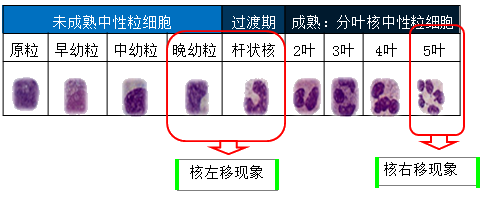

# 药学综合知识与技能
# 目录
[TOC]

# 第一章
## 第一节

怎么确定给药间隔：
1. 根据半衰期确定
2. 根据平均稳态血药浓度
3. 根据峰、谷浓度

`CSS`：平均稳态浓度

> 给药**剂量相同**，稳态血药浓度相同
>
> 给药**间隔不同**，血药浓度不同

治疗指数底：容易中毒，稍微过量，直接中毒

半衰期小于 30 分钟：
* 给药间隔
    * 治疗指数低
        * 一般静脉滴注
    * 治疗指数高
        * 一般 1~3 个

半衰期在 8~24 小时

特点：消除慢、长效

给药间隔：

+ 每个半衰期给药一次
+ 如果需要立即达到稳态，可首剂加倍

### 四、调整给药方案
#### 什么情况下需要调？
1. 治疗窗改变（药效改变）
2. 血药浓度 - 时间曲线改变（药时曲线）
3. 治疗窗与药时曲线改变
4. 红细胞 / 血红蛋白减少的意义3

1. 急性、慢性红细胞丢失过多

2. null

3. 红细胞破坏过多

   1. 红细胞内异常

      如：膜结构缺陷，酶活性缺失

   2. 红细胞外异常

      如：血清中存在红细胞抗体导致的自身免疫性溶血性贫血。

# 第七章 常见医学指标的解读

## 第一节 血常规检查

### 常见的检查项目

#### 三大常规

1. 血常规
2. 尿常规
3. 粪常规

#### 两大功能

1. 肝功能检查
2. 肾功能检查

#### 其它

1. 血生化
2. 两对半

### 血液的组成

1. 血浆
2. 血细胞
   1. 红细胞
   2. 白细胞
   3. 血小板

### 一、红细胞计数（RBC）

###### 正常参考区间

1. 新生儿： （6.0-7.0） ×1012/L
2. 婴儿： （5.2-7.0） ×1012/L
3. 儿童： （4.2-5.2） ×1012/L
4. 成人：
   1. 男：（4.0-5.5） ×1012/L
   2. 女：（3.5-5.0） ×1012/L

### 二、血红蛋白（Hb）

血红蛋白常被称为“血色素”，是组成红细胞的主要成分。

###### 正常参考区间

1. 女性：110-150g/L
2. 男性：120-160g/L
3. 新生儿：170～200g/L

### 三、红细胞/血红蛋白的临床意义

#### 红细胞/血红蛋白与贫血的关系

贫血：即RBC及Hb减少。

贫血的程度主要取决于血红蛋白（Hb）。

###### 贫血按严重程度分类

1. 轻度贫血，Hb量＞90g/L且低于正常参考值下限；
2. 中度贫血，Hb量61～90g/L；
3. 重度贫血，Hb量31～60g/L；
4. 极重度贫血，Hb量＜30g/L。

#### 红细胞/血红蛋白增多的意义

1. 相对增多

   频繁呕吐、出汗过多，大面积烧伤等，由于大量失水使血浆减少，血液浓缩，血中各种有形成分包括红细胞相对增多，仅为一种暂时的现象。 

2. 代偿性和继发性增多

   长期缺氧，导致的红细胞增多。常继发于：慢性肺心病、肺气肿、高原病和肿瘤患者，可引起红细胞代偿性增生。

3. 真性红细胞增多

   为原因不明的慢性骨髓功能亢进，红细胞计数可达（7.0-12.0）×1012/L。 

#### 红细胞/血红蛋白减少的意义

1. 急性、慢性红细胞丢失过多

   常由各种原因的出血引起。如：消化道溃疡、痔疮、十二指肠钩虫病等。

2. 生成减少

   1. 红细胞生成减少：如：再生障碍性贫血； 骨髓病性贫血；巨幼细胞性贫血； 慢性病贫血； 肾性贫血。
   2. 血红蛋白生成减少：如：缺铁性贫血、 铁粒幼细胞性贫血、 铅中毒贫血、 珠蛋白合成障碍性贫血。

3. 红细胞破坏过多

   1. 红细胞内异常：如：膜结构缺陷，导致的遗传性球形红细胞增多症； 酶活性缺陷，导致的葡萄糖-6-磷酸脱氢酶缺陷等；珠蛋白肽链量改变及分子结构变异导致的血红蛋白病等
   2. 红细胞外异常：如：血清中存在红细胞抗体导致的自身免疫性溶血性贫血；机械性、化学性、物理性及生物因素、脾亢等原因导致红细胞破坏过多。

### 四、白细胞（WBC）

白细胞的使命：监视、识别、防御、攻击、修复。

#### 一、白细胞分类

1. 有粒白细胞
   1. 中性粒细胞
   2. 嗜酸性粒细胞
   3. 嗜碱性粒细胞
2. 无粒白细胞
   1. 单核细胞
   2. 淋巴细胞

#### 二、计数

白细胞计数：指单位体积血液中含的白细胞数目。

###### 正常参考区间（白细胞计数）

1. 成人末梢血：（4.0～10.0）×109/L
2. 成人静脉血：（3.5～10.0）×109/L
3. 新生儿：（15.0～20.0）×109/L
4. 6个月～2岁婴幼儿：（11.0～12.0）×109/L

###### 正常参考区间（白细胞分类计数）

1. 中性分叶核粒细胞（中性粒细胞）0.50～0.70（50%-70%）
2. 中性杆状核粒细胞0.01～0.06（1%～6%）
3. 嗜酸性粒细胞
   1. 成人0.01～0.05（1%～5%）
   2. 儿童0.005～0.05（0.5%～5%）
4. 嗜碱性粒细胞0～0.01（0%～1%）
5. 淋巴细胞0.20～0.40（20%～40%）
6. 单核细胞0.03～0.08（3%～8%）

#### 三、临床意义

##### 1. 中性粒细胞的临床意义

由于中性粒细胞在白细胞所占百分率高（50%～70%），因此它的数值增减是影响白细胞总数的关键。

###### 中性粒细胞增加的意义

1. 生理性
2. 病理性
   1. 急性感染和化脓性炎症
   2. 白血病、骨髓增殖性疾病及恶性肿瘤
   3. 中毒、急性大出血
   4. 严重的组织损伤及大量红细胞破坏 

###### 中性粒细胞减少的意义

1. 特殊感染
   1. 革兰阴性菌感染（伤寒、副伤寒）
   2. 结核分枝杆菌感染
   3. 病毒感染（风疹、肝炎、感冒）
   4. 寄生虫感染（疟疾）
2. 物理化学损害
3. 血液系统疾病
4. 过敏性休克、重度恶病质
5. 脾功能亢进和自身免疫性疾病

###### 中性粒细胞异常改变的意义

1. 核象变化

   1. 核左移现象

      1. 幼稚的：杆状核、晚幼粒细胞增加；
      2. 若白细胞总数不增高而核左移，常见于严重感染或患者机体抵抗力低下，如：中毒性休克等。

   2. 核右移现象

      1. 衰老的：五叶核粒细胞增多
      2. 超过5%提示骨髓功能减退；

      出现于如：败血症等急性重症细菌性感染；

      也可见于：应用抗代谢药（如：阿糖胞昔）

      

2. 毒性变化与退行性变化

   1. 中性粒细胞胞浆中可出现中毒颗粒，或胞浆内出现空泡，发生核膨胀或核固缩等变性。　　
   2. 提示严重感染或中毒。　

##### 2. 嗜酸性粒细胞的临床意义

1. 嗜酸性粒细胞——增多的意义
   1. 过敏、寄生虫。
   2. 药物：应用头孢拉定、头孢氨苄、头孢呋辛、头孢哌酮等抗生素等。
   3. 血液病：慢性粒细胞性白血病、嗜酸性粒细胞性白血病等。
2. 嗜酸性粒细胞减少
   1. 伤寒、副伤寒、大创伤。
   2. 长期用肾上腺皮质激素。

##### 3. 嗜碱性粒细胞的临床意义

略。

##### 4. 单核细胞的临床意义

1. 单核细胞增多的意义：

   可见于：结核、伤寒、亚急性细菌性心内膜炎。

##### 5. 淋巴细胞的临床意义

1. 淋巴细胞增多的意义

   1. 传染病（病毒、结核）
   2. 血液系统疾病（白血病）
   3. 其他 肾移植术后发生排斥反应时。

2. 淋巴细胞减少的意义

   多见于：

   1. 传染病的急性期
   2. 细胞免疫缺陷病（如艾滋病）
   3. 长期应用肾上腺皮质激素后
   4. 接触放射线

###### 长期应用肾上腺皮质激素对骨髓造血的影响

促进骨髓制造：红细胞、中性粒细胞、血小板；

抑制骨髓制造：其它血细胞（嗜酸、嗜碱性、淋巴）

### 五、血小板计数（PLT）

#### 一、简述

血小板是由骨髓巨核细胞产生的，每个巨核细胞可以产生2000～3000个血小板，生存期为8～11天，具有黏附、聚集、释放等多种功能。

###### 正常参考区间

（100～300）×109/L

###### 作用

1. 营养、维护、保持毛细血管壁的完整性；
2. 参与止血和凝血，促进血液凝固。

###### 生理止血过程

受损小血管收缩 $\Rightarrow$ 血小板血栓 $\Rightarrow$ 血液凝固

#### 二、临床意义

1. 血小板减少
   1. 血小板生成减少：造血功能损伤（再障、白血病）
   2. 血小板破坏过多：免疫性或继发性血小板减少性紫癜/脾亢/体外循环
   3. 血小板消耗过多：如弥漫性血管内凝血
   4. 血小板分布异常：脾肿大
   5. 药物中毒或过敏反应：磺胺类药
2. 血小板增多（略）

### 六、红细胞沉降率（血沉，ESR）

#### 一、简述

指红细胞在单位时间内沉降的距离。

###### 正常参考区间

1. 男性0～15mm/1h
2. 女性0～20mm/1h

#### 二、临床意义

1. 生理性增快

   见于：月经期、妊娠3个月以上至分娩后3周内。

2. 病理性增快

   1. 炎症
   2. 组织损伤及坏死
   3. 恶性肿瘤——是鉴别恶性和良性肿瘤的指标之一。
   4. 高球蛋白血症——其实还是炎症
   5. 贫血——贫血越严重，血沉增快越明显。　　
   6. 高胆固醇血症。