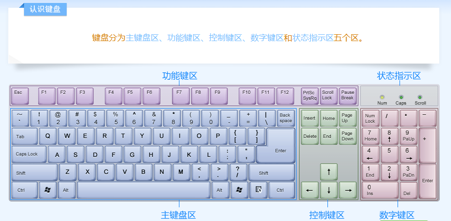

# 基础（死记硬背）

世界上第一台计算机：1946年，美国，用途：计算导弹路径

计算机发展表：

| 时代 | 年份 | 器件 | 软件 | 应用 |
| ---------- | ---------- | ---------- | ---------- | ---------- |
| 一 | 46-58 | 电子管 | 机器语言、汇编语言 | 科学计算 |
| 二 | 58-64 | 晶体管 | 高级语言 | 数据处理、工业控制 |
| 三 | 64-71 | 中小规模集成电路 | 操作系统 | 文字处理、图形处理 |
| 四 | 71迄今 | 大规模和超大规模集成电路 | 数据库、网站等 | 社会的各个领域 |

CPU(Central Processing Unit): 中央处理器

ROM(Read Only Memory): 只读存储器

RAM(Random Access Memory)：随机存取存储器

# 键盘分区

功能键区：

`Esc,F1~F12,PrintScreen,ScroolLock,Pause`

光标控制区：

`Up,Down,Left,Right,Insert,Delete,Home,End,PageUp,PageDown`

数字键区：

`1~9,NumLock,/,*,-,+,.,Enter`

字符键区：

`~,1~0,-,=,A~Z,{,},:,",<,>,?,Backspace,Tab,CapsLock,Shift,Ctrl,Windows,Alt,Menu,Enter,`

图示（图片来自金山打字通2016）：

# 快捷键

| 按键 | 功能 |
| :--------: | :--------: |
| Ctrl+A | 全选 |
| Ctrl+C | 复制 |
| Ctrl+V | 粘贴 |
| Ctrl+X | 剪切 |
| Ctrl+Z | 撤销上一次操作|

# 文件管理器

文件和文件夹的属性通常有三个：存档、只读、隐藏

# Word

格式刷：可以复制格式，将复制的格式应用到其他文字上。单击复制一次，双击复制多次。

