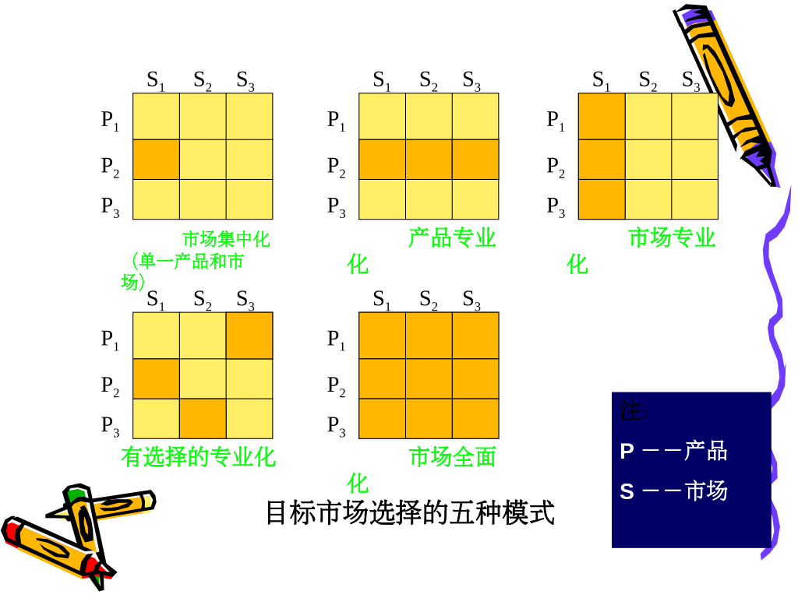

# 非处方药营销与应用
# 目录
[TOC]
# 第一章 市场营销概论
## 第一节 药品市场营销概述
## 第二节 企业市场观念选择
### 市场观念的类型
#### 黑店观念
企业在经营活动中无视国家法律、社会公德以及顾客和社会利益，甚至无视他人生命财产安全，不择手段牟取暴利的经营活动和指导思想。
##### 特点
1. 害人害己
2. 钻社会和法律空子，甚至不择手段
3. 短期行为，干一天算一天，捞一把是一把
##### 分类
1. “黑店”，即非法企业
2. “白店”，即合法企业

#### 产品观念（生产观念）

指企业不是通过需求分析开发相应的产品，而是把提高质量、降低成本作为一切活动的中心。以次扩大销售，取得利润这样一种经营指导思想。

##### 特点

以生产为中心

1. 重自身条件，轻市场需求
2. 重产品生产，轻销售
3. 重数量，也重产品质量

产品观念是生产观念的后期表现

#### 推销观念

企业维持生产已不受市场欢迎的产品，在此基础上强行销售，把强迫和引诱顾客购买作为一切活动的中心，以扩大销售，取得利润的经营指导思想。

#####  特点

1. 基本认识是：产品是卖出去的，而不是被买出去的
2. 以销售为中心
3. 重销售，轻产品开发、产品质量，忽视市场需求

企业目标是销售能够生产的东西而不是生产能够销售的东西。

#### 市场营销观念
指企业把满足顾客需要作为一切活动的中心，通过顾客的广泛购买和重复购买来扩大销售，取得利润这样一种经营指导思想。

##### 特点

1. 首先分析顾客需要，确定目标市场，然后通过产品设计开发，生产过程，促销和售后服务等整体营销活动满足目标市场需要
2. 具体表现为：“顾客需要什么，我们就生产什么”

以顾客为中心的观念

##### 四大支柱

1. 目标市场
2. 顾客满意
3. 整体营销
4. 盈利率

#### 社会营销观念

指企业以兼顾顾客眼前的利益和长远利益，顾客个人利益和社会整体利益为中心而开展一切活动，在取得顾客信任和社会好评的基础上扩大销售，增加利润这样一种经营指导思想。

##### 特点

1. 注重长远利益，兼顾眼前的利益
2. 以顾客和社会整体利益为中心
3. 注重、强调企业文化和对社会服务的价值观

#### 五种营销观念的异同

| 营销观念 | 营销观念     | 重点     | 方法         | 目标                                   |
| :------: | :----------: | :---     | :---         | :---                                   |
| 旧       | 生产观念     | 产品     | 提高生产效率 | 通过扩大销售量，增加利润               |
| 观       | 产品观念     | 产品     | 提高产品质量 | 通过扩大销售量，增加利润               |
| 念       | 推销观念     | 产品     | 加强推销     | 通过扩大销售量，增加利润               |
|----------|--------------|----------|--------------|----------------------------------------|
| 新       | 市场营销观念 | 市场需求 | 整体营销     | 通过满足消费者需要而获利               |
| 观       | 市场营销观念 | 企业利益 | 整体营销     | 通过满足消费者需要而获利               |
| 念       | 社会营销观念 | 市场需求 | 整体营销     | 通过满足消费者需要、增进社会福利而获利 |
|          | 社会营销观念 | 企业利益 | 整体营销     | 通过满足消费者需要、增进社会福利而获利 |
|          | 社会营销观念 | 社会利益 | 整体营销     | 通过满足消费者需要、增进社会福利而获利 |

### 企业内在性质与市场观念原初形态

企业内在本性：盈利性与安全性。

盈利性与安全性是对立统一的。

原初形态市场观念：从企业立场看，能够使自己在特定环境中安全地获取最大限度利润的观念。

#### 盈利性

1. 低投入原则
2. 高收益原则
3. 低机会成本原则

#### 安全性

1. 人身安全
2. 财产安全
3. 经营安全

### 市场环境压力类型与企业市场观念

不变的企业本性与变化的市场环境相结合就形成了不同类型的市场观念。

制约企业市场观念选择的市场环境因素可归纳为两项：

1. 法制健全程度
2. 科学技术和生产力发展水平

根据上述两项因素的状况不同，市场环境分为五种类型：

1. 完全无压环境
2. 压力环境
3. 低压环境
4. 高压环境
5. 完全压力环境

### 市场营销组合构成

产品、定价、分销、促销

## 第三节 顾客让渡价值和顾客满意

### 顾客让渡价值

顾客让渡价值：指总顾客价值与总顾客成本之间的差额。

总顾客价值：指顾客期望从某一特定产品或服务中得到的一系列利益。

1. 产品价值
2. 服务价值
3. 人员价值
4. 形象价值

总顾客成本：指顾客在购买某一特定产品或服务时所花费的一组成本。

1. 货币成本
2. 时间成本
3. 精力成本
4. 体力成本

### 顾客满意

#### 4C理论

1. 顾客（ Customer ）
2. 成本（ Cost ）
3. 便利（ Convenience ）
4. 沟通（ Communication ）

#### 4R理论

1. 关系（ Relationship ）
2. 节省（ Retrenchment ）
3. 关联（ Relevancy ）
4. 报酬（ Reward ）

#### CS理论

客户满意（ Customer Satisfaction ）：是消费者通过对一种产品的可感知的效果于他的期望值相比较后，所形成的愉悦或失望的感觉状态。

$CS=f(PV, AV)$

CS：顾客满意

PV：顾客预期价值

AV：顾客认知价值

### 客户关系管理（CRM）

客户关系管理（Customer Relationship Management）：是企业以提高核心竞争力为直接目的，确立以客户为导向的发展战略，并在此基础上展开包括评估、选择、开发、发展和保持客户关系的整个商业过程。

CRM是一种战略

CRM是一种经营管理模式

CRM是一种应用系统、方法和手段的综合

#### 客户关系管理（CRM）系统的主要功能

1. 客户联系人管理
2. 销售人员时间管理
3. 客户信息管理
4. 潜在客户管理
5. 客户服务管理
6. 电话营销和电话销售
7. 呼叫中心
8. 综合销售管理
9. 整合传播管理
10. 合作伙伴关系管理
11. 系统运营管理
12. 智能化图表管理

#### 成功实施CRM的关键因素

1. 确立合理可行的项目实施目标
2. 高层管理者的理解与支持
3. 让业务驱动CRM项目的实施
4. 有效控制变更管理
5. 项目实施组织机构的建立
6. 软件供应商及实施伙伴的选择

## 第四节 前沿理论

### 4P理论

**以满足市场需求为目标**

1. 产品（Product）

   注重开发的功能，要求产品有独特的**卖点**，把产品的功能诉求放在第一位。

2. 价格（Price）

   根据不同的市场定位，制定不同的价格策略，产品的定价依据是企业的**品牌战略**，注重品牌的含金量。 

3. 渠道（Place）

    企业并不直接面对消费者，而是注重经销商的培育和**销售网络**的建立，企业与消费者的联系是通过**分销商**来进行的。 

4. 促销（Promotion）

   企业注重销售行为的改变来**刺激消费者**，以短期的行为（如让利，买一送一，营销现场气氛等等）促成消费的增长，吸引其他品牌的消费者或导致提前消费来促进销售的增长。 

### 7P理论：服务营销

4P+人员(people)+有形展示(physical evidence)+过程(process)

### 6P理论：大市场营销理论

1984年，菲利普-科特勒提出的。

4P+政治力量(political power)+公共关系(public relation)

### 10P理论：战略性营销

1986年6月30日，科特勒在我国对外经贸大学演讲中提出。

6P+探查(probing)+划分(partitioning)+优先(prioritizing)+定位(positioning)

### 4C理论：以追求顾客满意为目标

由美国营销专家劳特朋教授在1990年提出

1. 消费者(Consumer)
2. 成本(Cost)
3. 便利(Convenience)
4. 沟通(Communication)

### 4R理论：以建立顾客忠诚为目标

21世纪初，《4R营销》的作者艾略特·艾登伯格提出4R营销理论。

4R理论以关系营销为核心，重在建立顾客忠诚。

1. 关联(Relativity)：企业与顾客在市场变化的动态中应建立长久互动的关系。
2. 反应(Reaction)：学会倾听顾客的意见，及时寻找、发现和挖掘顾客的渴望与不满，建立快速反应机制以对市场变化快速作出反应。
3. 关系(Relation)：企业与顾客之间应建立长期而稳定的朋友关系，从实现销售转变为实现对顾客的责任与承诺，以维持顾客再次购买和顾客忠诚。
4. 回报(Retribution)：追求市场回报，并将市场回报当作企业进一步发展和保持与市场建立关系的动力与源泉。

### 直复营销：direct marketing

世界直销联盟、美国直销协会和美国直销教育基金会对“无店铺销售”的共同定义是：

**无店铺销售**：不通过零售商的固定店面而从事销售商品及服务给最终消费者的商业活动

**直复营销**：消费者通过非人员的媒体接触商品或服务后，其订货和购买是通过邮电、电话、电脑及其它科技媒体来完成的销售方式，有人也把“直复营销”翻译成“直效行销”。

**人员直销**

**自动销售**

类型：目录营销、直邮营销、电话营销、电视营销、网络营销。 

### 红海与蓝海

#### 红海策略-以竞争为中心

竞争力=价值/成本

结果：薄利、微利、奈利

#### 蓝海策略-以创新为中心

关键：通过创新，消费者利益最大化

途径：创造有效的新需求；进行有价值的差异化；策略定价模式；选择性降低成本。

# 第二章 市场分析

## 第一节 市场营销环境分析

### 市场营销环境含义及其构成

**市场营销环境**：是指影响企业市场营销活动的不可控制的各种参与者和影响力 ，包括宏观市场营销环境和微观市场营销环境 。

### 市场营销环境的特点

宏观营销环境对企业的影响通常是**间接的**，微观环境的影响是**直接的**。

客观性、差异性、多变性、相关性 

### 宏观环境

作用于微观营销环境，并因而造成市场机会或构成环境威胁的主要社会力量。

#### 中国市场环境的特点

1. **大**：地域辽阔;前景巨大;赚钱的天堂。 
2. **变**：发展快;变化快;政策多变;法规不健全。 
3. **乱**：市场秩序混乱;假冒侵权严重;反常怪事多;信誉(商业伦理)严重缺乏。 
4. **燥**：短期导向;大起大落;过度竞争。 
5. **异**：区域差异;体制差异;行业差异；营销水平差异;世代差异都很显著。

### 微观环境

#### 一、供应商

是向企业及其竞争者提供生产经营所必须的原材料、零部件、能源、劳动力和资金等资源的企业或个人。

供应商这一环境因素对企业的营销活动有着重大的影响。供应商提供资源的价格、品种以及交货期，直接制约着公司产品的成本、利润、销售量及生产进度安排。因此，企业既要与主要的供应商建立长期的信用关系，又要避免资源来源的单一化，受制于人。 

#### 二、营销中介

是指为企业推销产品、提供各种便利营销服务的企业和个人。

1. 中间商。如经销商、代理商、批发商、零售商。
2. 物流机构。包括仓储，运输，配送，加工的实体和个人。
3. 营销服务机构：是提供促销服务的各类调研公司、广告公司、传播媒介公司、咨询公司等。
4. 金融服务机构：是提供信贷和资金融通的各类金融中介机构，如银行、保险公司、信托投资公司等。

#### 三、顾客

1. 消费者市场：个人和家庭购买商品及劳务以供个人消费。
2. 产业市场：组织机构购买产品与劳务，供生产其他产品及劳务所用，以达到赢利或其他的目的。
3. 中间商市场：组织机构购买产品及劳务用以转售，从中赢利。
4. 政府市场：政府机构组织购买产品及劳务以提供公共服务或把这些产品及劳务转让给其他需要它们的人。
5. 国际市场：买主在国外，这些买主包括外国消费者、生产厂、转售商及政府。

#### 四、企业

企业内部各部门如生产部门、采购部门、研究与开发部门、财务部门、市场营销部门等等。企业内部各部门、各层次分工是否科学，协作是否和谐，有没有“人和”的气氛是企业营销活动的一个内在的、重要的因素。

#### 五、竞争者

在同一产品市场上，企业会面临许多竞争者，他们之间形成了不同的竞争关系。

对企业而言，消费者认识需求的过程即“目前我需要什么”可视为**第一种类型**的竞争者，称之为**愿望竞争者**。

消费者判定选择的过程“采取什么方法能满足这一欲望”可视为**第二种类型**竞争者，称之为**平行竞争者**。

消费者满足同一需求的产品中进一步选择某一类产品可视为**第三种类型**的竞争者，称之为**产品形式竞争者**。

消费者又会面临品牌的抉择可视为**第四种类型**竞争者，即**品牌竞争者**。

#### 六、公众

是指对一个组织实现其目标的能力有实际的或潜在的兴趣或影响的任何团体。包括七个方面：

1. 融资公众
2. 媒介公众
3. 政府公众
4. 群众团体
5. 当地公众
6. 一般公众
7. 内部公众

## 第二节 消费者市场分析

### 消费者市场的含义和特点

#### 消费者市场的含义

消费者市场是指为了生活消费而购买产品或服务的个人或家庭。

一切企业，无论是生产企业还是服务企业或商业企业，也无论是否直接为消费者服务，都必须研究消费者市场，因为只有消费者市场才是商品的最终归宿，即最终市场。从这个意义上，可以说，**消费者市场是一切市场的基础，是最终起决定作用的市场。** 

## 第三节 竞争者分析

### 竞争者识别

企业可以从行业和市场两个方面识别自己的竞争对手。从行业和市场来看，企业有四个层次的竞争者：

1. **通常竞争者/一般竞争者**：争取同一消费者钱的消费项目
2. **形式竞争者**：所有制造能提供相同服务的产品的公司
3. **行业竞争者**：制造同业或同类产品的公司
4. **品牌竞争者**：以相似的价格向相同的顾客提供类似产品或服务

企业要树立“大竞争者观念”。不仅要密切关注行业内的竞争者，还要注意行业外的竞争者；不仅要注意现实竞争者的动向，还要提防潜在竞争者的威胁。

### 竞争者分析

| 你能看到的现象     | 产品/服务、价格、渠道、广告促销                              |
| ------------------ | :----------------------------------------------------------- |
| 你能分析的结论     | 产品的差异性、整体产品价格政策、成本结构销售模式、主要卖点   |
| 你想知道的核心内容 | 对手的经营战略和目标、目标客户群和竞争优势、下一步的行动方案 |

### 竞争分析的层次和目标

分为6步

1. 找出谁是竞争对手
2. 描述竞争对手的状况
3. 分析竞争对手的状况
4. 掌握竞争对手的方向
5. 洞悉竞争对手的战略意图
6. 引导竞争对手的行动和战略

### 判定竞争者的目标和战略

#### 一、判定竞争者的目标

虽然每个竞争者的最终目标都是获得利润，但不同竞争者为实现最终目标所制定的子目标组合和侧重点不同。

了解竞争者的目标可以判断他们对不同竞争行为的反应。

#### 二、判定竞争者的战略

**战略**：愿景、使命、价值观

竞争战略可以概括为三种类型：总成本领先战略、差异化战略和集中化战略。

了解竞争者的战略有助于企业扬长避短地制定或调整自己的战略。

### 评估竞争者的实力和反应

#### 评估竞争者的优势和劣势

对竞争者的优势和劣势的评估基于收集和分析竞争者在以下方面的最新数据：销售量、市场份额、利润率、投资回报率、心理份额、情感份额、现金流量、新投资等。

评估竞争者的优势和劣势能够使企业更好的扬长避短，利用竞争者的弱点来取得竞争优势，避免在竞争者的优势领域与之交锋。

#### 评估竞争者的反应模式

1. 从容不迫型竞争者
2. 选择型竞争者
3. 凶狠型竞争者
4. 随机型竞争者

掌握竞争者的反应模式有助于企业选择最佳的进攻类型，以及遇见竞争者对本企业的营销策略可能做出的反应。

### 确定竞争对象和战略原则

#### 确定攻击对象和回避对象

企业要攻击的竞争者有三种类型：

1. 强竞争者或弱竞争者
2. 近竞争者或远竞争者
3. 循规蹈矩的竞争者与破坏性的竞争者

#### 市场竞争的战略原则

1. 创新致胜
2. 优质致胜
3. 廉价致胜
4. 技术致胜
5. 服务致胜
6. 速度致胜
7. 宣传致胜

# 第三章 企业战略计划与市场营销管理过程

## 第一节 企业战略

### 企业战略的含义和构成

企业战略：是指企业为了实现预定目标所作的全盘考虑和统筹安排。

一般认为企业战略由五个因素构成：

1. 业务范围
2. 目的目标
3. 资源配置
4. 可持续竞争优势
5. 合力增效

### 企业战略的特征

1. 全局性
2. 长远性
3. 纲领性
4. 抗争性

### 企业战略的层次结构

1. 公司战略
2. 经营单位战略
3. 职能战略

## 第二节 企业战略计划过程

### 界定企业使命

#### 企业使命的界定方法

使命是企业的总体发展目标。企业使命可以通过回答下列问题来界定：

1. What is our business?
2. Who are our customers?
3. What kinds of value can we provide to these customers?
4. What should our business be in the future?

#### 使命说明书

使命必须以文字的形式确定下来，形成使命说明书。

使命说明书的基本要素：

1. 远景目标
2. 活动领域
3. 政策和价值观（经营理念）

### 划分战略经营单位

#### 战略经营单位

是指在市场、技术等方面不同于其他业务，使企业必须为其专门制定一套战略的业务项目。

#### 经营单位的主要特点

1. 有独立的业务
2. 有自己的竞争者
3. 掌握一定的资源
4. 有自己的管理班子

#### 在界定经营单位的业务时，必须注意

1. 以市场需求为导向，而不要以产品为导向
2. 业务切实可行，而不要过宽或过窄

## 第三节 市场营销管理过程

**市场营销管理过程**：是企业为实现使命和目标而寻找、分析、选择和利用市场机会的过程，包括寻找和分析市场机会、选择目标市场、设计市场营销组合、管理市场营销活动。

### 寻找和分析市场机会

收集市场信息：报纸、展销会、竞争者的产品、献计献策会、消费者的需要等。

分析市场机会：

1. 市场机会与企业的使命目标是否一致
2. 企业有无利用市场机会的资源条件
3. 是否有利于发挥企业的差别优势

### 选择目标市场

1. 细分市场
2. 选择目标市场

### 设计市场营销组合

1. 市场营销组合
2. 大市场营销
3. 4C理论
4. 4R理论

### 管理市场营销活动

1. 营销战略、战术的规划
2. 营销计划的制定
   1. 营销计划一旦制定，企业必须执行计划，并对执行过程加以控制，以确保计划得到落实和完成。

# 第四章 目标市场战略

## 第一节 市场细分概论

#### 市场营销策略的演变

1. 大量营销阶段
2. 差异化营销阶段
3. 目标市场营销阶段

#### 市场细分的作用

1. 分析市场时机，开拓新市场
2. 集中企业资源，投入目标市场
3. 有利于企业制定适当的营销策略

## 第二节 市场细分的标准、原则及程序

#### 市场细分的标准

1. 地理细分
   1. 根据消费者工作和居住的地理位置把市场分成不同的地理区域
2. 人口统计细分
   1. 按年龄、性别、家庭人数、家庭生命周期、收入、职业、教育、宗教、社会阶层、民族和国籍等
3. 心理细分
   1. 构成消费者心理的因素，如社会阶层、生活方式、个性等。
4. 行为细分
   1. 购买时机
      1. 节假日
      2. 寒暑假
   2. 寻求利益
   3. 使用状况
      1. 从未使用过
      2. 曾经使用过
      3. 准备使用
      4. 初次使用
      5. 经常使用
   4. 使用频率
   5. 忠诚程度
      1. 对企业的忠诚
      2. 对品牌的忠诚
   6. 待购阶段
   7. 态度
      1. 态度一般分为五种：热爱、肯定、冷淡、拒绝、敌意

#### 市场细分的原则

+ 可衡量性：规模和购买力可衡量程度的大小
+ 可接近性：有效达到细分市场并为止有效服务的程度
+ 有效性：细分市场要有适当的规模和发展潜力

#### 市场细分程序

1. 确定产品市场范围
2. 列举出潜在顾客的基本需求
3. 分析潜在顾客的不同需求
4. 剔除潜在顾客的共同需求
5. 为不同的细分市场暂定称谓
6. 进一步认识各细分市场的特点
7. 测量各细分市场规模

## 第三节 目标市场的选择

### 评估细分市场

目标市场是企业营销活动所需要满足的市场，是企业为了实现预期目标而要进入的市场。

选择目标市场的条件：

+ 适当的规模和发展潜力-市场
+ 公司的目标和资源-公司
+ 市场的吸引力-竞争

#### 竞争环境分析

+ 同行业的竞争者
+ 潜在的竞争者
+ 替代产品
+ 购买者的讨价还价能力
+ 供应商的讨价还价能力

### 目标市场范围策略

产品 / 市场矩阵——按不同的顾客需要（以不同的产品来表示）和不同的顾客群（以不同的市场部分来表示）：

1. 产品 / 市场集中
2. 产品专业化
3. 市场专业化
4. 选择性的专业化
5. 目标市场包括整个市场

### 目标市场营销策略

#### 目标市场营销覆盖战略

##### 无差异的营销战略

1. 需求和期望基本一致的产品，如高科技、工业产品
2. 高档奢侈用品
3. 功能性强的产品
4. 具有来源国（地）效应的产品

##### 差异化的营销战略

##### 集中性的营销战略

##### 优缺点

###### 无差异营销战略

以整个市场中的共性部分为目标，不管细分部分的差异性，只求满足最大多数的顾客的共同性需要。产品和营销方案都是针对大多数顾客，为的是获取规模经济效益。

优点：大量营销，品种少批量大，可节省费用，降低成本，提高利润率。

缺点：当同一个市场有许多企业采用此战略，竞争激化，获利的机会不多，对实力不强的小企业来说，难于取得成功；单一的产品和单一营销方案很难覆盖所有客户群，也难于让客户满意。

###### 差异营销战略

在市场细分的基础上，选择多个子市场作为目标，针对每个目标市场，分别设计不同的产品和营销方案。

优点：有的放矢，可满足多种需要，扩大销量，提高市场占有率。

缺点：增加产品设计、管理、仓储和促销等方面的费用和成本，从而使营销成本增高，利润较少，甚至得不偿失。

###### 集中性的营销战略

选择一个或几个子市场作为目标，指定一套营销方案，集中力量争取在这些子市场上占有大量的份额，而不是在整个市场上占有小份额。

此战略适用于视图在某个方面获取绝对优势的企业，或资源有限，实力不强的专业化小公司。

优点：可较深入了解目标市场的需要，便于专业化经营，节省费用，降低成本，增加整体盈利能力。

缺点：目标过分集中，市场的变化或竞争者的介入，存在市场风险。

#### 选择市场覆盖战略的依据

+ 企业的资源
+ 产品的情况
+ 市场的情况
+ 竞争者的战略
+ 产品生命周期
+ 市场竞争状况
+ 营销的宏观调整

##### 企业的资源

差异营销或无差异营销战略：适合大企业或资源、实力雄厚的企业。

集中营销战略：适合实力不强、资源有限的公司，或小型专业化公司。

##### 产品的情况

###### 产品本身差异性的大小

差异性小：差异或无差异营销

###### 产品所处的产品生命周期阶段

导入和成长期：无差异营销或集中营销

成熟期：差异化营销

##### 市场的情况

同质市场：无差异营销

不同质市场：差异营销

产品同质：差异营销或集中营销

##### 竞争者的战略

| 竞争对手战略 | 己方应对措施       |
| ------------ | ------------------ |
| 无差异营销   | 差异化营销         |
| 差异化营销   | 更深层次的差异营销 |

##### 产品生命周期

产品在市场上可以保持一定时间的领先，以获得足够的利润。

##### 市场竞争状况

竞争者还未完全控制市场，或本企业有一定的优势进入该产品市场。

##### 营销的宏观环境

+ 市场有一定的购买力，经济社会发展相对稳定情况。
+ 国家的宏观政策、通货膨胀或收缩，国民经济发展的持续性和稳定性。

## 第四节 市场定位