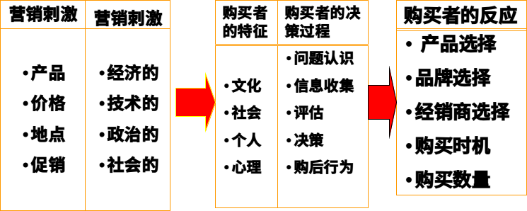
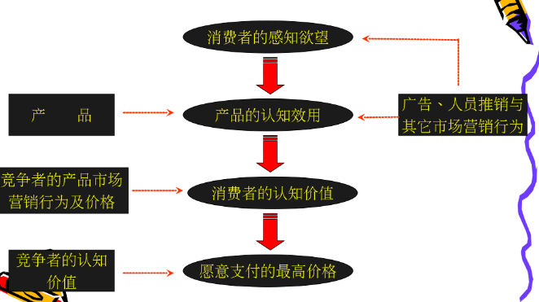
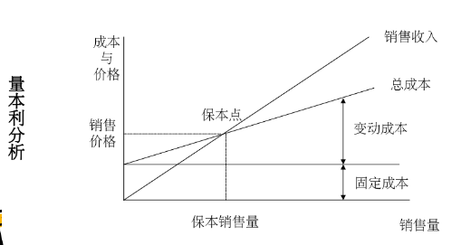

# 非处方药营销与应用
# 目录
[TOC]
# 第一章 市场营销概论
## 第一节 药品市场营销概述
## 第二节 企业市场观念选择
### 市场观念的类型
#### 黑店观念
企业在经营活动中无视国家法律、社会公德以及顾客和社会利益，甚至无视他人生命财产安全，不择手段牟取暴利的经营活动和指导思想。
##### 特点
1. 害人害己
2. 钻社会和法律空子，甚至不择手段
3. 短期行为，干一天算一天，捞一把是一把
##### 分类
1. “黑店”，即非法企业
2. “白店”，即合法企业

#### 产品观念（生产观念）

指企业不是通过需求分析开发相应的产品，而是把提高质量、降低成本作为一切活动的中心。以次扩大销售，取得利润这样一种经营指导思想。

##### 特点

以生产为中心

1. 重自身条件，轻市场需求
2. 重产品生产，轻销售
3. 重数量，也重产品质量

产品观念是生产观念的后期表现

#### 推销观念

企业维持生产已不受市场欢迎的产品，在此基础上强行销售，把强迫和引诱顾客购买作为一切活动的中心，以扩大销售，取得利润的经营指导思想。

##### 特点

1. 基本认识是：产品是卖出去的，而不是被买出去的
2. 以销售为中心
3. 重销售，轻产品开发、产品质量，忽视市场需求

企业目标是销售能够生产的东西而不是生产能够销售的东西。

#### 市场营销观念
指企业把满足顾客需要作为一切活动的中心，通过顾客的广泛购买和重复购买来扩大销售，取得利润这样一种经营指导思想。

##### 特点

1. 首先分析顾客需要，确定目标市场，然后通过产品设计开发，生产过程，促销和售后服务等整体营销活动满足目标市场需要
2. 具体表现为：“顾客需要什么，我们就生产什么”

以顾客为中心的观念

##### 四大支柱

1. 目标市场
2. 顾客满意
3. 整体营销
4. 盈利率

#### 社会营销观念

指企业以兼顾顾客眼前的利益和长远利益，顾客个人利益和社会整体利益为中心而开展一切活动，在取得顾客信任和社会好评的基础上扩大销售，增加利润这样一种经营指导思想。

##### 特点

1. 注重长远利益，兼顾眼前的利益
2. 以顾客和社会整体利益为中心
3. 注重、强调企业文化和对社会服务的价值观

#### 五种营销观念的异同

| 营销观念 | 营销观念     | 重点     | 方法         | 目标                                   |
| :------: | :----------: | :---     | :---         | :---                                   |
| 旧       | 生产观念     | 产品     | 提高生产效率 | 通过扩大销售量，增加利润               |
| 观       | 产品观念     | 产品     | 提高产品质量 | 通过扩大销售量，增加利润               |
| 念       | 推销观念     | 产品     | 加强推销     | 通过扩大销售量，增加利润               |
|----------|--------------|----------|--------------|----------------------------------------|
| 新       | 市场营销观念 | 市场需求 | 整体营销     | 通过满足消费者需要而获利               |
| 观       | 市场营销观念 | 企业利益 | 整体营销     | 通过满足消费者需要而获利               |
| 念       | 社会营销观念 | 市场需求 | 整体营销     | 通过满足消费者需要、增进社会福利而获利 |
|          | 社会营销观念 | 企业利益 | 整体营销     | 通过满足消费者需要、增进社会福利而获利 |
|          | 社会营销观念 | 社会利益 | 整体营销     | 通过满足消费者需要、增进社会福利而获利 |

### 企业内在性质与市场观念原初形态

企业内在本性：盈利性与安全性。

盈利性与安全性是对立统一的。

原初形态市场观念：从企业立场看，能够使自己在特定环境中安全地获取最大限度利润的观念。

#### 盈利性

1. 低投入原则
2. 高收益原则
3. 低机会成本原则

#### 安全性

1. 人身安全
2. 财产安全
3. 经营安全

### 市场环境压力类型与企业市场观念

不变的企业本性与变化的市场环境相结合就形成了不同类型的市场观念。

制约企业市场观念选择的市场环境因素可归纳为两项：

1. 法制健全程度
2. 科学技术和生产力发展水平

根据上述两项因素的状况不同，市场环境分为五种类型：

1. 完全无压环境
2. 压力环境
3. 低压环境
4. 高压环境
5. 完全压力环境

### 市场营销组合构成

产品、定价、分销、促销

## 第三节 顾客让渡价值和顾客满意

### 顾客让渡价值

顾客让渡价值：指总顾客价值与总顾客成本之间的差额。

总顾客价值：指顾客期望从某一特定产品或服务中得到的一系列利益。

1. 产品价值
2. 服务价值
3. 人员价值
4. 形象价值

总顾客成本：指顾客在购买某一特定产品或服务时所花费的一组成本。

1. 货币成本
2. 时间成本
3. 精力成本
4. 体力成本

### 顾客满意

#### 4C理论

1. 顾客（ Customer ）
2. 成本（ Cost ）
3. 便利（ Convenience ）
4. 沟通（ Communication ）

#### 4R理论

1. 关系（ Relationship ）
2. 节省（ Retrenchment ）
3. 关联（ Relevancy ）
4. 报酬（ Reward ）

#### CS理论

客户满意（ Customer Satisfaction ）：是消费者通过对一种产品的可感知的效果于他的期望值相比较后，所形成的愉悦或失望的感觉状态。

$CS=f(PV, AV)$

CS：顾客满意

PV：顾客预期价值

AV：顾客认知价值

### 客户关系管理（CRM）

客户关系管理（Customer Relationship Management）：是企业以提高核心竞争力为直接目的，确立以客户为导向的发展战略，并在此基础上展开包括评估、选择、开发、发展和保持客户关系的整个商业过程。

CRM是一种战略

CRM是一种经营管理模式

CRM是一种应用系统、方法和手段的综合

#### 客户关系管理（CRM）系统的主要功能

1. 客户联系人管理
2. 销售人员时间管理
3. 客户信息管理
4. 潜在客户管理
5. 客户服务管理
6. 电话营销和电话销售
7. 呼叫中心
8. 综合销售管理
9. 整合传播管理
10. 合作伙伴关系管理
11. 系统运营管理
12. 智能化图表管理

#### 成功实施CRM的关键因素

1. 确立合理可行的项目实施目标
2. 高层管理者的理解与支持
3. 让业务驱动CRM项目的实施
4. 有效控制变更管理
5. 项目实施组织机构的建立
6. 软件供应商及实施伙伴的选择

## 第四节 前沿理论

### 4P理论

**以满足市场需求为目标**

1. 产品（Product）

   注重开发的功能，要求产品有独特的**卖点**，把产品的功能诉求放在第一位。

2. 价格（Price）

   根据不同的市场定位，制定不同的价格策略，产品的定价依据是企业的**品牌战略**，注重品牌的含金量。 

3. 渠道（Place）

    企业并不直接面对消费者，而是注重经销商的培育和**销售网络**的建立，企业与消费者的联系是通过**分销商**来进行的。 

4. 促销（Promotion）

   企业注重销售行为的改变来**刺激消费者**，以短期的行为（如让利，买一送一，营销现场气氛等等）促成消费的增长，吸引其他品牌的消费者或导致提前消费来促进销售的增长。 

### 7P理论：服务营销

4P+人员(people)+有形展示(physical evidence)+过程(process)

### 6P理论：大市场营销理论

1984年，菲利普-科特勒提出的。

4P+政治力量(political power)+公共关系(public relation)

### 10P理论：战略性营销

1986年6月30日，科特勒在我国对外经贸大学演讲中提出。

6P+探查(probing)+划分(partitioning)+优先(prioritizing)+定位(positioning)

### 4C理论：以追求顾客满意为目标

由美国营销专家劳特朋教授在1990年提出

1. 消费者(Consumer)
2. 成本(Cost)
3. 便利(Convenience)
4. 沟通(Communication)

### 4R理论：以建立顾客忠诚为目标

21世纪初，《4R营销》的作者艾略特·艾登伯格提出4R营销理论。

4R理论以关系营销为核心，重在建立顾客忠诚。

1. 关联(Relativity)：企业与顾客在市场变化的动态中应建立长久互动的关系。
2. 反应(Reaction)：学会倾听顾客的意见，及时寻找、发现和挖掘顾客的渴望与不满，建立快速反应机制以对市场变化快速作出反应。
3. 关系(Relation)：企业与顾客之间应建立长期而稳定的朋友关系，从实现销售转变为实现对顾客的责任与承诺，以维持顾客再次购买和顾客忠诚。
4. 回报(Retribution)：追求市场回报，并将市场回报当作企业进一步发展和保持与市场建立关系的动力与源泉。

### 直复营销：direct marketing

世界直销联盟、美国直销协会和美国直销教育基金会对“无店铺销售”的共同定义是：

**无店铺销售**：不通过零售商的固定店面而从事销售商品及服务给最终消费者的商业活动

**直复营销**：消费者通过非人员的媒体接触商品或服务后，其订货和购买是通过邮电、电话、电脑及其它科技媒体来完成的销售方式，有人也把“直复营销”翻译成“直效行销”。

**人员直销**

**自动销售**

类型：目录营销、直邮营销、电话营销、电视营销、网络营销。 

### 红海与蓝海

#### 红海策略-以竞争为中心

竞争力=价值/成本

结果：薄利、微利、奈利

#### 蓝海策略-以创新为中心

关键：通过创新，消费者利益最大化

途径：创造有效的新需求；进行有价值的差异化；策略定价模式；选择性降低成本。

# 第二章 市场分析

## 第一节 市场营销环境分析

### 市场营销环境含义及其构成

**市场营销环境**：是指影响企业市场营销活动的不可控制的各种参与者和影响力 ，包括宏观市场营销环境和微观市场营销环境 。

### 市场营销环境的特点

宏观营销环境对企业的影响通常是**间接的**，微观环境的影响是**直接的**。

客观性、差异性、多变性、相关性 

### 宏观环境

作用于微观营销环境，并因而造成市场机会或构成环境威胁的主要社会力量。

#### 中国市场环境的特点

1. **大**：地域辽阔;前景巨大;赚钱的天堂。 
2. **变**：发展快;变化快;政策多变;法规不健全。 
3. **乱**：市场秩序混乱;假冒侵权严重;反常怪事多;信誉(商业伦理)严重缺乏。 
4. **燥**：短期导向;大起大落;过度竞争。 
5. **异**：区域差异;体制差异;行业差异；营销水平差异;世代差异都很显著。

### 微观环境

#### 一、供应商

是向企业及其竞争者提供生产经营所必须的原材料、零部件、能源、劳动力和资金等资源的企业或个人。

供应商这一环境因素对企业的营销活动有着重大的影响。供应商提供资源的价格、品种以及交货期，直接制约着公司产品的成本、利润、销售量及生产进度安排。因此，企业既要与主要的供应商建立长期的信用关系，又要避免资源来源的单一化，受制于人。 

#### 二、营销中介

是指为企业推销产品、提供各种便利营销服务的企业和个人。

1. 中间商。如经销商、代理商、批发商、零售商。
2. 物流机构。包括仓储，运输，配送，加工的实体和个人。
3. 营销服务机构：是提供促销服务的各类调研公司、广告公司、传播媒介公司、咨询公司等。
4. 金融服务机构：是提供信贷和资金融通的各类金融中介机构，如银行、保险公司、信托投资公司等。

#### 三、顾客

1. 消费者市场：个人和家庭购买商品及劳务以供个人消费。
2. 产业市场：组织机构购买产品与劳务，供生产其他产品及劳务所用，以达到赢利或其他的目的。
3. 中间商市场：组织机构购买产品及劳务用以转售，从中赢利。
4. 政府市场：政府机构组织购买产品及劳务以提供公共服务或把这些产品及劳务转让给其他需要它们的人。
5. 国际市场：买主在国外，这些买主包括外国消费者、生产厂、转售商及政府。

#### 四、企业

企业内部各部门如生产部门、采购部门、研究与开发部门、财务部门、市场营销部门等等。企业内部各部门、各层次分工是否科学，协作是否和谐，有没有“人和”的气氛是企业营销活动的一个内在的、重要的因素。

#### 五、竞争者

在同一产品市场上，企业会面临许多竞争者，他们之间形成了不同的竞争关系。

对企业而言，消费者认识需求的过程即“目前我需要什么”可视为**第一种类型**的竞争者，称之为**愿望竞争者**。

消费者判定选择的过程“采取什么方法能满足这一欲望”可视为**第二种类型**竞争者，称之为**平行竞争者**。

消费者满足同一需求的产品中进一步选择某一类产品可视为**第三种类型**的竞争者，称之为**产品形式竞争者**。

消费者又会面临品牌的抉择可视为**第四种类型**竞争者，即**品牌竞争者**。

#### 六、公众

是指对一个组织实现其目标的能力有实际的或潜在的兴趣或影响的任何团体。包括七个方面：

1. 融资公众
2. 媒介公众
3. 政府公众
4. 群众团体
5. 当地公众
6. 一般公众
7. 内部公众

## 第二节 消费者市场分析

### 消费者市场的含义和特点

#### 消费者市场的含义

消费者市场是指为了生活消费而购买产品或服务的个人或家庭。

一切企业，无论是生产企业还是服务企业或商业企业，也无论是否直接为消费者服务，都必须研究消费者市场，因为只有消费者市场才是商品的最终归宿，即最终市场。从这个意义上，可以说，**消费者市场是一切市场的基础，是最终起决定作用的市场。** 

#### 消费者市场的特点

1. 人数众多，分布广泛
2. 单次购买量小，购买频繁
3. 需求复杂多样
4. 购买的非专业性
5. 购买力的分散性

### 消费者购买行为模式

#### 外界刺激与消费者反应模式

### 影响消费者购买行为的因素

+ 文化因素
  + 文化
  + 亚文化
  + 社会阶层
+ 社会因素
  + 相关群体
  + 家庭
  + 身份与地位
+ 个人因素
  + 经济
  + 生理
  + 个性
  + 生活方式
+ 心理因素
  + 动机
  + 知觉
  + 学习
  + 信念与态度

#### 文化因素

文化：文化是人类欲望和行为最基本的决定因素。

亚文化：每一文化都包含较小的亚文化群体。这些亚文化群体为其成员提供更为具体的认同感。亚文化群体包括民族群体、宗教群体、种族团队和地理区域。

社会阶层：社会阶层是在一个社会中具有相对的同质性和持久性的群体，它们是按等级排列的，每一阶层成员具有类似的价值观、兴趣爱好和行为方式。社会阶层的几个特点

社会阶层的几个特点：

1. 同一社会阶层内的人，其行为要比来自两个不同社会阶层的人行为更加相似。
2. 人们以自己所处的社会阶层来判断各自在社会中占有的高低地位。
3. 某人所处的社会阶层并非由一个变量决定，而是受到职业、所得、财富、教育和价值观等多种变量的制约。
4. 个人能够在一生中改变自己所处的阶层，既可以向高阶层迈进，也可以跌至低阶层。但是，这种变化的变动程度因某一社会的层次森严程度不同而不同。 

## 第三节 竞争者分析

### 竞争者识别

企业可以从行业和市场两个方面识别自己的竞争对手。从行业和市场来看，企业有四个层次的竞争者：

1. **通常竞争者/一般竞争者**：争取同一消费者钱的消费项目
2. **形式竞争者**：所有制造能提供相同服务的产品的公司
3. **行业竞争者**：制造同业或同类产品的公司
4. **品牌竞争者**：以相似的价格向相同的顾客提供类似产品或服务

企业要树立“大竞争者观念”。不仅要密切关注行业内的竞争者，还要注意行业外的竞争者；不仅要注意现实竞争者的动向，还要提防潜在竞争者的威胁。

### 竞争者分析

| 你能看到的现象     | 产品/服务、价格、渠道、广告促销                              |
| ------------------ | :----------------------------------------------------------- |
| 你能分析的结论     | 产品的差异性、整体产品价格政策、成本结构销售模式、主要卖点   |
| 你想知道的核心内容 | 对手的经营战略和目标、目标客户群和竞争优势、下一步的行动方案 |

### 竞争分析的层次和目标

分为6步

1. 找出谁是竞争对手
2. 描述竞争对手的状况
3. 分析竞争对手的状况
4. 掌握竞争对手的方向
5. 洞悉竞争对手的战略意图
6. 引导竞争对手的行动和战略

### 判定竞争者的目标和战略

#### 一、判定竞争者的目标

虽然每个竞争者的最终目标都是获得利润，但不同竞争者为实现最终目标所制定的子目标组合和侧重点不同。

了解竞争者的目标可以判断他们对不同竞争行为的反应。

#### 二、判定竞争者的战略

**战略**：愿景、使命、价值观

竞争战略可以概括为三种类型：总成本领先战略、差异化战略和集中化战略。

了解竞争者的战略有助于企业扬长避短地制定或调整自己的战略。

### 评估竞争者的实力和反应

#### 评估竞争者的优势和劣势

对竞争者的优势和劣势的评估基于收集和分析竞争者在以下方面的最新数据：销售量、市场份额、利润率、投资回报率、心理份额、情感份额、现金流量、新投资等。

评估竞争者的优势和劣势能够使企业更好的扬长避短，利用竞争者的弱点来取得竞争优势，避免在竞争者的优势领域与之交锋。

#### 评估竞争者的反应模式

1. 从容不迫型竞争者
2. 选择型竞争者
3. 凶狠型竞争者
4. 随机型竞争者

掌握竞争者的反应模式有助于企业选择最佳的进攻类型，以及遇见竞争者对本企业的营销策略可能做出的反应。

### 确定竞争对象和战略原则

#### 确定攻击对象和回避对象

企业要攻击的竞争者有三种类型：

1. 强竞争者或弱竞争者
2. 近竞争者或远竞争者
3. 循规蹈矩的竞争者与破坏性的竞争者

#### 市场竞争的战略原则

1. 创新致胜
2. 优质致胜
3. 廉价致胜
4. 技术致胜
5. 服务致胜
6. 速度致胜
7. 宣传致胜

# 第三章 企业战略计划与市场营销管理过程

## 第一节 企业战略

### 企业战略的含义和构成

企业战略：是指企业为了实现预定目标所作的全盘考虑和统筹安排。

一般认为企业战略由五个因素构成：

1. 业务范围
2. 目的目标
3. 资源配置
4. 可持续竞争优势
5. 合力增效

### 企业战略的特征

1. 全局性
2. 长远性
3. 纲领性
4. 抗争性

### 企业战略的层次结构

1. 公司战略
2. 经营单位战略
3. 职能战略

## 第二节 企业战略计划过程

### 界定企业使命

#### 企业使命的界定方法

使命是企业的总体发展目标。企业使命可以通过回答下列问题来界定：

1. What is our business?
2. Who are our customers?
3. What kinds of value can we provide to these customers?
4. What should our business be in the future?

#### 使命说明书

使命必须以文字的形式确定下来，形成使命说明书。

使命说明书的基本要素：

1. 远景目标
2. 活动领域
3. 政策和价值观（经营理念）

### 划分战略经营单位

#### 战略经营单位

是指在市场、技术等方面不同于其他业务，使企业必须为其专门制定一套战略的业务项目。

#### 经营单位的主要特点

1. 有独立的业务
2. 有自己的竞争者
3. 掌握一定的资源
4. 有自己的管理班子

#### 在界定经营单位的业务时，必须注意

1. 以市场需求为导向，而不要以产品为导向
2. 业务切实可行，而不要过宽或过窄

## 第三节 市场营销管理过程

**市场营销管理过程**：是企业为实现使命和目标而寻找、分析、选择和利用市场机会的过程，包括寻找和分析市场机会、选择目标市场、设计市场营销组合、管理市场营销活动。

### 寻找和分析市场机会

收集市场信息：报纸、展销会、竞争者的产品、献计献策会、消费者的需要等。

分析市场机会：

1. 市场机会与企业的使命目标是否一致
2. 企业有无利用市场机会的资源条件
3. 是否有利于发挥企业的差别优势

### 选择目标市场

1. 细分市场
2. 选择目标市场

### 设计市场营销组合

1. 市场营销组合
2. 大市场营销
3. 4C理论
4. 4R理论

### 管理市场营销活动

1. 营销战略、战术的规划
2. 营销计划的制定
   1. 营销计划一旦制定，企业必须执行计划，并对执行过程加以控制，以确保计划得到落实和完成。

# 第四章 目标市场战略

## 第一节 市场细分概论

### 市场营销策略的演变

1. 大量营销阶段
2. 差异化营销阶段
3. 目标市场营销阶段

### 市场细分的作用

1. 分析市场时机，开拓新市场
2. 集中企业资源，投入目标市场
3. 有利于企业制定适当的营销策略

## 第二节 市场细分的标准、原则及程序

### 市场细分的标准

1. 地理细分
   1. 根据消费者工作和居住的地理位置把市场分成不同的地理区域
2. 人口统计细分
   1. 按年龄、性别、家庭人数、家庭生命周期、收入、职业、教育、宗教、社会阶层、民族和国籍等
3. 心理细分
   1. 构成消费者心理的因素，如社会阶层、生活方式、个性等。
4. 行为细分
   1. 购买时机
      1. 节假日
      2. 寒暑假
   2. 寻求利益
   3. 使用状况
      1. 从未使用过
      2. 曾经使用过
      3. 准备使用
      4. 初次使用
      5. 经常使用
   4. 使用频率
   5. 忠诚程度
      1. 对企业的忠诚
      2. 对品牌的忠诚
   6. 待购阶段
   7. 态度
      1. 态度一般分为五种：热爱、肯定、冷淡、拒绝、敌意

### 市场细分的原则

+ 可衡量性：规模和购买力可衡量程度的大小
+ 可接近性：有效达到细分市场并为止有效服务的程度
+ 有效性：细分市场要有适当的规模和发展潜力

### 市场细分程序

1. 确定产品市场范围
2. 列举出潜在顾客的基本需求
3. 分析潜在顾客的不同需求
4. 剔除潜在顾客的共同需求
5. 为不同的细分市场暂定称谓
6. 进一步认识各细分市场的特点
7. 测量各细分市场规模

## 第三节 目标市场的选择

### 评估细分市场

目标市场是企业营销活动所需要满足的市场，是企业为了实现预期目标而要进入的市场。

选择目标市场的条件：

+ 适当的规模和发展潜力-市场
+ 公司的目标和资源-公司
+ 市场的吸引力-竞争

#### 竞争环境分析

+ 同行业的竞争者
+ 潜在的竞争者
+ 替代产品
+ 购买者的讨价还价能力
+ 供应商的讨价还价能力

### 目标市场范围策略

产品 / 市场矩阵——按不同的顾客需要（以不同的产品来表示）和不同的顾客群（以不同的市场部分来表示）：

1. 产品 / 市场集中
2. 产品专业化
3. 市场专业化
4. 选择性的专业化
5. 目标市场包括整个市场

### 目标市场营销策略

#### 目标市场营销覆盖战略

##### 无差异的营销战略

1. 需求和期望基本一致的产品，如高科技、工业产品
2. 高档奢侈用品
3. 功能性强的产品
4. 具有来源国（地）效应的产品

##### 差异化的营销战略

##### 集中性的营销战略

##### 优缺点

###### 无差异营销战略

以整个市场中的共性部分为目标，不管细分部分的差异性，只求满足最大多数的顾客的共同性需要。产品和营销方案都是针对大多数顾客，为的是获取规模经济效益。

优点：大量营销，品种少批量大，可节省费用，降低成本，提高利润率。

缺点：当同一个市场有许多企业采用此战略，竞争激化，获利的机会不多，对实力不强的小企业来说，难于取得成功；单一的产品和单一营销方案很难覆盖所有客户群，也难于让客户满意。

###### 差异营销战略

在市场细分的基础上，选择多个子市场作为目标，针对每个目标市场，分别设计不同的产品和营销方案。

优点：有的放矢，可满足多种需要，扩大销量，提高市场占有率。

缺点：增加产品设计、管理、仓储和促销等方面的费用和成本，从而使营销成本增高，利润较少，甚至得不偿失。

###### 集中性的营销战略

选择一个或几个子市场作为目标，指定一套营销方案，集中力量争取在这些子市场上占有大量的份额，而不是在整个市场上占有小份额。

此战略适用于视图在某个方面获取绝对优势的企业，或资源有限，实力不强的专业化小公司。

优点：可较深入了解目标市场的需要，便于专业化经营，节省费用，降低成本，增加整体盈利能力。

缺点：目标过分集中，市场的变化或竞争者的介入，存在市场风险。

#### 选择市场覆盖战略的依据

+ 企业的资源
+ 产品的情况
+ 市场的情况
+ 竞争者的战略
+ 产品生命周期
+ 市场竞争状况
+ 营销的宏观调整

##### 企业的资源

差异营销或无差异营销战略：适合大企业或资源、实力雄厚的企业。

集中营销战略：适合实力不强、资源有限的公司，或小型专业化公司。

##### 产品的情况

###### 产品本身差异性的大小

差异性小：差异或无差异营销

###### 产品所处的产品生命周期阶段

导入和成长期：无差异营销或集中营销

成熟期：差异化营销

##### 市场的情况

同质市场：无差异营销

不同质市场：差异营销

产品同质：差异营销或集中营销

##### 竞争者的战略

| 竞争对手战略 | 己方应对措施       |
| ------------ | ------------------ |
| 无差异营销   | 差异化营销         |
| 差异化营销   | 更深层次的差异营销 |

##### 产品生命周期

产品在市场上可以保持一定时间的领先，以获得足够的利润。

##### 市场竞争状况

竞争者还未完全控制市场，或本企业有一定的优势进入该产品市场。

##### 营销的宏观环境

+ 市场有一定的购买力，经济社会发展相对稳定情况。
+ 国家的宏观政策、通货膨胀或收缩，国民经济发展的持续性和稳定性。

## 第四节 市场定位

### 定位的含义及特点

定位的含义：勾画本公司形象及所提供的价值行为，使目标市场顾客能理解和正确认识到本公司有别于其他竞争者的特征，具体的说，是在**目标顾客心目中**为本公司及其产品塑造特定形象、赋予一定的特征。

定位的内容：

1. 产品定位：侧重于产品实体定位
2. 企业定位：即企业形象塑造
3. 竞争定位：确定企业相对于竞争者的市场位置
4. 消费者定位：确定企业的目标顾客群

定位的特点：

+ 相对于竞争者
+ 目标消费者心中

### 市场定位的方法

+ 对抗性定位
+ 避强定位
+ 重新定位

### 定位的步骤

+ 明确潜在的竞争优势
  + 分析细分市场
  + 抓住潜在的细分市场
+ 选择竞争优势
  + 决定选择哪些和多少细分市场作为目标市场
  + 确定每个细分市场的营销组合（服务战略）
+ 明示独特的竞争优势
  + 消费者如何感受本企业和竞争对手的产品或服务的差别
  + 使产品在消费者头脑中定位
  + 沟通、传递所定位的信息

### 市场定位战略

#### 产品差异化

产品差异化变量包括产品特色、性能、耐用性、可靠性、可维修性、风格等。

#### 服务差异化

服务差异化变量包括订货的方便性、送货、安装、培训、咨询、修理等。

#### 人员差异化

人员差异化变量包括业务水平、可靠性、服务态度、责任心、应变能力、沟通能力等。

#### 形象差异化

形象差异化的实现手段包括标志、媒体、气氛、事件等。

# 第五章 产品策略

## 第一节 产品整体概念

### 市场营销观念中的产品

凡是能够提供给市场以引起人们注意、获取、使用、或消费，从而满足某种欲望或需要的一切东西。包括：实物、服务、人员、地点、组织和主意。

### 产品整体概念的构成

#### 产品整体概念的层次

##### 三层次整体概念

+ 附加产品
+ 形式产品
+ 核心产品

产品的附加：附加服务和附加利益

产品的形体：包括质量、特色、式样、品牌和包装

产品的核心：产品的基本效用

##### 五层次整体概念

+ 潜在产品
+ 衍生产品
+ 期望产品
+ 形式产品
+ 核心产品

#### 产品的分类

| 根据其耐用性和是否有形 | 消费品分类（根据产品及其购买特性） | 产业用品分类（根据产品特性） |
| ---------------------- | ---------------------------------- | ---------------------------- |
| 非耐用品               | 便利品                             | 材料和部件                   |
| 耐用品                 | 选购品                             | 资本项目                     |
| 劳务                   | 特殊品                             | 供应品和服务                 |
|                        | 非渴求品                           |                              |

## 第二节 产品组合策略

### 关于产品组合的几个概念

产品组合：指某一企业所生产或销售的全部产品线和产品项目的组合

产品组合的宽度：一个企业有多少产品线的数目

产品组合的长度：一个企业产品组合中产品项目的总数

产品组合的深度：产品线中的每一产品有多少花色品种

产品组合的关联度：一个企业的各产品线在最终用途、生产条件、分销渠道等方面的密切相关程度

### 产品组合的分析评价

#### 对不同产品线进行分析评价

如果把每条产品线看做企业的一个组织单位，那么可以采用波士顿咨询集团的**“市场增长率\-相对市场占有率”矩阵**，对各条产品线进行评价，以确定哪些产品应该发展、维持、收割或放弃。

#### 对同一产品线的不同产品项目进行分析评价

产品线上的不同产品项目对总销售额和利润所做的贡献可能不同。通过分析**不同产品项目的贡献率**，可以确定产品线中哪些产品项目应该发展、维持、收割或放弃。

在一条产品线上，如果销售额利润来源高度集中在少数产品项目上，则意味着该产品线比较脆弱。0

### 产品组合决策

#### 拓展产品组合的宽度

增加产品线，即扩大经营范围

#### 缩减产品组合的宽度

减少产品线，即缩小经营范围

#### 延伸产品线

1. 向下延伸
   1. 即在高档产品线中增加中、底档产品项目
2. 向上延伸
   1. 即在现有产品线中增加高档产品项目
3. 双向延伸
   1. 即将原定位于中档市场的产品线向上下两面增加产品项目

#### 缩短产品线

#### 提高或降低产品组合的深度

## 第三节 品牌决策

### 品牌的含义

#### 品牌

是指一个名字、名词、符号和设计，或者是以上四者的组合，用于同一个（群）出售者的产品相区别。

#### 品牌的组成

+ 品牌名称：品牌中可以发出声音的部分
+ 品牌标志：品牌中不能发出声音，但可以辨认的部分

#### 品牌与商标

品牌：Brand

商标：Trademark

商标是指受法律保护的品牌或品牌中的某一部分

区别：

+ 在品牌中未注册的部分没有专用权，不受法律保护；而商标具有专用权
+ 商标可以为企业独占而不使用；品牌一定是使用的，不管是否为使用者独占
+ 品牌可以按企业的要求去设计、创意；商标则要受国家商标登记注册机关的有关规定约束

### 品牌的作用

品牌对营销者的作用

品牌对消费者的作用

品牌的功能作用说明

+ 标识
+ 承诺
+ 文化
+ 沟通

### 品牌形象

品牌与其说是市场营销意义中的实体性的名称、符号、设计，毋宁说是一种心理上的存在，是附加了消费者心里感觉、印象和情绪的品牌，即品牌形象。

#### 品牌形象的四个层面

1. 品牌的名称和标志的知名度
2. 品牌品质的认知度：好、差、高、底
3. 品牌联想：受众一想到品牌便会联想到相应的东西，反之亦然
4. 品牌忠实度

### 品牌资产

#### 品牌资产的概念

一种超越商品或服务本身利益以外的价值，经过提升形成的整合性总体价值。

#### 品牌资产的特征

+ 无形性
+ 典型个性
+ 放大增值性
+ 难以估量性
+ 价值波动性
+ 可累积性

#### 品牌知名度的价值

品牌知名度是消费者想到的某一类别的产品时，脑海中能想起或辨识某一品牌的程度

判断品牌知名度的四个层级：

1. 第一提及知名度
2. 未提示知名度
3. 提示知名度
4. 无知名度

品牌联想的代名词——运用传播，不断教育累积，经消费者消化了解而认知品牌

熟悉度引发好感

知名度是种承诺——大品牌印象、品质保证感、用的人大概多

进入品牌目录群——购买行为的主要考虑品牌

##### 品质认知度的价值

品质认知度是消费者对某一品牌在品质上的整体印象，品质并非单指生产的问题，而是以消费者的角度审视：

+ 功能
+ 特点
+ 可信赖度
+ 耐用度
+ 服务度
+ 高品质外观

价值：

+ 提供购买的理由
+ 差异化定位的基础
+ 高价位的基础
+ 渠道的最爱
+ 品牌延伸

##### 品牌联想所产生的价值

+ 差异化与竞争者明确区隔
+ 提供购买的理由
+ 创造正面的态度及情感
+ 品牌延伸的依据

### 品牌决策

#### 品牌命名决策

+ 使人联想到产品的利益
+ 易读、易认和易记
+ 与众不同或标新立异
+ 符合传统习俗

#### 品牌所有权决策

+ 全国性品牌/制造商品牌
+ 私人品牌/中间商品牌

#### 亲族品牌决策

+ 个别品牌决策：“潘婷”、“飘柔”、“海飞丝”
+ 同一品牌决策：“GE”、“哇哈哈”
+ 分类品牌决策：产品的不同类型或产品的质量水平
+ 企业名称加个别品牌

#### 品牌延伸决策

#### 多品牌决策

## 第四节 产品生命周期

### 产品生命周期的概念

一件新产品自开发过程结束，从投入市场开始到被淘汰为止，均有一个投入、成长、成熟至衰老的过程，这一过程被称为产品生命周期。

+ 投入期
+ 成长期
+ 成熟期
+ 衰老期

#### 产品生命周期的四个阶段

对于产品生命周期四个阶段的划分，一般是以销售量的变化来衡量和区分的。

##### 销售增长率分析

先计算产品的销售增长率，计算公式为：销售增长率=（本年度的销售量-上年度的销售量）÷上年度的销售量×100%

小于10%且不稳定，为投入期

大于10%，为成长期

小于10%，为成熟期

小于0，为衰老期

##### 产品普及率分析

可利用产品普及率指标来分析生命周期的不同阶段。对不同产品可分别按两个口径计算普及率

按人口平均普及率：某种产品社会拥有量÷人口总数×100%

按家庭平均普及率：某种产品社会拥有量÷家庭户数×100%

| 普及率（%） | 生命周期   |
| ----------- | ---------- |
| 0\~5        | 投入期     |
| 5\~50       | 成长期前期 |
| 50\~80      | 成长期后期 |
| 80\~90      | 成熟期     |
| \>90        | 衰退期     |

需要注意的是，普及率越高，需求量越低

##### 同类产品类比分析

即用一种产品的生命周期的变化规律类比分析另一种同类产品的生命周期。例如，可以用彩电的发展趋势分析电冰箱的发展趋势。因为这两种产品同属高档耐用消费品，而且，人们对拥有这类产品的消费心理很相似，所以，可以进行类比分析。

### 使用产品生命周期概念时应注意的问题

1. 产品生命周期是由需求和技术的生命周期决定的
2. 不仅产品属类有生命周期，产品形式、品牌也有生命周期
3. 产品生命周期有多种形态，并不是每一种产品的生命周期曲线都呈正态分布
4. 产品生命周期有缩短的趋势
5. 在不同国家、不同地区，同一产品可能处于生命周期的不同阶段
6. 与产品的使用寿命无关

### 产品生命周期的意义

+ 认识产品在市场中的地位
+ 预测或掌握产品的市场发展价值
+ 根据不同的市场阶段采取相应的营销策略

### 产品生命周期各阶段的策略

#### 投入期的特点及营销策略

##### 特点

1. 销售增长缓慢
2. 产品技术、性能不完善
3. 价格偏高
4. 分销渠道未建立、健全
5. 促销费用高
6. 竞争未出现
7. 利润少，甚至亏损

##### 策略

###### 快速撇脂

1. 不知晓
2. 了解产品的人愿付高价
3. 竞争激烈，公司欲形成品牌偏好

###### 快速渗透

1. 市场规模大
2. 市场不了解产品
3. 顾客对价格敏感
4. 竞争者强大
5. 有规模效应或经济曲线效应

###### 缓慢撇脂

1. 市场规模有限
2. 大部分顾客不了解产品
3. 顾客愿付高价
4. 无激烈竞争

###### 缓慢渗透

1. 市场规模大
2. 顾客了解产品
3. 顾客对价格敏感
4. 存在竞争对手

| 快速撇脂 | 快速渗透 | 高促销投入 |
| -------- | -------- | ---------- |
| 缓慢撇脂 | 缓慢渗透 | 低促销投入 |
| 高定价   | 低定价   |            |

高价撇脂

低价渗透

高促销快速

低促销缓慢

#### 成长期的特点及营销策略

##### 特点

1. 销量大增
2. 产品技术成熟
3. 价格趋降
4. 渠道已建立
5. 促销稳定或略有提高
6. 竞争日益激烈
7. 成本下降
8. 利润大增

##### 策略

在成长期，企业应致力于在迅速扩展的市场中最大限度的提高市场占有率。

1. 提高产品质量，增加产品的花色品种
2. 适时降价，增强产品的竞争力
3. 巩固现有渠道，开辟新渠道
4. 改进广告宣传，把中心从建立产品知名度转移到树立产品形象

#### 成熟期的特点及营销策略

##### 特点

1. 销售增长率下降
2. 部分顾客转而寻求其他产品或替代品
3. 行业生产能力过剩，竞争达到白热化
4. 利润在缓慢增长达到最大后将有所下降

##### 策略

在成熟期，企业要致力于维持市场占有率，获取最大限度的利润

1. 改进市场：进入新的细分市场，开发新市场
2. 改进产品：改进包装，增加新特点、新用途
3. 改进营销组合

#### 衰退期的特点及营销策略

##### 特点

1. 销量迅速下降
2. 价格降到最低水平
3. 多数企业因无利可图被迫退出市场

##### 策略

企业在确定衰退产品应采取的策略之前，首先要正确判断该产品是否确实进入衰退期。不能因为产品的销售和利润开始下降，就认定该产品已经进入衰退期。只有那些被确认不管采取什么刺激措施都无法扭转其销售和利润下降趋势的产品，才能确定为衰退产品。

1. 维持
2. 集中
3. 榨取

## 第五节 新产品开发

### 新产品的含义及开发的风险

#### 新产品的含义

##### 从生产销售方面来说

只要产品在功能上和或形态上发生改变，与原来的产品产生差异，甚至只是产品从原有市场进入新的市场，都可视为新产品。在消费者方面，则是指能进入市场给消费者提供新的利益或新的效用而被消费者认可的产品。

##### 从产品研究开发过程来说

###### 全新产品

采用新原理、新结构、新技术、新材料制成的产品

###### 替代产品

在原有产品的基础上，部分采用新技术、新材料制成的性能有显著提高的产品

###### 改进产品

在原有基础上，为改善其性能、提高其质量而派生的新产品

###### 仿制产品

#### 新产品开发的风险

##### 新产品的失败率

+ 消费品 40%
+ 工业品 20%
+ 服务产品 18%

##### 失败原因

1. 对市场判断失误 30%
2. 对技术发展判断失误 30%
3. 对生产和费用判断失误 20%
4. 组织管理不善 15%

### 新产品开发的模式和组织

+ 新产品委员会
+ 新产品部
+ 产品经理
+ 新产品经理
+ 项目团队
+ 项目小组

### 新产品开发的程序

1. 构思
2. 筛选
3. 概念与测试
4. 初步的营销计划
5. 商业分析
6. 结果
7. 终止

结合实践的几种情况：

1. 根据市场反馈信息开发投放
2. 根据竞争情况开发投放
3. 根据地区市场不同开发投放
4. 根据技术发展情况开发投放
5. 快速开发投放模式分析

#### 新产品构思的产生

1. 构思的来源
   1. 顾客
   2. 竞争对手
   3. 科学家
   4. 推销员
   5. 代理商
2. 产生构思的方法
   1. 属性排列法
   2. 强制关系法
   3. 形态分析法
   4. 专家献计献策法

#### 产品概念的形成和测试

产品构思：企业从自己的角度考虑的能够向市场提供的可能产品的构想

产品概念：企业从消费者的角度对这个构思所作的详尽的描述

产品概念的测试：

1. 是否清楚并相信产品所提供的利益
2. 是否认为该产品解决了你的某一类需求
3. 目前是否有其他产品偏好
4. 对价格、包装、口味等意见

#### 制定营销策略

营业分析

+ 销售量（额）的估计
+ 成本或利润的估计

产品开发

产品试销：

+ 销售额波动研究
+ 模拟商店技巧
+ 控制性试销术
+ 实验市场

正式上市

### 新产品的推广和扩散

#### 新产品推广过程

1. 感知
2. 兴趣
3. 评价
4. 试用
5. 接受

#### 新产品的扩散

##### 新产品采用者的类型

###### 创新采用者 2.5%

收入、地位和受教育程度较高的具有冒险精神的年轻人

###### 早期采用者 13.5%

群体中威信较高的舆论领袖，对新产品扩散有着决定性的影响

###### 早期大众 34%

收入稳定、工作环境好，受过一定教育；深思熟虑、谨慎。模仿心理较强

###### 晚期大众 34%

教育程度、收入较差，多疑，信息来自周围人，从不主动采用新产品

###### 落后采用者 16%

社会地位和收入低，思想保守，坚持传统消费

## 第六节 包装策略

### 包装的含义和作用

包装：指为产品设计和制作容器或包装物的一系列活动，一般来说，产品包装应该包括商标或品牌、形状、颜色、图案、材料、标签等要素。按在流通过程中作用，产品包装可分为运输包装（外包装）和销售包装（内包装）

包装的主要作用有：

+ 保护商品
+ 便于储运
+ 促进销售
+ 增加盈利

### 包装种类

#### 按在流通中的功能分类

可以分为运输包装和销售包装。运输包装有称为工业包装（大包装）。销售包装又称为商业包装（小包装）

#### 按使用的材料分类

可以分为纸和纸制品包装、木包装、草编和纺织品包装、玻璃和陶瓷包装、金属包装、高分子材料包装等

#### 按产品的存在形态分类

可以分为固体包装、液体包装和气体包装

#### 按使用的次数分类

可以分为一次性使用包装（如单件包装，多用于食品或贵重物品）和重复性使用包装。重复性使用包装又分为两种情况：一是收回直接再用（如酒瓶、集装箱），另一是收回复制后再用（如纸、金属、玻璃等）

### 常用的包装方法和包装技术

1. 包装的大小。它主要受消费者的购买使用习惯及购买力的影响
2. 包装的形状。它主要取决与产品的形状和性质
3. 包装的构造。包装的构造应能突出产品的特点，体现产品的功能，同时应开启方便
4. 包装的颜色。研究表明，颜色能影响人们的情绪，进而影响人们的行为
5. 包装的材料。包装材料的选用除了能有效的保护产品外，还应该考虑材料与环境保护的关系，应多选用多功能、简单化、容易回收的绿色产品包装物
6. 符合销售地的风俗习惯
7. 经济实用
   1. 选用的包装材料要尽量便宜
   2. 要设计多用途和多次使用的包装
   3. 要尽可能合理的利用包装空间
   4. 要避免过分的包装
8. 显示出产品的特点
9. 文字设计一目了然

### 包装策略

#### 类似包装策略

就是指企业所生产的各种产品在包装物外形上采用相同的形状、近似的色彩和共同的特征，以便使消费者从包装的共同特点产生联想，一看就知道是哪个企业的产品。实行这种策略的优点是容易提高企业信誉，节约包装设计费用。缺点是一损俱损。

#### 等级包装策略

将产品分为若干等级，对高档优质产品采用优质包装，对一般产品采用普通包装，使产品的价值与包装相称。如人参。

#### 配套包装策略

也称组合包装策略、多种包装策略。它是指将数种有关联的产品放在同一容器内进行包装，以方便消费者购买、携带和使用。例如，把乒乓球、球拍、球网配套包装

#### 双重用途包装策略

也称为再使用包装策略。它是指将原包装的产品使用完以后，包装物可移作其他用途。如酒瓶

#### 附赠品包装策略

指在产品包装物内，附赠小物品，目的是吸引顾客购买和重复购买，以扩大销售，尤其是在儿童用品市场上最具吸引力。如糖果和其他小食品包装内附有连环画、小塑料动物等

# 第六章 价格策略

## 第一节 有效定价的基本程序

### 企业定价目标

澳克森菲尔德定价目标

+ 维持企业生存
+ 追求利润最大化
+ 市场占有率最大化
+ 产品质量最优化
+ 适应竞争

#### 维持企业生存

企业经营管理不善、竞争不力或市场、顾客的需求发生变化，致使企业销售不畅，产品大量积压，甚至出现难于为继，在此情况下被迫以生存为首要考虑的定价目标。

#### 追求利润最大化

##### 以获取当期最大利润为目标

目前利润最大化不会影响长远利益时，企业综合分析各方面内外因素后，以总收入减去总成本的差额最大化的定价基点，确定单位产品的价格，争取最大利润。

##### 以获取合理利润为定价目标

在激烈的竞争压力下，由于企业自身的实力不足，为保全自己，减少风险，在补偿正常情况下的社会平均成本的基础上，加上适度利润作为商品的定价目标

#### 市场占有率最大化

+ 市场占有率关系企业的存亡
+ 当企业或某某类产品处于市场成长阶段时，一般把保持或扩大市场占有率作为定价目标
+ 实力雄厚的企业常采用低价来维持或扩充其市场占有率

#### 产品质量最优化

+ 企业或产品在消费者心中已有一定的知名度和声誉
+ 以高价格高利润保持产品质量的领先地位
+ 以高价格暗示、维持产品的质量和声誉

#### 适应竞争

实力雄厚的企业，为防止竞争对手进入目标市场，以低价抢先占领市场。

实力不强的中小企业，根据实力强大的市场领导者的价格为基础，并根据自身情况制定产品价格，以避免或缓和竞争，稳定市场的定价目标

### 有效定价的基本程序

+ 明确目标市场和产品定位
+ 明确企业定价目标
+ 分析影响产品定价的因素
+ 选择定价方法
+ 确定定价策略
+ 确定价格

1. 首先，决策层必须全面分析成本、需求及竞争是如何影响产品的定价环境
2. 下一步，设立公司的战略目标（Objectives）
3. 进一步考虑确定战略分目标（Goals），更具体明确，且有实现目标的期限
4. 确定定价策略

### 定价的具体程序

定价整合思维：考虑产品竞争力、寻求各方力量的均衡

#### 考虑产品竞争力

决策原则：边际效用最大化

边际效用：每一单位新增的商品或服务带来的效用量的增量

#### 寻求各方力量的均衡

决策原则：企业在各方力量间寻求一种均衡

## 第二节 影响价格的主要因素

### 消费者对价格的认知和接受过程

### 影响价格的主要因素

#### 产品成本

主要包括生产成本、管理成本和销售成本

#### 市场需求

影响价格敏感性的因素：

+ 认知替代品效应
+ 独特价值效应
+ 转换成本效应
+ 对比困难效应
+ 价格-质量效应
+ 支出效应
+ 最终利益效应
+ 分担成本效应
+ 公平效应
+ 存货效应

降低消费者对价格敏感性的方法：

+ 将产品放置在更昂贵的替代品旁边
+ 将顾客的注意力集中在产品的特色上
+ 提高产品的转换成本
+ 使顾客相信在同类产品间进行比较是困难的，且有风险
+ 提高产品价位，使其成为一种“地位”的象征
+ 将产品与一个顾客对价格不太敏感、重要的最终利益相联系，或使产品占相关总成本较少份额
+ 尽量不要让顾客认为价格是“不合理”的

## 第三节 定价的基本方法

### 成本导向定价法

基本逻辑：首先确定产品的销售量，然后计算出产品的单位成本和利润目标，最后确定产品价格

基本方法：

+ 成本加成定价法
+ 目标收益法
+ 收支平衡法
+ 边际贡献定价法

#### 成本加成定价法

以成本为基础，加上预期的市场环境稳定的利润来确定产品的售价

##### 定额法

单位产品价格=(单位完全成本+定额利润)/(1-税率)

其中，定额利润=全部产品要求的总利润/产品总量

##### 外加法

单位产品价格=[单位完全成本\*(1+成本利润率)]/(1-税率)

其中，成本利润率=要求的总利润/产品总成本\*100%

##### 内加法

单位产品价格=单位完全成本/(1-销售利润率-税率)

其中，销售利润率=要求的总利润/产品销售总量\*100%

##### 优点

简单易行，市场环境稳定的情况下，可获取预期的利润

##### 缺点

生产导向的定价方法，计算缺乏科学

#### 目标收益法

目标利润价格=单位成本+(目标利润率\*投资成本)/销售量

#### 收支平衡法

保本价格

P\*Q=F+V\*Q

P=F/Q+V

考虑利润的价格

P=F/Q+V+E

Q：平衡点销量

F：固定成本

V：单位产品变动

P：平衡点单位产品价格

E：单位产品目标利润

#### 边际贡献定价法

只计算变动成本，暂不计算固定成本，而以预期的边际贡献补偿固定成本并获得利润

计算公式：价格=单位变动成本+单位产品边际贡献

边际贡献：指企业每多出售以单位产品而使总收益增加的数量

### 需求导向定价法

#### 可销价格倒推

按消费者或者企业可以接受的价格或利润率定价

#### 理解价值定价

按消费者可以接受的价格为基础，将顾客对价值的感受转换成恰当的价格的定价方法

#### 需求差异定价

1. 因时间而异
2. 因地点而异
3. 因顾客而异
4. 因产品式样而异

### 竞争导向定价法

#### 随行就市定价法

以本行业竞争者，即同行业企业的一般水平作为本企业的定价基础

#### 投标定价法

买方引导卖方通过竞争择优成交取得最低商品价格的定价方法

#### 竞争差异定价法

根据竞争对手的有关情况，对照本企业产品的情况，制定出高于或低于竞争者的价格

#### 拍卖定价法

## 第四节 定价策略

### 心理定价策略

#### 对价格差异的感受

韦伯-费勒定律：消费者对价格变化的感受更多取决与变化的百分比而非绝对值；价格上下各有一个界限，将价格调整到价格之外易被注意，在界限之内的调价往往被忽视；在价格上限之内一点点提价比一下子提较高价更易被接受，相反，一次性将价格下降到下限之下，比多次小幅度降价效果要好。

#### 参考价格的形成

包含建议参考价格的广告宣传与不包含建议参考价格的广告宣传相比，对耐用消费品的购买决策影响更大。

#### 价格的“心理设计”

##### 价格心理设计的理论基础-预期理论

即人们对损益的感受是不同的，损失带给消费者的痛苦比相对大小的利得带给他们的欢乐要大

##### 设计消费者的参考点-捐赠效应

消费者宁肯维持现状也不愿意失去对某种财产的拥有权

##### 设计利得和损失

在推销一些高品质的产品时，经常使用的广告策略并不是向消费者介绍这些产品的优点以使其产生购买欲望，而是要向他们说明如果不购买的话会损失些什么。

##### 设计复合的损失或利得

随着人们获得的好处或遭受的损失的增大，它们对人们的心理的影响越来越小。

启示：

+ 将好处分开
+ 将损失结合
+ 将小的损失和大的好处组合在一起
+ 将小的好处和大的损失分开

#### 为随机性产品定价

什么是随机性产品：购买某种产品是为了获得某种可能的利益或者为了规避某种可能的损失。如保险、服务合同等。

##### 启示一 一项针对工业品购买代理商的调查

如果购买一种产品时消费者更看重这种产品给人们带来的正的效应，那么他们往往采用更安全的购买方案，哪怕多花一些钱——当有可能获得某种好处时，人们的态度往往不爱冒风险

而购买的产品为了避免某种风险时，人们更愿意冒险，购买比较便宜的产品——当人们可能遭受一些损失时，人们的态度变成了爱冒风险

##### 启示二 

人们往往认为确定的事情的价值更高，而对那些不太确定的方案不感兴趣。

### 折扣定价策略

### 差异定价策略

### 等级定价策略

### 阶段定价策略

### 组合定价策略

### 关系定价策略

## 第五节 价格调整策略

### 企业降价与提价

#### 降价

企业降价的主要原因有：

+ 生产能力过剩，产品积压
+ 维持或提高市场占有率
+ 产品生产成本下降
+ 竞争产品降价

#### 提价

企业提价的主要原因有：

+ 通货膨胀导致成本上升
+ 产品供不应求

在通货膨胀条件下，除直接提高产品实际价格外，企业还可以采用以下变相提价的方式：

+ 推迟报价
+ 在合同中规定按物价指数调价的条款
+ 将原来低价或免费提供的服务分解出来，单独定价
+ 降低价格折扣
+ 采用低价原料或配件，或采用廉价包装材料，或减少产品的功能、服务和分量，或降低产品质量等

### 顾客对企业调价的反应

#### 对降价的反应

有利的反应是认为企业让利于顾客

不利的反应有：

+ 认为产品过时
+ 认为产品有缺陷
+ 认为企业资金周转困难
+ 价格进一步下跌的预期

#### 对提价的反应

有利的反应是：

+ 质量提高
+ 产品供不应求
+ 不及时买就可能买不到
+ 价格可能继续上升

### 竞争者对企业调价的反应

#### 异质产品市场

竞争者一般不会追随企业的调价

#### 同质产品市场

竞争者通常追随企业的调价。但不同的竞争者反应的模式不同。反应模式因竞争者的经营目标、经济实力、一贯作风等因素不同而不同。因此，企业应根据对竞争者有关特点的分析，预测竞争者可能做出的反应。

### 企业对竞争者调价的对策

#### 异质产品市场

对竞争者的调价，企业做出反应的自由度很大。而在同质市场上，竞争者提价时，企业可以提价也可以不提价。但如果竞争者降价，企业通常只能降价。因此，在企业身处同质市场的情况下，应密切关注竞争者的降价动向。

#### 同质产品市场

对竞争者的降价行动，企业可以选择的对策主要有：

+ 维持原价，但改进产品、增加服务等
+ 追随降价
+ 推出价格更高的新品牌攻击竞争者的降价品牌
+ 推出更廉价的产品进行竞争

# 第七章 促销策略

## 第一节 促销组合决策

### 促销的含义和方式

#### 促销的含义

营销者将有关企业及产品（品牌）的信息通过各种方式传递给消费者和用户，促进其了解、信赖并购买本企业的产品，以达到扩大销售的目的。实质就是营销者与购买者和潜在购买者之间的信息沟通。

#### 促销的方式

+ 广告：传递有关企业及产品的信息
+ 营销推广：增加顾客对产品的兴趣，进而促使其购买产品
+ 公共关系：改善企业在公众心目中的形象
+ 人员推销：面对面的说服顾客购买产品

### 促销的目标和作用

#### 促销的目标

+ 提供信息
+ 增加需求
+ 产品差异化
+ 强调产品价值
+ 稳定销售

#### 促销的作用

+ 激发消费者对一类产品的需求
+ 塑造企业形象，打出知名度
+ 提高企业信誉，加大信任度
+ 影响用户决策，建立偏爱度
+ 帮助用户消费，触发消费点

### 促销组合的含义

促销组合：为了以最小的成本投入，获取最大的经济效益，企业需要对各种不同的促销活动进行有机组合，使企业的全部促销活动互相配合，协调一致，最大限度地发挥整体效果，从而顺利实现促销目标。

促销策略组合：

+ 人员推销
+ 广告宣传
+ 营业推广
+ 公共宣传

### 影响促销组合策略的因素

+ 各种促销方式的特点
+ 产品种类或市场类型
+ 产品生命周期阶段
+ 促销的总策略：“拉”式策略和“推”式策略
+ 顾客购买准备阶段
+ 促销目标和价格
+ 可供促销使用资金

对消费品的相对重要性：

+ 广告
+ 销售促进
+ 人员推销
+ 公关

对产业用品的相对重要性：

+ 人员推销
+ 销售促进
+ 广告
+ 公关

## 第二节 广告

### 广告要素和广告的主要分类

#### 什么是广告

由明确的主办人向不确定的受众所进行的单方面的信息沟通。

#### 广告的主要分类

##### 广告的阶段不同

+ 显露广告
+ 认知广告
+ 竞争广告
+ 扩销广告

##### 诉求方法不同

+ 感情诉求广告
+ 理性诉求广告

##### 广告目的不同

+ 产品广告
+ 形象广告
+ 公益广告

#### 构成广告的要素

+ 广告主
+ 媒体
+ 信息
+ 费用

### 广告运动的管理及决策

+ 广告调研
  + 消费者
  + 企业及其产品
  + 竞争者
  + 市场环境
+ 广告战略决策
  + 明确广告受众
  + 制定广告目标
+ 确定广告主题
+ 进行广告创意
+ 决定广告表现
+ 广告媒体策划
+ 确立广告预算
+ 进行广告评估

### 广告整体冲击力

#### 制定广告目标

什么是广告目标：广告主希望广告要达成的效果

广告目标的类型：

+ 销售上的目标
+ 行动上的目标
+ 传播上的目标

为什么要制定广告目标：

+ 是广告效果评估的标准和依据
+ 决定广告表现的形式

#### 不同广告目标所对应的广告表现形式

+ 知晓
  + 悬疑广告
  + 广告口号
  + 广告歌曲
+ 了解
  + 分类广告
  + 说明性广告
  + 文案
+ 偏爱
  + 形象广告
  + 富有声望和魅力的诉求
  + 辩论性文章
  + 竞争性广告
  + 证言广告
+ 行动
  + 价格诉求
  + 最后机会的提供
  + POP广告（购买现场广告）
  + 折让

#### 决定广告主题

什么是广告主题：广告主题就是广告所传达内容的中心思想。

广告主题策划的基础：产品能向消费者提供的价值或利益

广告主题策划的方法：

+ 建立产品价值网
+ 建立产品价值链
+ 创造产品新价值

广告主题选择的原则：

+ 广告目标
+ 消费心理
+ 信息个性

#### 广告创意

广告创意的内涵：为广告意念选择、创造一个或一组意象或意象组合

意象：在人们头脑中形成的表象经过创作者的感受、情感体验和理解作用，渗透进主观情感、情绪和一定的意味，经过一定的联想、夸大、浓缩、扭曲和变形，便形成转化为意象。

意象的意义：

+ 指示意义
+ 象征意义
+ 感情意义
+ 情绪意义
+ 诱惑意义

意象的选择、创造和组合

广告创意的原则：

+ 独创性原则
+ 实效性原则

## 第三节 销售促进

## 第四节 公共关系

## 第五节 人员促销

# 第八章 分销渠道策略

## 第一节 分销渠道概述

### 分销渠道概述

#### 分销渠道的含义

分销渠道：是指产品或服务在从生产者向消费者或用户转移的过程中，取得产品或服务所有权，或者帮助转移所有权的所有企业或个人。包括商人中间商、代理中间商和物流公司。他们统称为渠道成员。

#### 分销渠道的作用

分销渠道的作用在于它是连结生产者和消费者或用户的桥梁和纽带。企业使用分销渠道是因为在市场经济条件下，生产者和消费者或用户之间存在空间分离、时间分离、所有权分离、供需数量差异以及供需品种差异等方面的矛盾。

#### 分销渠道的意义

分销渠道的意义表现在它能够提高企业的工作效率，降低企业的交易成本。使用与不使用中间商条件下的经济效益比较

### 分销渠道的功能和流程

#### 分销渠道的功能

1. 交易功能
   1. 采购
   2. 销售
   3. 风险
2. 运筹功能
   1. 产品集合
   2. 贮藏
   3. 分类：集中-分装-组合-整理
   4. 运输
3. 其它功能
   1. 财务支持
   2. 分级
   3. 营销研究
   4. 促销

#### 分销渠道的流程

1. 产品实体流程
2. 所有权流程
3. 资金流程
4. 信息流程
5. 促销流程

### 分销渠道的模式

#### 分销渠道的长度模式

分销渠道长度是指商品在流通过程中经过不同类型的中间商数目的多少。

##### 直接分销

指使用零级渠道，即生产者将产品直接卖给消费者或用户，不经过任何中间环节。

##### 间接分销

指使用一级以上的渠道，即商品从生产者流向消费者或用户的过程中至少经过一个中间环节。

#### 分销渠道的宽度模式
分销渠道宽度是指商品流通渠道的每个环节上使用同种类型中间商数目的多少。

##### 密集分销

指生产者通过尽可能多的批发商和零售商推销产品。

##### 选择分销

指生产者在某一地区仅选择少数几个最合适的中间商推销产品。

##### 独家分销

指生产者在某一地区仅选择一家中间商推销产品。

## 第二节 分销渠道的设计与选择

### 分销渠道设计的含义

销渠道设计：是指企业对分销渠道的长度和/或宽度进行设计，从而使企业能够以 最快的速度、最好的服务质量、最低的费用、最大的市场覆盖面把产品源源不断地送达消费者或用户。

### 分析分销渠道设计的影响因素

#### 产品因素

销渠道长度和/或宽度的选择受到产品的单价、体积和重量、易损性、技术性、所处的生命周期阶段等因素的影响。

#### 顾客因素

分销渠道长度和/或宽度的选择受到顾客的数量、分布范围、单次购买量、购买频率等因素的影响。

#### 中间商因素

分销渠道长度和/或宽度的选择受到中间商的数量、连锁功能、配套功能等因素的影响。

#### 生产者因素

分销渠道长度和/或宽度的选择受到生产者的实力和声誉、产品组合状况、市场营销能力、控制分销渠道的愿望等因素的影响。

#### 竞争者因素

分销渠道长度和/或宽度的选择受到竞争者所选择的分销渠道长度和/或宽度的影响。

#### 环境因素

分销渠道长度和/或宽度的选择受到经济、法律等环境因素的影响。

### 确定渠道选择方案

#### 确定渠道结构

1. 确定中间商类型
2. 中间商数目 

密集经销、选择经销、独家经销

#### 确定每个渠道成员的责任

依据：

1. 产品属性
2. 企业的实力及渠道管理水平
3. 市场需求及规模
4. 运输、费用
5. 市场战略和销售模式
6. 自然条件
7. 政策法规等

### 规定渠道成员的权利和义务

#### 渠道成员的权利

1. 付款条件
2. 价格折扣
3. 生产者提供的保证
4. 销售地区等

#### 渠道成员的义务

1. 提供市场信息
2. 提供规定的顾客服务
3. 维持合理库存
4. 开展营销活动
5. 不泄露保密信息
6. 按期付款
7. 接受对经营竞争者产品的限制等

### 评估渠道方案

#### 经济性标准

指对每一种渠道方案所产生的销售量和成本进行比较。

#### 控制性标准

指根据生产者可控制程度对每一种渠道方案进行评价。

#### 适应性标准

指根据生产者能否随环境变化调整渠道设计对每一种渠道方案进行评价。

## 第三节 分销渠道的管理

## 第四节 批发商和零售商

## 第五节 营销物流

# 市场营销执行

## 概念

市场营销执行是一个艰巨而复杂的过程。市场营销执行则是要解决“由谁去做”、“在什么时候做”和“怎样做”的问题。90%的计划人员认为，他们制定的战略和战术之所以没有成功，是因为没有得到有效的执行。

市场营销执行不良的原因：

+ 计划脱离实际
+ 长短期目标的矛盾
+ 因循守旧的惰性
+ 缺乏具体明确的方案

## 市场营销执行的过程

+ 制定行动方案
+ 建立组织结构
+ 设计决策和报酬制度
+ 开发人力资源
+ 建设企业文化

## 执行过程的问题与协调

1. 市场营销战略执行过程中的问题常常出现在企业的如下三个层次：
2. 在四个方面进行协调

